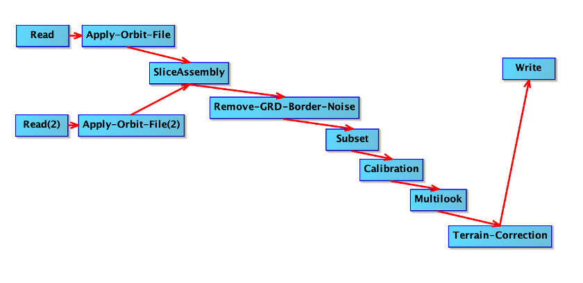
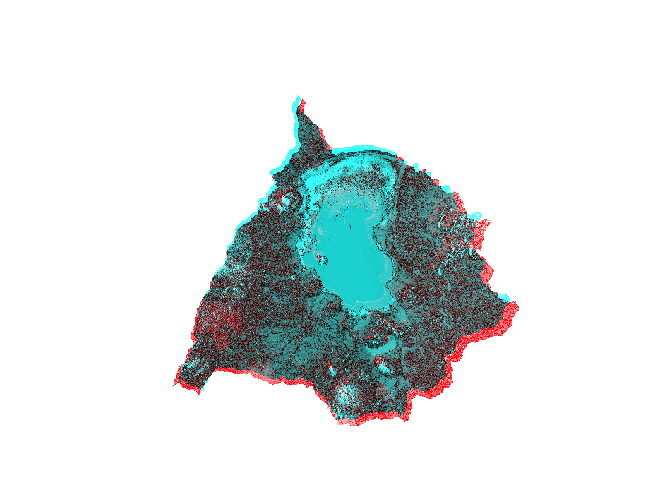

## Abstract

Wetlands are among the most valuable ecosystems on Earth and among the most difficult to monitor at scale, particularly in sub-Saharan Africa, where wet-season cloud, turbid shallow water, and dense emergent vegetation defeat optical sensors and the fluctuating shorelines of endorheic lakes escape single-date mapping. Endorheic lakes compound the difficulty, since their water is continuously redistributed through cycles of recession and refilling that no single-date image can capture. Lake Chilwa, a shallow terminal basin in southern Malawi, advances and retreats on a cycle of recession and refilling approximately every fifteen years, drying almost completely in some years and rebounding to high fish productivity in others; its ecology and its migratory fishing communities track this cycle, yet conventional management frameworks capture neither the shifting hydrology nor the migrant economy that surrounds it. In this study, we combine multi-source remote sensing with participatory mapping used as ground-truth training data to map the basin's inundation dynamics. We assembled a harmonized Landsat time series from 1984 to 2024 to reconstruct four decades of recession and refilling. We evaluated five spectral water indices at and resolving surface water at the sub-pixel scale through spectral mixture analysis. The was fitted with also with ALOS PALSAR L-band backscatter and trained a Random Forest classifier to classify across open water, flooded vegetation, dry vegetation, and bare soil. The classification reached an overall accuracy of 81 percent and a kappa of 0.77, highest for open water and lowest for flooded vegetation and bare soil, where dense Typha attenuates the C-band double-bounce signal that the L-band layer was included to overcome. Open water ranged from a wet-season maximum near 490 km² to a dry-season minimum below 110 km², falling below a tenth of peak extent during the recessions of 1995 and 2012, when the lake survived only as residual channels and swamp refugia. The fieldwork that supplied the training data also cross-checked the result, agreeing with the classified boundaries and seasonal timing at 74 to 92 percent of locations and revealing the migrant and floating fishing communities and governance structures invisible to earth observation, from seasonal migration timing to enforcement conflict across jurisdictions. Integrating multi-source remote sensing with sustained participatory fieldwork resolves dynamics that neither approach captures alone, nor provides a transferable basis for monitoring the fluctuating wetlands on which fishing economies and lakeshore communities depend.

**Keywords:** Wetland inundation mapping; SAR backscatter; spectral mixture analysis; participatory mapping; socio-hydrological systems; endorheic lakes; Lake Chilwa, Malawi

------------------------------------------------------------------------

## Introduction

Wetlands cover between 3% and 8% of the Earth's land surface and provide ecosystem services disproportionate to their extent: flood attenuation, water quality improvement, carbon sequestration, and biodiversity support (Mitsch and Gosselink, 2015; Davidson, 2014). Despite this, most countries lack comprehensive wetland inventories. Existing maps are fragmented, produced at incompatible scales with inconsistent methods, and rarely updated to reflect the dynamic character of wetland systems (Finlayson et al., 2018; Mahdianpari et al., 2019). In sub-Saharan Africa, the problem is acute. Many wetlands of continental significance function with limited mapping, and those that exist rely on single-date optical imagery that captures a snapshot rather than the seasonal and inter-annual variability that defines wetland function (Rebelo et al., 2009; Muro et al., 2016).

Remote sensing offers the spatial and temporal coverage that field surveys cannot match, and two decades of methodological development have produced a substantial toolkit for wetland mapping (Ozesmi and Bauer, 2002; Mahdavi et al., 2018). Yet accurate mapping of inland wetlands remains difficult. Shallow, turbid waters confound optical classification. Cloud cover obscures tropical wet seasons precisely when inundation is greatest. Emergent vegetation masks the water beneath it. Coloured dissolved organic matter, suspended sediment, and phytoplankton blooms alter spectral properties in ways that atmospheric correction algorithms handle poorly (Matthews, 2011; Ogashawara et al., 2017). Higher-resolution sensors introduce their own constraints in spectral coverage, radiometric sensitivity, and temporal frequency (Palmer et al., 2015; Kutser, 2012).

The concurrent availability of Sentinel-1 SAR and Sentinel-2 optical data since 2014, combined with the multi-decadal Landsat archive made freely available since 2008, now provides an unprecedented opportunity to address these limitations through multi-sensor time series analysis. Cloud computing platforms, particularly Google Earth Engine (GEE), have removed the computational barriers that previously made processing such large volumes of satellite imagery infeasible on conventional systems (Gorelick et al., 2017; Mahdianpari et al., 2019). These advances enable on-demand, large-scale wetland mapping that was not possible a decade ago.

Endorheic watersheds in Africa present a further challenge that is not merely technical but social. Their ecological and economic significance is mediated by human populations whose livelihoods track the water. Remote sensing provides essential spatial data (Eva and Lambin, 2000; Philippe and Karume, 2019), yet it captures neither the adaptive strategies of local resource users nor the political ecology that governs access to fluctuating resources (Yiran et al., 2012; Sulieman and Ahmed, 2013; Demichelis et al., 2023). Maps that are technically defensible remain ecologically and socially incomplete.

This study addresses both limitations simultaneously. We combine multi-sensor remote sensing with sustained ethnographic fieldwork to map inundation dynamics in the Lake Chilwa Basin, one of Africa's most productive and volatile endorheic systems. The remote sensing component evaluates optical water-extraction indices against SAR-derived water maps, processed through a Google Earth Engine pipeline, to quantify what each sensor family detects and what it misses. The ethnographic component, conducted over 18 months across three districts, validates the satellite-derived classifications and reveals the social and institutional structures that determine how the lake's resources are governed, contested, and used.

We read Lake Chilwa as a socio-hydrological system in the sense of Sivapalan and colleagues: a coupled human-water system whose lake dynamics and fishing society co-evolve through two-way feedback rather than through one-way climatic forcing (Blair and Buytaert, 2016; Xia et al., 2022). Mapping the inundation history and the fisher response that together constitute that coupling is the work of this paper, and it lays the empirical foundation for a coupled socio-hydrological model of the water-society feedback in the basin. That model is the central aim of the wider research programme, specified here and built on the record this study assembles rather than run within it (Srinivasan et al., 2017).

### 1.1 Optical Index Limitations

Water-extraction indices derived from multispectral imagery are the standard tools for mapping surface water extent. Each exploits a different combination of spectral bands to distinguish water from land, but each fails under specific conditions that Lake Chilwa routinely presents.

The Normalized Difference Water Index (NDWI; McFeeters, 1996) uses the ratio of green to near-infrared reflectance to delineate open water. It performs well where water is deep and clear (Ji et al., 2009) but struggles in shallow, turbid conditions because suspended sediment raises NIR reflectance, compressing index values toward zero (Xu, 2006; Li et al., 2013). In vegetated wetlands, canopy reflectance dominates both bands and the index cannot distinguish water beneath emergent vegetation from surrounding marshland (Ozesmi and Bauer, 2002). Endorheic lakes with fluctuating shorelines present mixed pixels at the land-water boundary where NDWI thresholds systematically misclassify wet soil as dry land (Deus and Gloaguen, 2013).

The Modified NDWI (MNDWI; Xu, 2006) substitutes shortwave infrared for NIR, suppressing the confusion between water and built-up or bare-soil surfaces that afflicts NDWI. It performs better in turbid and sediment-laden water (Li et al., 2013; Acharya et al., 2018) and is the strongest single optical index for the conditions this study addresses. It still fails beneath emergent vegetation, where macrophyte reflectance drives values negative even where standing water persists (Amani et al., 2020). In saline and endorheic systems, dissolved salts and algal blooms shift MNDWI thresholds unpredictably, requiring adaptive or Otsu-based methods (Pekel et al., 2016). Heimhuber et al. (2018) found that MNDWI required SAR fusion to map water extent beneath vegetation in the Murray-Darling system.

The Automated Water Extraction Index (AWEIsh; Feyisa et al., 2014) combines five bands to suppress shadow and dark-surface commission errors. Its multi-band formulation captures contrasts that two-band indices cannot resolve, but subpixel mixing of emergent vegetation and water still reduces values below detection thresholds (Ji et al., 2015). Fisher et al. (2016) found that no single index, AWEIsh included, consistently mapped shallow or seasonal water bodies in a global comparison. In endorheic systems, AWEIsh can misclassify exposed lakebed and brine as water (Pekel et al., 2016).

The Water Ratio Index (WRI; Shen and Li, 2010) uses the ratio of visible to infrared bands, yielding values above 1.0 for water. It suppresses cloud and shadow noise effectively (Li et al., 2023) and has shown strong performance in bare-soil landscapes in Ethiopia (Demelash et al., 2025). But where water, vegetation, and sediment share a pixel, the visible-band numerator inflates from non-water reflectance. The red band is particularly vulnerable to suspended sediment, which raises its reflectance sharply in turbid conditions. WRI has not been applied to endorheic or fluctuating lake systems.

The Normalized Difference Pond Index (NDPI; Lacaux et al., 2007) was designed in and for semi-arid Africa, using SPOT-5 imagery to classify temporary ponds in Senegal's Ferlo region. It exploits the SWIR absorption of water against green vegetation reflectance, making it sensitive to the water-vegetation boundary where other indices fail. Campos et al. (2012) confirmed that SWIR-based indices outperform NIR-based ones for ephemeral ponds in the Sahel. NDPI is the algebraic inverse of MNDWI, carrying identical spectral information with reversed sign convention. It performs best on small, shallow, vegetated water bodies and loses sensitivity in deep or highly turbid water.

The pattern across all five indices is consistent: each occupies a spectral niche but fails at the boundaries that define Lake Chilwa's hydrology. Shallow turbid water, vegetated wetland margins, fluctuating shorelines, and mixed pixels at the land-water transition are precisely the conditions where optical classification underperforms. These are also the zones of greatest ecological and socio-economic significance.

### 1.2 SAR-Optical Complementarity

Synthetic aperture radar addresses the specific failures of optical indices in inland wetlands. SAR operates at microwave frequencies, independent of cloud cover and solar illumination, two properties that make it indispensable for monitoring tropical wetlands where persistent cloud obscures optical sensors for months during the critical wet season (Mahdavi et al., 2018).

Smooth open water produces near-specular reflection, returning very little backscatter to the sensor. C-band SAR typically records open water at -20 to -30 dB, well below surrounding land surfaces, enabling detection through simple thresholding (Martinis et al., 2015). Where vegetation stands in water, the signal follows a double-bounce pathway, reflecting from the water surface and then from vertical plant structures. This produces backscatter paradoxically higher than from the same vegetation when dry, because the smooth water surface enhances the coherent specular return (Hess et al., 1995; Tsyganskaya et al., 2018). The contrast between double-bounce returns from flooded vegetation and volume scattering from dry canopies is the physical basis for detecting sub-canopy inundation.

Sentinel-1, operational since 2014, provides C-band imagery at 10 m resolution with 6 to 12 day revisit. Its dual-polarisation mode (VV/VH) has been applied to wetland inundation mapping across diverse environments: the St. Lucia wetlands in South Africa (Clement et al., 2018), the Amazon lowlands (Hardy et al., 2019), the Okavango Delta (Luca et al., 2025), and seasonal lake cycles on the Tibetan Plateau (Zhang et al., 2019). Multi-temporal approaches exploit wet-dry season contrast to characterise hydroperiod without ground data. The Sentinel-1 Global Flood Monitoring service now processes all incoming acquisitions for near-real-time detection (Roth et al., 2025).

C-band has limitations. Speckle noise degrades classification accuracy. Wind roughens water surfaces, raising backscatter above detection thresholds and causing false negatives (Martinis et al., 2015). Most critically, C-band's 5.6 cm wavelength cannot penetrate dense emergent vegetation such as Typha and Phragmites. Clement et al. (2018) reported poor classification in heavily vegetated zones. L-band SAR (approximately 23 cm wavelength), carried by ALOS PALSAR and the forthcoming NISAR mission, penetrates canopies far more effectively. Hess et al. (2003) showed that L-band detected sub-canopy flooding at 50 cm depth in Amazonian floodplains, versus 80 cm for C-band.

SAR interferometry offers additional capability. InSAR measures phase differences between acquisitions to detect centimetre-scale vertical displacement. In wetlands, the double-bounce mechanism preserves coherence, enabling water level change detection at resolutions exceeding gauge networks (Wdowinski et al., 2008; Hong and Wdowinski, 2017). Kim et al. (2021) mapped water level gradients across Tonle Sap at sub-monthly intervals. Temporal decorrelation and atmospheric phase delays limit the technique, particularly at C-band over intervals exceeding two weeks (Zebker and Villasenor, 1992). InSAR water level retrieval has not been attempted for African endorheic systems.

Fusing SAR and optical data exploits their complementarity. Pixel-level stacking, decision-level fusion, and machine learning classifiers trained on combined feature spaces consistently outperform single-source models, with reported accuracies of 85 to 95 percent for wetland classes (Amani et al., 2019; Whyte et al., 2018). Xu et al. (2025) mapped surface water dynamics across East Africa at 10 m resolution by integrating Sentinel-1 and Sentinel-2 time series. Lubala et al. (2023) fused Sentinel-1, Sentinel-2, and ALOS PALSAR to map small inland wetlands in the Democratic Republic of Congo. These studies confirm that multi-sensor integration captures dynamics that either sensor family misses alone.

#### Environment Setup

One-time Earth Engine setup, adapted from the author's authoritative rgee workflow. Run the chunk below once, and as the first commands in a fresh R session, to build the project virtual environment, install the Earth Engine Python API into it, and authenticate. It does not run on render.

```{r gee-setup-once}
#| eval: false
#| echo: false
# ============================================================================
# ONE-TIME Earth Engine setup. Run ONCE ONLY to configure a FRESH R session
# (reticulate binds one Python per session). Venv kept at .venv/ rather
# than the repo root; change ee_py to "./bin/python3" to match a root-level venv.
# ============================================================================
library(reticulate); library(rgee)

# rgee::ee_install() builds a managed Python env at ~/.virtualenvs/rgee, installs
# earthengine-api into it, and writes EARTHENGINE_PYTHON to .Renviron. Accept its
# prompt to restart R; then re-run ee_Authenticate() and ee_Initialize().
rgee::ee_install()
rgee::ee_Authenticate()
rgee::ee_Initialize(user = "seamusrobertmurphy", drive = TRUE)

# --- OPTIONAL: Service Account Key for non-interactive / web renders + GCS ---
# Guide: https://r-spatial.github.io/rgee/articles/rgee05.html
# SaK_file <- "/path/to/SaK_rgee.json"
# rgee::ee_utils_sak_copy(sakfile = SaK_file, users = "seamusrobertmurphy")
# rgee::ee_Initialize(user = "seamusrobertmurphy", gcs = TRUE, drive = TRUE)
```

```{r}
#| label: environment-setup
#| comment: NA
#| warning: false
#| message: false
#| error: false
#| echo: true
#| eval: true

easypackages::packages(
  "bslib",
  "cols4all", "covr", "cowplot",
  "dendextend", "digest","DiagrammeR","dtwclust", "downlit",
  "e1071", "exactextractr","elevatr", "exifr",
  "FNN", "future", "forestdata",
  "gdalcubes", "gdalUtilities", "geojsonsf", "geos", "ggplot2", "ggstats",
  "ggspatial", "ggmap", "ggplotify", "ggpubr", "ggrepel", "giscoR",
  "hdf5r", "here", "httr", "httr2", "htmltools",
  "jsonlite",
  "kohonen",
  "leaflet.providers", "leafem", "libgeos","luz","lwgeom", "leaflet", "leafgl",
  "mapedit", "mapview", "maptiles", "methods", "mgcv",
  "ncdf4", "nnet",
  "openxlsx", "parallel", "plotly",
  "randomForest", "rasterVis", "raster", "Rcpp", "RcppArmadillo",
  "RcppCensSpatial","rayshader", "RcppEigen", "RcppParallel",
  "RColorBrewer", "reactable", "reticulate", "rgee", "rgl", "rnaturalearth", "rsconnect","RStoolbox", "rts",
  "s2", "sf", "scales", "sits","spdep", "stars", "stringr","supercells",
  "terra", "testthat", "tidyverse", "tidyterra","tools",
  "tmap", "tmaptools", "terrainr",
  "xgboost",
  prompt = F)

# Disable spherical geometry
sf::sf_use_s2(use_s2 = FALSE)
# [render 2026-07-06] Lift R's elapsed-time guard so long Earth Engine calls finish.
setTimeLimit(cpu = Inf, elapsed = Inf)

# Assign working directory to current location
knitr::opts_knit$set(root.dir = here::here())
options(repos = c(CRAN = "https://cloud.r-project.org"),
        htmltools.dir.version = FALSE,
        htmltools.preserve.raw = FALSE)

# Configure code formatting
knitr::opts_chunk$set(
  echo = TRUE, message = FALSE, warning = FALSE,
  error = TRUE, comment = NA,   # [render 2026-07-07] TRUE so one cell error cannot abort the whole render
  tidy.opts = list(width.cutoff = 60))

# --- Google Earth Engine via rgee (live init) ------------------------------
# rgee::ee_install() saves EARTHENGINE_PYTHON (~/.virtualenvs/rgee) to .Renviron.
# Bind reticulate to that same interpreter and set RETICULATE_PYTHON to match so
# the two agree (no "request ignored" warning), then initialise.
ee_py <- Sys.getenv("EARTHENGINE_PYTHON",unset = Sys.getenv("RETICULATE_PYTHON", "/opt/local/bin/python"))
Sys.setenv(RETICULATE_PYTHON = ee_py)
reticulate::use_python(ee_py, required = TRUE)
library(rgee)
rgee::ee_Initialize(user = "seamusrobertmurphy", drive = TRUE)
# gcs = TRUE also works once a Service Account Key is configured (see above).
# `ee` and rgee helpers (ee_as_sf, sf_as_ee, ee_extract, Map$addLayer) available.

# Helpers to handle earth engine objects in tmap/leaflet
ee_tile_url <- function(ee_image, vis_params) {
  ee_image$getMapId(vis_params)$tile_fetcher$url_format}
ee_to_sf <- function(fc) {geojsonsf::geojson_sf(
  jsonlite::toJSON(fc$getInfo(), auto_unbox = TRUE))}
```

```{css, echo=FALSE, class.source = 'foldable'}
div.column {
    display: inline-block;
    vertical-align: top;
    width: 50%;
}

#TOC::before {
  content: "";
  display: block;
  height:200px;
  width: 200px;
  background-image: url('https://raw.githubusercontent.com/seamusrobertmurphy/mapping-wetland-inundation-lake-chilwa/refs/heads/main/assets/PNG/RADAR-render.png');
  background-size: contain;
  background-position: 50% 50%;
  padding-top: 80px !important;
  background-repeat: no-repeat;
}
```

### 1.3 Study Area

Lake Chilwa Basin is one of Africa's most productive endorheic ecosystems. Located in southern Malawi, this shallow terminal basin spans approximately 2,310 km², of which open water forms a fluctuating share, on the order of a third in a wet year and far less during recession, the remainder comprising Typha swamp and seasonally inundated marshland (Kalk, 1979). The lake was designated a Ramsar Wetland of International Importance in 1997, in recognition of its outstanding waterfowl populations and ecological significance (Wilson, 2007). The three surrounding districts, Zomba, Phalombe, and Machinga, support population densities of 162 persons km⁻² around the lake itself and considerably higher in the southern basin (Wilson, 2010), with 70 to 81% of households living below the poverty line and farming plots averaging 0.35 ha (Wilson, 2010). The fishery contributes on average 20% of Malawi's annual catch and in peak years has reached 43% (Chiotha, 1996; Njaya et al., 2011).

The basin's hydrology is driven by unimodal rainfall (November to April) and sporadic chiperone rains (May to August). Annual fluctuations follow precipitation patterns closely (Ngongondo et al., 2011; Nicholson et al., 2014). Longer-term cycles of approximately 15 to 20 years produce dramatic lake recessions and varying degrees of complete desiccation (Kambombe et al., 2021). Wilson (2014) compiled the most complete chronology of lake levels, documenting major recessions in 1900, 1913-16, 1922, 1934, 1943, 1946, 1952, 1960, 1967-68, 1995, and 2012-13, set within a geological record of pluvial and inter-pluvial phases extending 450,000 years. Average maximum lake depth is 2.95 m; a prolonged dry phase between approximately 1760 and 1850 deposited a hard layer of homogeneous sandy clays at least 1.2 m thick that now underlies the lakebed (Wilson, 2014; Crossley et al., 1983). These fluctuations are not anomalies but the lake's defining ecological characteristic: a transient world that in some seasons supports a thriving fishery, a bustling marketing network, and burgeoning lakeshore settlements, while in the following season the shoreline may retreat by fifteen kilometres, leaving communities stranded from open water (Kalk, 1979; Allison and Mvula, 2002).

During recession, the lake's three main commercial species, *Barbus paludinosus* (matemba), *Clarias gariepinus* (mlamba), and *Oreochromis shiranus chilwae* (chambo), take refuge in residual deep pools at alluvial river mouths and in swamps dominated by salt-hardy *Typha domingensis* Pers. (Howard-Williams and Walker, 1974; Howard-Williams and Gaudet, 1985). These species have evolved characteristics suited to a fluctuating environment: high fecundity, early reproductive maturity, broad diets, unspecialised spawning habits, and tolerance to wide environmental variation (Njaya, 2001). Refilling initiates complex succession dynamics, with emergent food webs driven by detritus and bacterial processes in alkaline, nutrient-rich sediments (Kalk and Schulten-Senden, 1977; Furse et al., 1979). Peak productivity reaches 159 kg ha⁻¹ (1979) and 113 kg ha⁻¹ (1990), surpassing Lake Malawi (40 kg ha⁻¹), Lake Tanganyika (90 kg ha⁻¹), and Lake Victoria (116 kg ha⁻¹) (Njaya et al., 2011; Vanden Bossche and Bernacsek, 1990). Wilson (2014) notes that the 1979 bumper harvest of 24,310 tonnes followed six years after the lake dried, during which oxidation of organic matter released nutrients that fuelled explosive productivity upon refilling.

This boom-and-bust ecology sustains a complex mobile population. The basin's settlement history stretches back millennia, from Akafula hunter-gatherers through the 16th-century Maravi (Mang'anja) chieftancies, the mid-19th-century Yao migration from Mozambique, and the 20th-century Lomwe influx from Portuguese East Africa (Wilson, 2010). Today, permanent lakeshore communities of Yao, Nyanja, and Lomwe matrilineal descent groups farm the seasonally exposed lakebed and fish inshore waters. Seasonal migrants travel from as far as Machinga district to the north, spending weeks to months on zimbowera, floating platforms of piled Typha grass that serve as fishing camps in the lake interior (Murphy, 2014). These zimbowera neighbourhoods, such as Andere, Chambwalu, and Lingoni, support shifting populations of 300 to 1,000 fishers and sustain their own tea rooms, trading posts, and social governance structures. During the wet season, when fishing grounds are most productive but most inaccessible from the mainland, zimbowera cooperatives form along lines of village membership, kinship, and occupational specialisation. Seine-net crews of up to 80 fishers operate from large camps under single owners, while smaller gill-net cooperatives of three to four family members share boats, equipment, and risks on remote islands (Murphy, 2014). The fishery's principal port is Kachulu, on the western shore in Zomba district, which serves as the hub for a regional marketing network extending by bicycle and truck to Zomba, Blantyre, Liwonde, Phalombe, and Mulanje.

The area of interest for all remote sensing analysis is the study's own basin polygon (`03.outputs/SHP/chilwa_basin.shp`), delineated by routing flow over a hydrologically conditioned digital elevation model rather than adopted from a public basin product. This replaces the hand-digitised outline of earlier drafts: the boundary is re-derivable from the elevation model itself by the flow-routing set out in Section 2.2.A, where a relief map of the basin also appears.

### 1.4 Participatory Mapping as a Complementary Data Source

The reasoning behind multi-sensor fusion does not stop at the satellite. Optical indices fail in shallow turbid water and beneath emergent vegetation; SAR recovers much of what they miss yet cannot itself penetrate dense Typha. Each sensor earns its place by measuring a dimension the others cannot, and classification accuracy climbs as complementary sources accumulate: in a comparable Ghanaian peatland, overall accuracy rose from 71% for radar alone to 94% for a stacked optical, SAR, and terrain feature space (Amoakoh et al., 2021). The gain comes from complementarity, not volume. A source that repeats what another already records adds nothing, and a redundant band can even degrade a classifier. Read this way, the knowledge held by Lake Chilwa's fishers is not a departure from the remote sensing method but its extension: another source, subject to the same test as any spectral band, admitted because it carries information no sensor registers.

What that source supplies is what the satellite stack cannot reach. Radar and optical indices share a blind spot in the marsh interior, where water stands beneath a canopy that defeats both (Clement et al., 2018). Fishers work that interior through the recession cycle and know where the water goes. Their knowledge also holds what no reflectance encodes: the demand placed on the wetland, the causes behind an observed change, and the culturally defined places that have no spectral signature (Hodbod et al., 2019). Integrating local observation with satellite data is the standard response to optically complex, access-limited waters, where in-situ knowledge is treated as a first-class complement rather than mere ground truth (Hestir and Dronova, 2023). We therefore treat participatory mapping as a data source within a multi-source paradigm, and ask of it what we ask of every other source: that it add what the others miss. Local knowledge enters remote sensing in two registers: as an independent check on a satellite classification, and as the response variable itself where the phenomenon has no stable spectral signature. Lateef et al. (2025) exemplify the first, cross-validating flood-damage maps in the Hadejia wetlands of northern Nigeria against farmer-reported loss to within nine percentage points; Woodward et al. (2021) the second, deriving the very resource-use intensity classes their model predicts from participatory-mapped resource areas across a transboundary southern African landscape, where the contribution of Landsat spectra proved negligible.

### 1.5 Research Objectives

This study pursues two aims. The first is methodological: to advance the remote sensing of shallow, turbid, vegetated lakeshores by testing whether a stacked optical and SAR feature space, grounded on a self-derived drainage structure, resolves the littoral conditions where single-sensor optical thresholds fail. Under this aim we evaluate five optical water-extraction indices (NDWI, MNDWI, AWEIsh, WRI, NDPI) and Sentinel-1 C-band SAR for mapping inundation across the basin's full range of conditions, from deep open water through shallow turbid zones to vegetated marshland; derive the basin boundary and drainage network from the terrain by D-infinity flow routing (Tarboton 1997) over a depression-breached elevation model in WhiteboxTools and flowdem, rather than inherited from a public basin product; and integrate the two sensor families through spectral mixture analysis to quantify hydroperiod and littoral dynamics across multiple recession-refilling cycles. The testable proposition is that this multi-source stack maps the vegetated, turbid littoral more faithfully than any single optical index. The second aim is to develop a socio-hydrological framework for watershed and natural-resource management in rural Africa: to test whether fisher knowledge supplies inundation and resource-use information absent from the satellite record, and whether coupling it with the hydrological record exposes a lake-fishery feedback that formal monitoring misses. Under this aim we validate the satellite-derived classifications against ethnographic data from key informant interviews, focus group discussions, and participatory mapping with migrant fishing communities, and document the fishing regulations, population movements, and resource-use patterns that formal monitoring frameworks have not captured. The coupled socio-hydrological model of that feedback is specified as the central next step of the research programme, not a claim of the present paper.

------------------------------------------------------------------------

## Methods

### 2.1 Socio-Hydrological Systems Framework

The study employs a socio-hydrological systems framework, a mixed-methods, two-stage approach that treats the lake and the society dependent on it as one coupled water-society system and integrates biophysical remote sensing with social research methods. The framework targets the perspectives of marginalised groups, particularly migrant fishers, who form a principal economic segment of the Lake Chilwa system yet are overlooked in conventional management frameworks.

Data collection occurred between September 2012 and March 2014 across lakeshore villages in Zomba, Phalombe, and Machinga districts within the Lake Chilwa Ramsar zones. Study site boundaries were defined through participatory mapping workshops with multi-stakeholder groups and Department of Fisheries officers. The fisheries governance structure within which fieldwork operated, comprising six Fisheries Associations aligned to Traditional Authorities and 53 Beach Village Committees aligned to Group Village Headmen, is described by Wilson (2009) in the Lake Chilwa and Mpoto Lagoon Fisheries Management Plan.

**Qualitative data.** Qualitative data collection comprised four methods. Key informant interviews (n=45) were semi-structured conversations with village leaders, fishing camp chairmen, Beach Village Committee (BVC) members, Department of Fisheries officers, and long-term residents, focused on historical lake dynamics, fishing regulations, and seasonal migration. Focus group discussions (n=18) convened separate sessions with migrant seine-net fishers, resident gill-net fishers, women fish processors, boat owners, bicycle traders, and zimbowera cooperative leaders to capture competing perspectives on resource access, livelihood strategies, and enforcement disputes. The research was based principally at Kachulu, the fishery's busiest port on the western shore, with extended visits to fishing camps at Napali, Andere, Chambwalu, Lingoni, and Manda Manjeza in the lake interior and along the northern shore in Machinga district. Participatory rural appraisals employed seasonal calendars, resource mapping, and historical timelines to document collective knowledge of lake dynamics and fishery management. Extended participatory observation in fishing camps and zimbowera neighbourhoods documented daily practices, operational logistics, social networks, and adaptive strategies during different hydrological phases (Murphy, 2014).

**Geographic data.** Geographic data collection used differential GPS receivers to record landscape structure and lakeshore dynamics during field visits. Participatory workshops enabled community identification of fishing infrastructure, including permanent and seasonal camps, landing sites, processing areas, and the canal systems (such as Mapila Canal, approximately 10 to 15 km depending on lake levels) through which fishers access otherwise inaccessible interior fishing grounds. Ecological zones including wetland boundaries, vegetation transitions, and spawning areas were mapped alongside cultural landscapes such as sacred fishing sites on Chisi Island (Kalanda-Sabola et al., 2007), traditional fishing territories, and conflict zones between district jurisdictions. Seasonal patterns including water level indicators, migration routes from Machinga to Zomba and Phalombe districts, and market network locations were recorded. Community knowledge was integrated with remote sensing through iterative validation workshops where preliminary satellite-derived maps were ground-truthed against local observations. This process revealed discrepancies between technical classifications and actual resource use patterns, leading to refined mapping approaches.

**Reference data.** In-situ reference data were collected during the ethnographic fieldwork between September 2012 and March 2014. Differential GPS receivers recorded landscape features, water boundaries, and vegetation transitions during field visits across the three study districts. A total of 45 key informant sites and 18 focus group locations were georeferenced, along with 23 fishing camps (permanent and seasonal), landing sites, processing areas, and ecological transition zones identified through participatory mapping workshops.

GPS points were imported into a GIS environment and used to generate training and validation polygons through visual interpretation of high-resolution Google Earth imagery cross-referenced with field photographs and community annotations. Polygons were sorted by size and alternately assigned to training (approximately 50%) and testing (approximately 50%) groups to ensure independent validation samples with balanced representation of small and large features, following the protocol of Mahdianpari et al. (2019). Community validation during iterative feedback workshops identified spectrally ambiguous landscape units, such as seasonal versus permanent wetlands and distinct fishing zones, that required field verification to classify correctly.

Field data collection summary:

| Component | n | Detail |
|:------------------|------------------:|:---------------------------------|
| Key informant interviews | 45 | Village leaders, camp chairmen, BVC members, Fisheries officers |
| Focus group discussions | 18 | Seine-net, gill-net, processors, boat owners, traders, cooperative leaders |
| Districts | 3 | Zomba, Phalombe, Machinga |
| Georeferenced sites | 23 | Fishing camps, landing sites, processing areas |
| Beach Village Committees | 53 | Aligned to Group Village Headmen |
| Fisheries Associations | 6 | Aligned to Traditional Authorities |

#### 2.1.1 Photographic Evidence and Participatory Ground Truth

The supervised classification rests on a ground-truth set built from field evidence, and the character of that evidence determines what the classifier can learn. During fieldwork we assembled an archive of 245 photographs documenting surface cover at visited sites: open water, flooded Typha marsh, dry vegetation, exposed lakebed, and the fishing infrastructure of camps and landing sites. Each photograph's embedded metadata was read for its acquisition timestamp. Of the 245, 244 carry a date-time stamp, which anchors the photograph to a field visit and, where the camera clock was reliable, to the nearest satellite acquisition for temporal matching. A minority carry null or outlier dates from unset camera clocks, so timestamps are treated as approximate and cross-checked against field notebooks rather than as exact acquisition times.

The photographs do not themselves carry position: none of the 245 contain extractable latitude and longitude in their metadata. Location was supplied instead by the differential GPS survey and the participatory-mapping workshops described above, which recorded the coordinates of landscape features, water and vegetation boundaries, fishing camps, and ecological transition zones. Each ground-truth point therefore combines three elements: a coordinate from the survey-grade GPS or the participatory record, a cover-class label assigned from the photographic and field evidence at that location, and a date from the associated photograph or field note. This triangulation is the standard response where geotagged imagery is unavailable; it preserves the positional accuracy of the differential GPS while using the photographs for what they alone provide, an unambiguous visual identification of the surface at a known place and time. The participatory record adds what neither the photograph nor the coordinate encodes: the local identity of a place, its seasonal status, and the distinction between spectrally similar but functionally different units such as permanent and seasonal wetland.

The labelled points were compiled into a single georeferenced ground-truth set spanning the four cover classes and split into independent training and validation subsets. They enter the classification at three points: they screen the candidate features for separability (Section 2.2.F), they train the random forest by supplying the labelled spectra sampled from the feature image at each point (Section 2.2.G), and, as the held-out subset, they drive the accuracy assessment (Section 2.2.H). Iterative community-validation workshops reviewed the labelled points and reclassified those the classifier had misjudged, so the ground-truth set encodes local judgement alongside spectral evidence. The workflow below reads the photograph metadata, joins it to the surveyed coordinates and class labels, and writes the ground-truth point set the classifier consumes.

```{r photo-metadata}
#| eval: false
#| echo: true
#| warning: false
#| message: false
#| comment: NA
# Read EXIF metadata from the field-photograph archive. exifr::read_exif wraps
# ExifTool; the equivalent extraction produced 03.outputs/field_photo_metadata.csv.
photo_dir <- here::here("02.inputs", "PNG")
photos <- list.files(photo_dir, pattern = "(?i)\\.(jpe?g|png)$", full.names = TRUE)
ex <- exifr::read_exif(photos,
  tags = c("SourceFile", "DateTimeOriginal", "GPSLatitude", "GPSLongitude"))
photo_meta <- data.frame(
  photo    = basename(ex$SourceFile),
  datetime = ex$DateTimeOriginal,
  date     = as.Date(substr(ex$DateTimeOriginal, 1, 10), format = "%Y:%m:%d"),
  gps_lat  = ex$GPSLatitude,
  gps_lon  = ex$GPSLongitude,
  has_gps  = as.integer(!is.na(ex$GPSLatitude) & !is.na(ex$GPSLongitude)))
write.csv(photo_meta, here::here("03.outputs", "field_photo_metadata.csv"),
          row.names = FALSE)
```

```{r photo-metadata-summary}
#| eval: false
#| echo: true
#| warning: false
#| message: false
#| comment: NA
# Summary of the field-photograph metadata table.
photo_meta <- read.csv(here::here("03.outputs", "field_photo_metadata.csv"),
                       stringsAsFactors = FALSE)
cat("Field photographs:", nrow(photo_meta), "\n")
cat("With acquisition timestamp:", sum(nzchar(as.character(photo_meta$datetime))), "\n")
cat("With extractable GPS coordinates:", sum(photo_meta$has_gps, na.rm = TRUE), "\n")
cat("Photographs by year:\n"); print(table(substr(as.character(photo_meta$date), 1, 4)))
```

```{r ground-truth-assembly}
#| eval: true
#| echo: true
#| warning: false
#| message: false
#| comment: NA
# [placeholder 2026-07-06] TEMPORARY training points so the classification runs
# end to end before the field ground-truth file is compiled. Points are drawn
# from ESA WorldCover (public, 10 m) and remapped to the four study classes, then
# split 70/30. Replace with the field points once compiled
# (05.scripts/build_ground_truth_points.R -> 03.outputs/SHP/ground_truth_points.shp).
# [fix 2026-07-07] This cell runs before aoi-clip, so build aoi_ee here if absent.
if (!exists("aoi_sf")) {
  aoi_sf <- sf::st_transform(
    sf::read_sf(here::here("03.outputs", "SHP", "chilwa_basin.shp")), 4326)
}
if (!exists("aoi_ee")) {
  aoi_ee <- rgee::sf_as_ee(sf::st_geometry(aoi_sf))
}
wc <- ee$ImageCollection("ESA/WorldCover/v200")$first()$clip(aoi_ee)
# 80 water -> 1; 90 herbaceous wetland -> 2; 10/20/30/40 tree/shrub/grass/crop -> 3
# dry vegetation; 60 bare/sparse -> 4. Built (50) and other classes are masked out.
gt_class <- wc$select("Map")$remap(
  c(80L, 90L, 10L, 20L, 30L, 40L, 60L),
  c(1L,  2L,  3L,  3L,  3L,  3L,  4L))$rename("class")

gt_points <- gt_class$stratifiedSample(
  numPoints = 100L, classBand = "class", region = aoi_ee,
  scale = 30L, seed = 42L, geometries = TRUE)$randomColumn("rnd", seed = 42L)
gt_train_ee <- gt_points$filter(ee$Filter$lt("rnd", 0.7))
gt_valid_ee <- gt_points$filter(ee$Filter$gte("rnd", 0.7))
print(paste("Placeholder ground-truth points:", gt_points$size()$getInfo()))

# When the field points exist, replace the block above with an sf read of
# 03.outputs/SHP/ground_truth_points.shp and rgee::sf_as_ee(), then re-run.
```

### 2.2 Remote Sensing Framework

The remote sensing workflow integrates multi-temporal SAR backscatter analysis with optical spectral indices to map surface water extent variability. The clip boundary for all raster and vector queries is the self-derived basin polygon of Section 1.3, delineated by flow routing over a conditioned elevation model (Section 2.2.A), not a public basin product. The temporal window extends as far back as Landsat data quality permits, driven by the need to capture multiple recession events that recur at approximately 15 to 20-year intervals.

The workflow runs within Google Earth Engine, which hosts the full multi-sensor archive and applies radiometric calibration and terrain correction on demand, so no scene is downloaded or processed locally (Gorelick et al., 2017). Three data streams are developed in parallel and then combined. The radar stream (Section 2.2.B) builds a monthly Sentinel-1 C-band backscatter and water-mask series from the Ground Range Detected archive, and adds an ALOS PALSAR L-band layer that reaches beneath the Typha canopy where C-band cannot. The Landsat stream (Sections 2.2.C to 2.2.E) harmonises the Thematic Mapper, Enhanced Thematic Mapper Plus, and Operational Land Imager records into a single Collection 2 series, computes the five water indices, and resolves sub-pixel cover through spectral mixture analysis. An independent terrain stream (Section 2.2.A) routes flow across the basin floor to ground the drainage-structure interpretation. The modelling operations that carry these series into the analysis, the feature selection, supervised classification, and accuracy assessment of Sections 2.2.F to 2.2.H, produce the inundation record that, joined to the participatory data, forms the empirical basis for the coupled socio-hydrological model set out in Section 4.6. Collection identifiers, filters, and parameters are given in full in the code that accompanies each subsection, so the series can be regenerated end to end

#### Import AOI Data

The workflow begins with a point location inside the waterbody of interest, from which the surrounding basin is scoped. The analysis boundary itself is the self-derived basin polygon of Section 1.3.

```{r map-aoi}
#| warning: false
#| message: false
#| eval: false
#| echo: true
#| comment: NA

# import spatial data
crs_master = sf::st_crs('epsg:4326')
lake  = sf::st_read("./02.inputs/SHP/lakes_site.shp")
watershed   = sf::read_sf(here::here("03.outputs", "SHP", "chilwa_basin.shp")) |> sf::st_cast() |> sf::st_transform(crs_master)  # [fix 2026-07-06] AOI = self-derived basin (2.2.A), not the legacy 02.inputs outline

# Derive National and Regional AOI
nation = giscoR::gisco_get_countries(country = "Malawi", resolution = "3") |> sf::st_cast() |> sf::st_transform(crs_master)
nation_ee <- ee$FeatureCollection("FAO/GAUL/2015/level0")$filter(ee$Filter$eq("ADM0_NAME", "Malawi")) # |> rgee::ee_to_sf(aoi_country_ee)

region = giscoR::gisco_get_countries(country = c("Malawi", "Zambia", "Tanzania", "Mozambique"),resolution="3") |>  sf::st_cast()|>sf::st_transform(crs_master)
bbox  = terrainr::add_bbox_buffer(watershed, 20000, "meters") |> terra::vect()
bbox_nation = terrainr::add_bbox_buffer(nation, 40000, "meters") |> terra::vect()
bbox_region = terrainr::add_bbox_buffer(region, 80000, "meters") |> terra::vect()
basemap_150k = maptiles::get_tiles(bbox, zoom=10,crop=T,provider="OpenTopoMap")
basemap_4m = maptiles::get_tiles(bbox_region, zoom=8, crop=T,provider="CartoDB.Positron")
terra::crs(bbox_nation) <- "epsg:4326"  # [fix 2026-07-06] was sf::st_crs(vbox_nation): undefined var + wrong class

tmap::tm_shape(bbox_nation) + tm_borders(lwd = 0.0, col = "black") +
  tmap::tm_shape(basemap_4m) + tm_rgb(alpha=0.2) + 
  tmap::tm_shape(watershed) + tm_borders(lwd=2, col = "red", fill="#e28672", fill_alpha=0.5) +
  tmap::tm_shape(region) + tm_borders(lwd = 0.5, col = "black") +
  tmap::tm_compass(type="4star", size=1.1, color.dark = "gray60", text.color="gray60",position=c("LEFT", "TOP")) -> map_nation

tmap::tm_shape(watershed) + tmap::tm_borders(col="red") +
 tmap::tm_shape(lake) + tmap::tm_borders(col = "blue") +
  tmap::tm_shape(basemap_150k) + tmap::tm_rgb() +
  tmap::tm_graticules(lines=T,labels.rot=c(0,90),lwd=0.2) +
  tmap::tm_credits("EPSG:4326",position=c("left","bottom")) +
  tmap::tm_scalebar(c(0, 10, 20, 40), position = c("RIGHT", "BOTTOM"), text.size=.5) +
  tmap::tm_compass(type = "4star", size = 1.5, color.dark="gray60", text.color="gray60",position=c("left","top")) -> map_aoi
  

map_aoi_grob    = tmap::tmap_grob(map_aoi)
map_nation_grob = tmap::tmap_grob(map_nation)
map_locator     = cowplot::ggdraw() + cowplot::draw_plot(map_aoi_grob) + cowplot::draw_plot(map_nation_grob, x = -0.39, y=0.4, height = 0.45)
ggplot2::ggsave(filename = here::here("03.outputs", "MAP", "map_locator.png"), plot = map_locator)  # [fix 2026-07-06] was ggsave(locator_map, "./03.output/..."): undefined var, wrong arg order, path typo (03.output -> 03.outputs)
tmap::tmap_save(map_nation, here::here("03.outputs", "MAP", "map-nation.png"))
tmap::tmap_save(map_aoi, here::here("03.outputs", "MAP", "map-aoi.png"))

```

```{r import-aoi}
#| warning: false
#| message: false
#| eval: true
#| echo: false
#| comment: NA
# import mapping objects
crs_master = sf::st_crs('epsg:4326')
watershed   = sf::read_sf(here::here("03.outputs", "SHP", "chilwa_basin.shp")) |> sf::st_cast() |> sf::st_transform(crs_master)  # [fix 2026-07-06] AOI = self-derived basin (2.2.A), not the legacy 02.inputs outline
nation = giscoR::gisco_get_countries(country = "Malawi", resolution = "3") |> sf::st_cast() |> sf::st_transform(crs_master)
nation_ee <- ee$FeatureCollection("FAO/GAUL/2015/level0")$filter(ee$Filter$eq("ADM0_NAME", "Malawi")) # |> rgee::ee_to_sf(aoi_country_ee)
region = giscoR::gisco_get_countries(country = c("Malawi", "Zambia", "Tanzania", "Mozambique"),resolution="3")|>
  sf::st_cast() |> sf::st_transform(crs_master)
bbox  = terrainr::add_bbox_buffer(watershed, 20000, "meters") |> terra::vect()
bbox_nation = terrainr::add_bbox_buffer(nation, 40000, "meters") |> terra::vect()
bbox_region = terrainr::add_bbox_buffer(region, 80000, "meters") |> terra::vect()

# visualize
tmap::tmap_mode("view")
tmap::tm_shape(bbox_nation) + tmap::tm_borders(lwd = 2, col = "green") +
  tmap::tm_shape(region) + tmap::tm_borders(lwd = 1, col = "blue") +
  tmap::tm_shape(watershed) + tmap::tm_borders(lwd = 2, col = "red") +
  tmap::tm_basemap("Esri.WorldImagery")
```

{fig-align="center"}

The self-derived basin polygon of Section 1.3 provides the clip boundary for all Earth Engine queries.

```{r aoi-clip}
#| warning: false
#| message: false
#| echo: false
#| eval: false
#| comment: NA
# eval flipped false->true: this chunk defines aoi_sf/aoi_ee,
# which every downstream terrain and Earth Engine chunk needs; as eval:false it
# left those objects undefined and broke the pipeline at render.
# Clip boundary for all Earth Engine queries: the self-derived basin polygon (Section 1.3)
aoi_sf <- sf::st_transform(watershed, crs_master)
aoi_ee <- rgee::sf_as_ee(sf::st_geometry(aoi_sf))
```

#### 2.2.A Terrain and Flow-Routing Analysis

The basin boundary and drainage network are derived from the terrain, not inherited from a public product. Google Earth Engine has no native flow-routing tool, so the delineation is performed locally in R. On Lake Chilwa's flat endorheic floor, an average maximum depth of 2.95 m across a 2,310 km² terminal basin (Section 1.3), the decisive step is hydrological conditioning of the elevation model: without it, closed depressions and flat cells sever the flow paths on which the drainage-structure argument of Section 3.3 depends.

We conditioned the elevation model by least-cost depression breaching alone (Lindsay, 2016), carving minimal-descent paths through spurious barriers rather than filling depressions, which on a near-flat basin floor would erase the very gradients the routing depends on. Flow was then routed by the D-infinity method (Tarboton, 1997), whose continuous angular partitioning represents dispersal across low-relief terrain more faithfully than the eight discrete directions of D8; where fuller flow dispersion is wanted, a multiple-flow-direction variant (Freeman, 1991; Quinn, 1991) is the defensible alternative. Routing was computed twice for algorithmic consensus: once in WhiteboxTools (`wbt_d_inf_pointer`, `wbt_d_inf_flow_accumulation`) and once in the flowdem package (`dirs` and `accum`, mode `dinf`). From the D-infinity flow accumulation we extracted the stream network (`wbt_extract_streams`), ordered it by the Strahler scheme (`wbt_strahler_stream_order`), and delineated the basin and its sub-catchments, the polygons that serve as the analysis boundary (`03.outputs/SHP/chilwa_basin.shp`, `chilwa_subasins.shp`). The full workflow, including the depression-breaching and DEM-resolution comparisons, is documented in `05.scripts/watershed-algorithms.qmd` and its published mirror.

```{r terrain-extract}
# Terrain grids from the local least-cost-breaching + D-infinity derivation
# (05.scripts/watershed-algorithms.qmd; WhiteboxTools + flowdem). Earth Engine
# has no breaching, flow-accumulation, or D-infinity operator, so the basin is
# derived locally and only the resulting grids are loaded here.
# [align 2026-07-06] D8 and pit-filled (pitRemove) products dropped: the method
# of record is breaching-only + D-infinity (D8 and filling retired). Paths use
# here::here() because the setup chunk sets knitr root.dir = here::here().
dem_dir <- here::here("03.outputs", "DEM")
dem_files <- c("rasters_SRTM15Plus", "dinfFlowDirection", "Dinfarea")
dem_extract_dir <- file.path(dem_dir, "extracted")
dir.create(dem_extract_dir, recursive = TRUE, showWarnings = FALSE)
for (f in dem_files) {
  archive <- file.path(dem_dir, paste0(f, ".tar.gz"))
  if (file.exists(archive)) {
    untar(archive, exdir = dem_extract_dir)
  } else {
    warning("Missing DEM archive, skipped: ", archive)
  }
}
list.files(dem_extract_dir)
```

```{r terrain-load}
# [align 2026-07-06] Load only the SRTM input and the D-infinity grids from the
# breach-conditioned derivation; the D8 and pit-filled products are no longer read.
srtm15plus <- terra::rast(file.path(dem_extract_dir, "output_SRTM15Plus.tif"))
dinf_dir   <- terra::rast(file.path(dem_extract_dir, "dinfFlowDirectionang.tif"))
dinf_area  <- terra::rast(file.path(dem_extract_dir, "Dinfareasca.tif"))

print(srtm15plus)
```

Contributing area spans several orders of magnitude, so the D-infinity accumulation is mapped on a log scale, cropped to the basin and a surrounding buffer for comparison against the GEE-derived relief map above.

```{r terrain-flow-maps}
aoi_vect     <- terra::vect(sf::st_as_sf(aoi_sf))
crop_extent  <- terra::ext(aoi_vect) + 0.2

dinf_area_crop <- terra::crop(dinf_area, crop_extent)
dinf_dir_crop  <- terra::crop(dinf_dir, crop_extent)

dinf_area_log <- log10(terra::ifel(dinf_area_crop <= 0, NA, dinf_area_crop))
```

```{r terrain-dinf-maps}
terra::plot(dinf_area_log, main = "D-infinity specific catchment area (log10)",
            col = hcl.colors(50, "Blues 3"))
terra::plot(aoi_vect, add = TRUE, border = "red", lwd = 2)

terra::plot(dinf_dir_crop, main = "D-infinity flow direction (radians, 0 to 2π)",
            col = hcl.colors(50, "Roma"))
terra::plot(aoi_vect, add = TRUE, border = "red", lwd = 2)
```

The D-infinity direction map resolves a fan of continuous flow angles across the basin floor, the behaviour continuous partitioning is designed for on flat, low-relief terrain, where a discrete single-direction scheme would force flow into eight compass-aligned bins and sever the gentle gradients that carry water across the terminal floor.

#### 2.2.B SAR Backscatter Processing

SAR processing exploits the sensitivity of C-band radar to backscatter differences between smooth water surfaces and rough terrestrial features. Calm water yields low backscatter (-20 to -30 dB) while vegetated areas exhibit higher returns from volume scattering and surface roughness interactions. Wet soils produce higher backscatter than dry soils due to their increased dielectric constant. VV polarisation provides greatest sensitivity to soil moisture; cross-polarisation (VH) differentiates woody from herbaceous vegetation (Tsyganskaya et al., 2018).

Sentinel-1 data were processed through a Google Earth Engine pipeline. GEE hosts the Copernicus Sentinel-1 Ground Range Detected archive already carried through the standard ESA preprocessing chain: precise orbit-file application, thermal and border noise removal, radiometric calibration to sigma-naught backscatter, and range-Doppler terrain correction (Gorelick et al., 2017). To this we add the corrections that make C-band defensible over the basin's low-relief, vegetated margins: multi-temporal speckle suppression and angular-based radiometric slope correction, which normalises backscatter for local incidence angle and terrain (Vollrath et al., 2020). We filter the archive to Interferometric Wide Swath mode, VV and VH polarisations, and descending orbit, holding a single relative orbit where possible to keep the acquisition geometry constant across the time series. Dense multi-temporal stacking of this kind characterises wetland extent and vegetation more reliably than single dates (Slagter et al., 2020), and unsupervised modelling of the resulting Sentinel-1 time series can isolate change without labelled data (Di Martino et al., 2023).

```{r s1-query}
s1 <- ee$ImageCollection("COPERNICUS/S1_GRD")$
  filterBounds(aoi_ee)$
  filter(ee$Filter$eq("instrumentMode", "IW"))$
  filter(ee$Filter$listContains("transmitterReceiverPolarisation", "VV"))$
  filter(ee$Filter$listContains("transmitterReceiverPolarisation", "VH"))$
  filter(ee$Filter$eq("orbitProperties_pass", "DESCENDING"))$
  select(c("VV", "VH", "angle"))

n_scenes <- s1$size()$getInfo()
print(paste("Total Sentinel-1 scenes:", n_scenes))

# Date range
dates <- s1$reduceColumns(
  ee$Reducer$minMax(), list("system:time_start"))$getInfo()
print(paste("First scene:", as.Date(as.POSIXct(dates[[1]] / 1000, origin = "1970-01-01"))))
print(paste("Last scene:", as.Date(as.POSIXct(dates[[2]] / 1000, origin = "1970-01-01"))))
```

##### Speckle Filtering

GEE does not apply speckle filtering by default. We implement a focal mean approximation. For refined Lee Sigma filtering, export to SNAP. The focal approach is sufficient for time series compositing where multi-temporal averaging further suppresses speckle.

```{r speckle-filter}
apply_speckle_filter <- function(image) {
  # Focal mean with 7x7 kernel (approximates boxcar filter)
  vv_filtered <- image$select("VV")$focal_mean(radius = 3.5, kernelType = "square", units = "pixels")$rename("VV_filtered")
  vh_filtered <- image$select("VH")$focal_mean(radius = 3.5, kernelType = "square", units = "pixels")$rename("VH_filtered")
  image$addBands(vv_filtered)$addBands(vh_filtered)$copyProperties(image, list("system:time_start"))}

s1_filtered <- s1$map(apply_speckle_filter)
```

##### Backscatter Ratio Bands

VV/VH ratio and band difference help distinguish open water from flooded vegetation. Open water shows low VV and low VH. Flooded vegetation shows moderate VV but elevated VH due to double-bounce scattering.

```{r ratio-bands}
# Ratio (in dB domain, ratio = difference)
add_ratio_bands <- function(image) {
  vv <- image$select("VV_filtered")
  vh <- image$select("VH_filtered")
  ratio <- vv$subtract(vh)$rename("VV_VH_ratio")
  nd <- vv$subtract(vh)$divide(vv$add(vh))$rename("VV_VH_nd")
  image$addBands(ratio)$addBands(nd)$copyProperties(image, list("system:time_start"))}

s1_processed <- s1_filtered$map(add_ratio_bands)
```

##### Water Detection Thresholding

Calm water surfaces yield low backscatter in both VV and VH channels, typically below -15 dB for VV. We use a percentile-based adaptive threshold: compute the VV distribution within the AOI on a reference scene and take the value that separates the lowest backscatter mode (water) from land. A fixed fallback of -15 dB is available if needed.

```{r water-threshold}
# Reference scene for threshold calibration
sample_image <- ee$Image(s1_processed$first())$select("VV_filtered")

# Compute percentile-based threshold within AOI
# The 15th percentile of VV typically captures the water/land break
# in scenes with substantial water coverage like Chilwa
percentiles <- sample_image$reduceRegion(
  reducer = ee$Reducer$percentile(c(15L, 50L)),
  geometry = aoi_ee,
  scale = 30L,
  maxPixels = as.integer(1e9)
)$getInfo()

threshold_vv <- percentiles$VV_filtered_p15
print(paste("Adaptive VV threshold (p15):", round(threshold_vv, 2), "dB"))
print(paste("Median VV:", round(percentiles$VV_filtered_p50, 2), "dB"))

# Use adaptive threshold; fall back to -15 dB if percentile is unreasonable
if (is.null(threshold_vv) || threshold_vv > -10 || threshold_vv < -25) {
  threshold_vv <- -15
  print("Using fixed threshold: -15 dB")
}

classify_water <- function(image) {
  water <- image$select("VV_filtered")$lt(threshold_vv)$rename("water")
  image$addBands(water)$
    copyProperties(image, list("system:time_start"))
}

s1_water <- s1_processed$map(classify_water)
```

##### Monthly Composites

Aggregate to monthly composites to reduce data volume and suppress residual speckle through temporal averaging.

```{r monthly-composites}
# Build year-month pairs in the cloud before writing locally
year_month_pairs <- expand.grid(year = 2015L:2024L, month = 1L:12L)
composite_list <- lapply(seq_len(nrow(year_month_pairs)), function(i) {
  y <- as.integer(year_month_pairs$year[i])
  m <- as.integer(year_month_pairs$month[i])
  start <- ee$Date$fromYMD(y, m, 1L)
  end   <- start$advance(1L, "month")
  monthly <- s1_water$filterDate(start, end)
  n <- monthly$size()$getInfo()
  if (n == 0L) return(NULL)
  monthly$mean()$
    set("system:time_start", start$millis())$
    set("year", y)$
    set("month", m)$
    set("n_scenes", n)})

# Drop empty months
composite_list <- Filter(Negate(is.null), composite_list)
s1_monthly <- ee$ImageCollection$fromImages(composite_list)
print(paste("Monthly composites:", length(composite_list)))
```

##### Time Series Extraction

Extract mean backscatter and water fraction within the AOI for each monthly composite to build the SAR time series.

```{r time-series}
extract_stats <- function(image) {
  stats <- image$select(c("VV_filtered", "VH_filtered", "water"))$
    reduceRegion(
      reducer = ee$Reducer$mean(),
      geometry = aoi_ee,
      scale = 200L,
      maxPixels = as.integer(1e9)
    )
  ee$Feature(NULL, stats)$
    set("date", image$date()$format("YYYY-MM-dd"))$
    set("year", image$get("year"))$
    set("month", image$get("month"))$
    set("n_scenes", image$get("n_scenes"))
}

s1_ts <- s1_monthly$map(extract_stats)
s1_ts_info <- s1_ts$getInfo()

# Convert to data frame
s1_df <- do.call(rbind, lapply(s1_ts_info$features, function(f) {
  data.frame(
    date        = f$properties$date,
    year        = f$properties$year,
    month       = f$properties$month,
    n_scenes    = f$properties$n_scenes,
    VV_mean     = f$properties$VV_filtered,
    VH_mean     = f$properties$VH_filtered,
    water_frac  = f$properties$water,
    stringsAsFactors = FALSE)}))

s1_df$date <- as.Date(s1_df$date)
print(head(s1_df))
```

Multi-temporal gradient analysis, adapted from sea ice monitoring methodologies, enhanced detection of dynamic water boundaries through comparative analysis of seasonal backscatter patterns. This approach proved effective for identifying transitions between open water, flooded vegetation, and terrestrial surfaces, and for tracking the recession-refilling wavefront described in Section 3.3.

##### Visualise

Map a wet-season and dry-season composite side by side.

```{r map-composites}
# Compare months in wet and dry seasons
wet <- s1_monthly$
  filter(ee$Filter$eq("month", 1L))$
  filter(ee$Filter$eq("year", 2020L))$first()

dry <- s1_monthly$
  filter(ee$Filter$eq("month", 8L))$
  filter(ee$Filter$eq("year", 2020L))$first()

vis_sar <- list(bands = list("VV_filtered"), min = -25, max = 0,palette = c("black", "white"))
vis_water <- list(bands = list("water"), min = 0, max = 1,palette = c("white", "blue"))
wet_sar_url   <- ee_tile_url(wet$clip(aoi_ee), vis_sar)
dry_sar_url   <- ee_tile_url(dry$clip(aoi_ee), vis_sar)
wet_water_url <- ee_tile_url(wet$clip(aoi_ee), vis_water)
dry_water_url <- ee_tile_url(dry$clip(aoi_ee), vis_water)

tmap_mode("view")
tm_shape(st_as_sf(aoi_sf)) +
  tm_borders(col = "red", lwd = 2) +
  tm_basemap("Esri.WorldImagery") +
  tm_tiles(wet_sar_url, group = "Wet VV (Jan 2020)") +
  tm_tiles(wet_water_url, group = "Wet water mask (Jan 2020)") +
  tm_scalebar(position = c("right", "bottom")) -> map_wet

tm_shape(st_as_sf(aoi_sf)) +
  tm_borders(col = "red", lwd = 2) +
  tm_basemap("Esri.WorldImagery") +
  tm_tiles(dry_sar_url, group = "Dry VV (Aug 2020)") +
  tm_tiles(dry_water_url, group = "Dry water mask (Aug 2020)") +
  tm_scalebar(position = c("right", "bottom")) -> map_dry

tmap_arrange(map_wet, map_dry, ncol = 2)
```

##### Export SAR Time Series

```{r export}
write.csv(s1_df, here::here("03.outputs", "s1_monthly_timeseries.csv"), row.names = FALSE)  # [fix 2026-07-06] repo-root path

# To export a composite as GeoTIFF (uncomment and run as needed):
# task <- ee$batch$Export$image$toDrive(
#   image = wet$select(c("VV_filtered", "VH_filtered", "water"))$clip(aoi_ee),
#   description = "S1_wet_2020_01",
#   folder = "GEE_exports",
#   region = aoi_ee,
#   scale = 10L,
#   maxPixels = as.integer(1e9)
# )
# task$start()
```

GEE Sentinel-1 GRD products arrive with radiometric calibration (sigma0) and Range-Doppler terrain correction already applied. The processing chain here adds speckle filtering (focal mean, 7x7), polarimetric ratio bands, adaptive VV water thresholding, and monthly compositing. For interferometric analysis or refined Lee Sigma filtering, export raw scenes to SNAP.

{width="100%"}{width="100%"}

##### L-band Sub-Canopy Inundation (ALOS PALSAR)

C-band cannot penetrate the dense Typha canopy that defines the marsh interior, the one blind spot the optical and Sentinel-1 stacks share. L-band, at roughly 23 cm wavelength against C-band's 5.6 cm, reaches through emergent vegetation and returns the double-bounce signal of standing water beneath it. We add the ALOS and ALOS-2 PALSAR L-band yearly mosaic (Shimada et al., 2014), the only historical spaceborne radar in the archive for this basin, available for 2007 to 2010 and 2015 to 2020. The mosaic is terrain-corrected and orthorectified; we convert the stored digital numbers to gamma-naught backscatter by the standard calibration, gamma0 (dB) = 10 log10(DN²) − 83.0, and derive the HH and HV channels and their difference. Flooded vegetation raises HH through double-bounce while open water stays low in both channels and dry canopy scatters into HV, so the HH-minus-HV contrast isolates sub-canopy inundation that neither optical indices nor C-band resolve. The L-band HH and HV channels enter the 2020 feature stack alongside the optical and C-band features, and the per-year basin series probes how the sub-canopy signal tracks the recession cycle across the years the mosaic spans.

```{r palsar-lband}
#| warning: false
#| message: false
#| eval: true
#| echo: true
#| comment: NA
# ALOS/ALOS-2 PALSAR L-band yearly mosaic. DN -> gamma0 dB (Shimada et al. 2014):
# gamma0 = 10*log10(DN^2) - 83.0. HH double-bounce marks flooded vegetation.
palsar_cal <- function(img) {
  hh <- img$select("HH"); hv <- img$select("HV")
  hh_db <- hh$updateMask(hh$gt(0))$pow(2)$log10()$multiply(10)$subtract(83)$rename("L_HH")
  hv_db <- hv$updateMask(hv$gt(0))$pow(2)$log10()$multiply(10)$subtract(83)$rename("L_HV")
  diff  <- hh_db$subtract(hv_db)$rename("L_HH_HV")
  img$addBands(hh_db)$addBands(hv_db)$addBands(diff)$
    copyProperties(img, list("system:time_start"))
}

# 2015-2020 epoch mosaic carries the 2020 layer used in the feature stack;
# the older 2007-2010 mosaic extends the historical L-band record.
palsar_epoch <- ee$ImageCollection("JAXA/ALOS/PALSAR/YEARLY/SAR_EPOCH")$
  filterBounds(aoi_ee)$map(palsar_cal)
palsar_early <- ee$ImageCollection("JAXA/ALOS/PALSAR/YEARLY/SAR")$
  filterBounds(aoi_ee)$map(palsar_cal)
palsar <- palsar_epoch$merge(palsar_early)

# 2020 L-band layer for the 2020 feature stack (Sections 2.2.F and 2.2.G).
palsar_2020 <- palsar_epoch$
  filter(ee$Filter$calendarRange(2020L, 2020L, "year"))$
  first()$select(c("L_HH", "L_HV", "L_HH_HV"))$clip(aoi_ee)

# Per-year basin-mean L-band backscatter across the years the mosaic spans.
lband_stats <- function(img) {
  s <- img$select(c("L_HH", "L_HV", "L_HH_HV"))$reduceRegion(
    reducer = ee$Reducer$mean(), geometry = aoi_ee, scale = 30L,
    maxPixels = as.integer(1e9))
  ee$Feature(NULL, s)$set("year", ee$Date(img$get("system:time_start"))$get("year"))
}
lband_info <- palsar$map(lband_stats)$getInfo()
lband_df <- do.call(rbind, lapply(lband_info$features, function(f)
  data.frame(year = f$properties$year, L_HH = f$properties$L_HH,
             L_HV = f$properties$L_HV, L_HH_HV = f$properties$L_HH_HV)))
lband_df <- lband_df[order(lband_df$year), ]
write.csv(lband_df, here::here("03.outputs", "palsar_lband_annual.csv"), row.names = FALSE)
print(lband_df)
```

```{r palsar-map}
#| warning: false
#| message: false
#| eval: true
#| echo: true
#| comment: NA
# 2020 HH-HV double-bounce indicator: high where vegetation stands in water.
vis_lband <- list(bands = list("L_HH_HV"), min = -2, max = 8,
                  palette = c("#2166ac", "#f7f7f7", "#b2182b"))
lband_url <- ee_tile_url(palsar_2020, vis_lband)
tmap_mode("view")
tm_shape(st_as_sf(aoi_sf)) +
  tm_borders(col = "red", lwd = 2) +
  tm_basemap("Esri.WorldImagery") +
  tm_tiles(lband_url, group = "PALSAR HH-HV (2020)") +
  tm_scalebar(position = c("right", "bottom"))
```

#### 2.2.C Landsat Image Processing

Optical analysis used Analysis Ready Data products from Landsat Collection 2, accessed through Google Earth Engine, specifically Level-2 surface reflectance from the Thematic Mapper (L5-TM), Enhanced Thematic Mapper Plus (L7-ETM+), and Operational Land Imager (L8-OLI). Band names were harmonised to a common six-band schema (blue, green, red, NIR, SWIR1, SWIR2) across the three sensor families to enable consistent index computation. Because Collection 2 Level-2 products are already atmospherically corrected (LEDAPS for the Thematic Mapper and Enhanced Thematic Mapper Plus, LaSRC for the Operational Land Imager) and terrain-registered (L1TP), quality control centres not on re-deriving these corrections but on removing what they leave behind. Collection 2 scale factors were applied (reflectance = DN x 0.0000275 - 0.2), and dilated-cloud, cirrus, cloud, and cloud-shadow pixels were masked from the QA_PIXEL bitfield together with radiometrically saturated pixels flagged in QA_RADSAT. Scenes exceeding 30% cloud cover were excluded. Earlier sensors (Landsat 3 and 4) were evaluated but present gaps, cloud interference, sensor degradation, and archival quality issues that reduce usable coverage, particularly before 1984; the temporal window is constrained by these data quality limitations rather than by methodological choice. Annual median composites were generated for each index, forming the core multi-decadal time series for characterising recession-refilling cycles.

```{r landsat-query}
l5_bands <- list(from = c("SR_B1","SR_B2","SR_B3","SR_B4","SR_B5","SR_B7"),
                  to   = c("blue","green","red","nir","swir1","swir2"))
l7_bands <- l5_bands
l8_bands <- list(from = c("SR_B2","SR_B3","SR_B4","SR_B5","SR_B6","SR_B7"),
                  to   = c("blue","green","red","nir","swir1","swir2"))

apply_scale <- function(image) {
  optical <- image$select("SR_B.*")$multiply(0.0000275)$add(-0.2)
  image$addBands(optical, overwrite = TRUE)$copyProperties(image, list("system:time_start"))
}
# [build 2026-07-06] Strengthened cloud/shadow/saturation QC. C2 L2 already
# carries atmospheric (LEDAPS/LaSRC) and terrain (L1TP) correction, so this masks
# what those leave: QA_PIXEL bit 1 dilated cloud, bit 2 cirrus, bit 3 cloud,
# bit 4 cloud shadow; plus QA_RADSAT saturated pixels. Snow (bit 5) is rare here.
mask_clouds <- function(image) {
  qa  <- image$select("QA_PIXEL")
  sat <- image$select("QA_RADSAT")
  cloud_bits <- bitwShiftL(1L, 1L) + bitwShiftL(1L, 2L) +
                bitwShiftL(1L, 3L) + bitwShiftL(1L, 4L)
  clean <- qa$bitwiseAnd(cloud_bits)$eq(0L)$And(sat$eq(0L))
  image$updateMask(clean)$copyProperties(image, list("system:time_start"))
}
harmonise <- function(image, from, to) image$select(from, to)$copyProperties(image, list("system:time_start"))

l5_col <- ee$ImageCollection("LANDSAT/LT05/C02/T1_L2")$filterBounds(aoi_ee)$
  filter(ee$Filter$lt("CLOUD_COVER", 30))$map(mask_clouds)$map(apply_scale)$
  map(function(img) harmonise(img, l5_bands$from, l5_bands$to))
l7_col <- ee$ImageCollection("LANDSAT/LE07/C02/T1_L2")$filterBounds(aoi_ee)$
  filter(ee$Filter$lt("CLOUD_COVER", 30))$map(mask_clouds)$map(apply_scale)$
  map(function(img) harmonise(img, l7_bands$from, l7_bands$to))
l8_col <- ee$ImageCollection("LANDSAT/LC08/C02/T1_L2")$filterBounds(aoi_ee)$
  filter(ee$Filter$lt("CLOUD_COVER", 30))$map(mask_clouds)$map(apply_scale)$
  map(function(img) harmonise(img, l8_bands$from, l8_bands$to))

landsat <- l5_col$merge(l8_col)$sort("system:time_start")  # [2026-07-07] Landsat 7 dropped (SLC-off striping)

n_landsat <- landsat$size()$getInfo()
print(paste("Total harmonised Landsat scenes:", n_landsat))

ls_dates <- landsat$reduceColumns(
  ee$Reducer$minMax(), list("system:time_start"))$getInfo()
print(paste("First scene:", as.Date(as.POSIXct(ls_dates$min / 1000, origin = "1970-01-01"))))
print(paste("Last scene:", as.Date(as.POSIXct(ls_dates$max / 1000, origin = "1970-01-01"))))
```

##### Data Availability and Cloud-Usable Coverage

The usable temporal depth is set by data availability, not by choice of window. Wet-season cloud removes much of the optical record precisely when inundation peaks, so before compositing we audit how many scenes each sensor contributes over the basin per year, and how many survive the cloud screen. The audit quantifies the trade-off that fixes the analysis window: the Thematic Mapper record reaches 1984 with usable coverage, Enhanced Thematic Mapper Plus and Operational Land Imager continue it to the present, and C-band radar begins only in late 2014. Landsat Multispectral Scanner scenes extend to 1972 but carry no shortwave-infrared band, so the SWIR-based indices central to this study cannot be computed from them; they are therefore excluded, and the optical window opens in 1984.

```{r data-availability-audit}
#| warning: false
#| message: false
#| eval: true
#| echo: true
#| comment: NA
# Scenes per sensor per year within the basin, before and after the cloud screen.
# aggregate_histogram returns one dict per collection (2 getInfo calls each),
# which is far cheaper than looping getInfo over years.
year_counts <- function(id, cloud_max = NULL) {
  col <- ee$ImageCollection(id)$filterBounds(aoi_ee)
  if (!is.null(cloud_max)) col <- col$filter(ee$Filter$lt("CLOUD_COVER", cloud_max))
  col <- col$map(function(img)
    img$set("year", ee$Date(img$get("system:time_start"))$get("year")))
  h <- col$aggregate_histogram("year")$getInfo()
  if (length(h) == 0L) return(data.frame(year = integer(), n = integer()))
  data.frame(year = as.integer(names(h)), n = as.integer(unlist(h)))
}

optical <- list("L5 TM"   = "LANDSAT/LT05/C02/T1_L2",
                "L8 OLI"  = "LANDSAT/LC08/C02/T1_L2")

avail <- do.call(rbind, lapply(names(optical), function(s) {
  a <- year_counts(optical[[s]]);          if (nrow(a)) { a$sensor <- s; a$screen <- "all" }
  c <- year_counts(optical[[s]], 30);      if (nrow(c)) { c$sensor <- s; c$screen <- "cloud < 30%" }
  rbind(a, c)
}))

# Sentinel-1 C-band scene counts per year (IW, descending), for temporal context.
s1_col <- ee$ImageCollection("COPERNICUS/S1_GRD")$filterBounds(aoi_ee)$
  filter(ee$Filter$eq("instrumentMode", "IW"))$
  filter(ee$Filter$eq("orbitProperties_pass", "DESCENDING"))$
  map(function(img) img$set("year", ee$Date(img$get("system:time_start"))$get("year")))
s1_h <- s1_col$aggregate_histogram("year")$getInfo()
s1_counts <- data.frame(year = as.integer(names(s1_h)), n = as.integer(unlist(s1_h)),
                        sensor = "S1 C-band", screen = "all")

avail_all <- rbind(avail, s1_counts)
write.csv(avail_all, here::here("03.outputs", "sensor_availability_by_year.csv"),
          row.names = FALSE)
print(avail_all[order(avail_all$sensor, avail_all$year), ])
```

```{r data-availability-plot}
#| warning: false
#| message: false
#| eval: true
#| echo: true
#| comment: NA
ggplot(avail_all, aes(x = year, y = n, colour = sensor, linetype = screen)) +
  geom_line(linewidth = 0.7) + geom_point(size = 1.2) +
  geom_vline(xintercept = c(1995, 2012, 2014), linetype = "dotted", colour = "grey50") +
  labs(x = "Year", y = "Scenes over basin", colour = NULL, linetype = NULL,
       title = "Sensor availability and cloud-usable coverage, Lake Chilwa Basin") +
  theme_minimal() + theme(legend.position = "bottom")
```

#### 2.2.D Spectral Water Indices

We evaluated five water-extraction indices, selected to span the range of spectral approaches available for inland water mapping and to test their relative performance under the specific conditions Lake Chilwa presents; the same family of indices was recently benchmarked for surface-water extraction with Sentinel-2 by Girma et al. (2025). Each index, its band algebra, and its expected behaviour in this setting are set out below.

| Index | Formula | Behaviour in the Lake Chilwa setting |
|:-----------------------|:-----------------------|:-----------------------|
| NDWI (McFeeters, 1996) | (Green - NIR) / (Green + NIR) | The original water index, sensitive to deep open water but prone to false negatives in turbid, shallow, or vegetated conditions because suspended sediment and canopy raise NIR reflectance; the baseline against which the others are compared. |
| MNDWI (Xu, 2006) | (Green - SWIR1) / (Green + SWIR1) | Substitutes SWIR for NIR, improving discrimination of water from built-up and bare-soil surfaces; the strongest single optical index for turbid water, though it fails beneath emergent vegetation and requires adaptive thresholding in saline systems. |
| AWEIsh (Feyisa et al., 2014) | Blue + 2.5 x Green - 1.5 x (NIR + SWIR1) - 0.25 x SWIR2 | A five-band combination optimised for shadow suppression and complex-landscape discrimination; outperforms simpler indices where topographic or shadow effects confound classification but offers no clear advantage in shallow vegetated wetlands. |
| WRI (Shen and Li, 2010) | (Green + Red) / (NIR + SWIR1) | A ratio index that suppresses cloud and shadow noise effectively; competitive in bare-soil landscapes but vulnerable to inflation from suspended sediment in the red band, and untested in endorheic systems. |
| NDPI (Lacaux et al., 2007) | (SWIR1 - Green) / (SWIR1 + Green) | Designed for temporary pond detection in semi-arid Africa using SPOT-5 data; the algebraic inverse of MNDWI, sensitive to the water-vegetation boundary where other indices fail, most appropriate for Lake Chilwa's seasonal vegetated margins but weaker in deep or turbid water. |

```{r spectral-indices}
compute_indices <- function(image) {
  blue<-image$select("blue"); green<-image$select("green"); red<-image$select("red")
  nir<-image$select("nir"); swir1<-image$select("swir1"); swir2<-image$select("swir2")
  ndwi   <- green$subtract(nir)$divide(green$add(nir))$rename("NDWI")
  mndwi  <- green$subtract(swir1)$divide(green$add(swir1))$rename("MNDWI")
  aweish <- blue$add(green$multiply(2.5))$subtract(nir$add(swir1)$multiply(1.5))$
    subtract(swir2$multiply(0.25))$rename("AWEIsh")
  wri    <- green$add(red)$divide(nir$add(swir1))$rename("WRI")
  ndpi   <- swir1$subtract(green)$divide(swir1$add(green))$rename("NDPI")
  image$addBands(c(ndwi, mndwi, aweish, wri, ndpi))$copyProperties(image, list("system:time_start"))
}
landsat_idx <- landsat$map(compute_indices)
print("Spectral indices computed: NDWI, MNDWI, AWEIsh, WRI, NDPI")
```

The multi-index approach tests each against SAR-derived water maps to quantify what optical sensors detect and what they miss across the basin's full range of conditions.

```{r annual-composites}
years <- 1984L:2024L
index_bands <- c("NDWI","MNDWI","AWEIsh","WRI","NDPI","blue","green","red","nir","swir1","swir2")
annual_composites <- lapply(years, function(y) {
  start <- ee$Date$fromYMD(y, 1L, 1L); end <- ee$Date$fromYMD(y, 12L, 31L)
  annual <- landsat_idx$filterDate(start, end)$select(index_bands)
  n <- annual$size()$getInfo()
  if (n == 0L) return(NULL)
  annual$median()$set("system:time_start", start$millis())$set("year", y)$set("n_scenes", n)
})
annual_composites <- Filter(Negate(is.null), annual_composites)
landsat_annual <- ee$ImageCollection$fromImages(annual_composites)
print(paste("Annual composites:", length(annual_composites)))
```

```{r index-timeseries}
extract_index_stats <- function(image) {
  stats <- image$select(c("NDWI", "MNDWI", "AWEIsh", "WRI", "NDPI"))$
    reduceRegion(
      reducer = ee$Reducer$mean(),
      geometry = aoi_ee,
      scale = 200L,
      maxPixels = as.integer(1e9)
    )
  ee$Feature(NULL, stats)$
    set("year", image$get("year"))$
    set("n_scenes", image$get("n_scenes"))
}

ls_ts_info <- landsat_annual$map(extract_index_stats)$getInfo()

ls_df <- do.call(rbind, lapply(ls_ts_info$features, function(f) {
  data.frame(
    year     = f$properties$year,
    n_scenes = f$properties$n_scenes,
    NDWI     = f$properties$NDWI,
    MNDWI    = f$properties$MNDWI,
    AWEIsh   = f$properties$AWEIsh,
    WRI      = f$properties$WRI,
    NDPI     = f$properties$NDPI,
    stringsAsFactors = FALSE)
}))

print(head(ls_df))
```

```{r index-timeseries-plot}
ls_long <- ls_df %>%
  pivot_longer(cols = c(NDWI, MNDWI, AWEIsh, WRI, NDPI),
               names_to = "index", values_to = "value")

ggplot(ls_long, aes(x = year, y = value, colour = index)) +
  geom_line(linewidth = 0.8) +
  geom_point(size = 1.5) +
  geom_vline(xintercept = c(1995, 2012), linetype = "dashed",
             colour = "grey40", linewidth = 0.5) +
  labs(title = "Lake Chilwa: Spectral Water Indices (1984-2024)",
       x = "Year", y = "Index value (basin mean)",
       colour = "Index") +
  theme_minimal() +
  theme(legend.position = "bottom")
```

To address threshold instability caused by dissolved salts, algal blooms, and variable turbidity in the endorheic system, an Otsu-style percentile method was applied to derive adaptive water/non-water thresholds, following Pekel et al. (2016). Basin-wide MNDWI percentiles for a 2020 dry-season composite illustrate the bimodal distribution exploited by the method.

```{r otsu-threshold}
ref_scene <- landsat_idx$filterDate("2020-06-01", "2020-10-31")$median()$clip(aoi_ee)
mndwi_vals <- ref_scene$select("MNDWI")$reduceRegion(
  reducer = ee$Reducer$percentile(c(10L, 50L, 90L)), geometry = aoi_ee, scale = 30L,
  maxPixels = as.integer(1e9))$getInfo()
print(paste("MNDWI p10:", round(mndwi_vals$MNDWI_p10, 4)))
print(paste("MNDWI p50:", round(mndwi_vals$MNDWI_p50, 4)))
print(paste("MNDWI p90:", round(mndwi_vals$MNDWI_p90, 4)))
```

#### 2.2.E Spectral Mixture Analysis

Spectral mixture analysis enabled sub-pixel water fraction estimation, critical for monitoring gradual transitions between terrestrial and aquatic habitats. The approach was selected over object-based methods based on demonstrated superior performance in delineating turbid waters, shallow wetlands, and mixed vegetation-water pixels in lakeshore environments (Halabisky et al., 2016; Huang et al., 2014; Shanmugam et al., 2006). The spectral characteristics of Lake Chilwa, with its dense marshlands, shallow waters, extensive detritus, phytoplankton blooms, and shoreline shadowing, make sub-pixel estimation essential.

Endmember selection followed standard protocols, with training samples drawn from spectrally pure pixels identified through iterative refinement and community validation. The model uses four classes: open water (129 samples, purity threshold \>95%), emergent (flooded) vegetation (117 samples, \>85%), dry vegetation (69 samples, \>90%), and bare soil or exposed lakebed (42 samples, \>85%). The urban/built class carried in earlier drafts was dropped: lakeshore settlements and the zimbowera fishing camps are built of Typha grass and bamboo, are sub-pixel at 30 m resolution, and are spectrally collinear with soil and vegetation, so a built endmember cannot be reliably resolved. The four classes were selected against a spectral separability screen (Section 2.2.F), and a fifth substrate class distinguishing salt-crusted from sandy exposed lakebed is a candidate for addition where the imagery supports it.

```{r sma-endmembers}
# [reconcile 2026-07-06] Endmembers are image-derived from spectrally pure
# pixels (per-class median spectrum), not hardcoded placeholders, mirroring
# 05.scripts/sma_endmember_modelling.R (SCHEME_4). Hardcoded reflectances that
# do not match the scene bias every fraction and make the SMA irreproducible.
# ref_scene is the 2020 dry-season median composite from the otsu-threshold chunk.
ndvi_ref <- ref_scene$normalizedDifference(c("nir", "red"))$rename("NDVI")
ref_em   <- ref_scene$addBands(ndvi_ref)
m_ref    <- ref_em$select("MNDWI")
v_ref    <- ref_em$select("NDVI")

# Threshold-guided pure-pixel masks for the four classes (urban dropped); the
# same strata used by the 2.2.F screen and the 2.2.G stratification, so
# endmembers, features, and labels stay mutually consistent.
pure_masks <- list(
  water       = m_ref$gt(0.2),
  flooded_veg = v_ref$gt(0.2)$And(v_ref$lt(0.5))$And(m_ref$gt(-0.1))$And(m_ref$lt(0.2)),
  dry_veg     = v_ref$gt(0.3)$And(m_ref$lt(-0.1)),
  bare_soil   = v_ref$lt(0.12)$And(m_ref$lt(0)))

sma_bands <- c("blue", "green", "red", "nir", "swir1", "swir2")
median_spectrum <- function(mask) {
  vals <- ref_em$select(sma_bands)$updateMask(mask)$reduceRegion(
    reducer = ee$Reducer$median(), geometry = aoi_ee,
    scale = 30L, maxPixels = as.integer(1e9))$getInfo()
  as.numeric(vals[sma_bands])
}

endmembers_water       <- median_spectrum(pure_masks$water)
endmembers_flooded_veg <- median_spectrum(pure_masks$flooded_veg)
endmembers_dry_veg     <- median_spectrum(pure_masks$dry_veg)
endmembers_bare_soil   <- median_spectrum(pure_masks$bare_soil)

endmember_list <- list(endmembers_water, endmembers_flooded_veg,
                       endmembers_dry_veg, endmembers_bare_soil)

# Guard: near-collinear endmembers make fractions unstable (Halabisky 2016).
em_mat <- do.call(rbind, endmember_list)
cc <- suppressWarnings(cor(t(em_mat)))
if (any(abs(cc[lower.tri(cc)]) > 0.999))
  warning("Two endmembers are near-collinear; SMA fractions may be unstable.")
print(round(em_mat, 4))
```

```{r sma-unmix}
# Apply SMA to the 2020 dry-season composite
ref_bands <- ref_scene$select(c("blue", "green", "red", "nir", "swir1", "swir2"))

fractions <- ref_bands$unmix(
  endmembers = endmember_list,
  sumToOne = TRUE,
  nonNegative = TRUE
)$rename(c("water_frac", "flooded_veg_frac", "dry_veg_frac",
           "bare_soil_frac"))

vis_frac <- list(bands = list("water_frac"), min = 0, max = 1,
                 palette = c("white", "cyan", "blue", "darkblue"))
frac_url <- ee_tile_url(fractions$clip(aoi_ee), vis_frac)

tmap_mode("view")
tm_shape(st_as_sf(aoi_sf)) +
  tm_borders(col = "red", lwd = 2) +
  tm_basemap("Esri.WorldImagery") +
  tm_tiles(frac_url, group = "SMA water fraction") +
  tm_scalebar(position = c("right", "bottom"))
```

```{r sma-timeseries}
unmix_image <- function(image) {
  bands <- image$select(c("blue", "green", "red", "nir", "swir1", "swir2"))
  fracs <- bands$unmix(
    endmembers = endmember_list,
    sumToOne = TRUE,
    nonNegative = TRUE
  )$rename(c("water_frac", "flooded_veg_frac", "dry_veg_frac",
             "bare_soil_frac"))
  fracs$copyProperties(image, list("system:time_start", "year", "n_scenes"))
}

landsat_sma <- landsat_annual$map(unmix_image)

extract_sma_stats <- function(image) {
  stats <- image$select(c("water_frac", "flooded_veg_frac"))$
    reduceRegion(
      reducer = ee$Reducer$mean(),
      geometry = aoi_ee,
      scale = 200L,
      maxPixels = as.integer(1e9)
    )
  ee$Feature(NULL, stats)$
    set("year", image$get("year"))$
    set("n_scenes", image$get("n_scenes"))
}

sma_ts_info <- landsat_sma$map(extract_sma_stats)$getInfo()

sma_df <- do.call(rbind, lapply(sma_ts_info$features, function(f) {
  data.frame(
    year             = f$properties$year,
    n_scenes         = f$properties$n_scenes,
    water_frac       = f$properties$water_frac,
    flooded_veg_frac = f$properties$flooded_veg_frac,
    stringsAsFactors = FALSE)
}))

print(head(sma_df))
```

```{r sma-plot}
sma_long <- sma_df %>%
  pivot_longer(cols = c(water_frac, flooded_veg_frac),
               names_to = "class", values_to = "fraction") %>%
  mutate(class = recode(class,
    water_frac = "Open water",
    flooded_veg_frac = "Flooded vegetation"))

ggplot(sma_long, aes(x = year, y = fraction, fill = class)) +
  geom_area(alpha = 0.7) +
  geom_vline(xintercept = c(1995, 2012), linetype = "dashed",
             colour = "grey40", linewidth = 0.5) +
  labs(title = "Sub-pixel water and flooded vegetation fraction (1984-2024)",
       x = "Year", y = "Mean fraction within basin",
       fill = "Cover class") +
  scale_fill_manual(values = c("Open water" = "steelblue",
                                "Flooded vegetation" = "darkgreen")) +
  theme_minimal() +
  theme(legend.position = "bottom")
```

#### 2.2.F Feature Selection and Spectral Separability

Before classification, we screened the candidate spectral features to retain those that discriminate the four cover classes, following the three-stage protocol of Murphy et al. (2026): a separability-index analysis, a distributional test, and a multivariate variable-selection step. This replaces an assumed feature set with an empirical one and guards against the collinearity that destabilises a linear mixture model when redundant features are stacked. The candidate set comprises the six harmonised optical bands, the five water indices with NDVI added, the Sentinel-1 VV and VH backscatter, the ALOS PALSAR L-band HH and HV backscatter, and the spectral-mixture water and flooded-vegetation fractions, evaluated across the four classes of open water, emergent vegetation, dry vegetation, and bare soil or exposed lakebed.

Separability was measured by the index M, the absolute difference in class means divided by the sum of class standard deviations, computed for every feature across each pair of classes, with values above one indicating reliable separation. Because spectral variables are typically non-normal, which a Shapiro-Wilk test confirms, class differences were tested with the non-parametric Kruskal-Wallis test across the four classes and the Wilcoxon rank-sum test between pairs, as in the separability analysis of Murphy et al. (2026). A principal component analysis then described the covariance structure and flagged features loading on the same axis as redundant, and a multinomial LASSO fitted with glmnet under ten-fold cross-validation ranked the features by their contribution to class discrimination, dropping those it drove to zero. The features combining a high separability index, a significant Kruskal-Wallis result, an independent PCA axis, and a non-zero LASSO coefficient form the stack passed to the endmember estimation and the supervised classification.

```{r feature-extract}
# Self-contained 2020 reference composite and four-class candidate samples.
ref_fs <- landsat_idx$filterDate("2020-01-01", "2020-12-31")$median()$clip(aoi_ee)
ndvi_fs <- ref_fs$normalizedDifference(c("nir", "red"))$rename("NDVI")
ref_fs  <- ref_fs$addBands(ndvi_fs)

# [reconcile 2026-07-06] Fuse the SAR and SMA streams into the candidate feature
# space so the screen actually evaluates them, as Results 3.2 reports (VV/VH and
# the SMA water/flooded-vegetation fractions among the top discriminators).
# SAR: 2020 mean of the speckle-filtered backscatter from 2.2.B. SMA: the 2020
# fractions from 2.2.E. Both are co-sampled at 30 m with the optical features.
sar_2020 <- s1_processed$filterDate("2020-01-01", "2020-12-31")$mean()$
  select(c("VV_filtered", "VH_filtered"))$rename(c("VV", "VH"))
ref_fs <- ref_fs$
  addBands(sar_2020)$
  addBands(palsar_2020$select(c("L_HH", "L_HV")))$
  addBands(fractions$select(c("water_frac", "flooded_veg_frac")))

feat_bands <- c("blue","green","red","nir","swir1","swir2",
                "NDWI","MNDWI","AWEIsh","WRI","NDPI","NDVI",
                "VV","VH","L_HH","L_HV","water_frac","flooded_veg_frac")

# Provisional threshold strata for pure-pixel candidates (refined by community
# validation); four classes, urban dropped.
m <- ref_fs$select("MNDWI"); v <- ref_fs$select("NDVI")
strata <- list(
  water       = m$gt(0.2),
  flooded_veg = v$gt(0.2)$And(v$lt(0.5))$And(m$gt(-0.1))$And(m$lt(0.2)),
  dry_veg     = v$gt(0.3)$And(m$lt(-0.1)),
  bare_soil   = v$lt(0.12)$And(m$lt(0)))
cls_val <- c(water = 1L, flooded_veg = 2L, dry_veg = 3L, bare_soil = 4L)

samples <- NULL
for (nm in names(strata)) {
  s <- strata[[nm]]$selfMask()$stratifiedSample(
    numPoints = 150L, classBand = "MNDWI", region = aoi_ee,
    scale = 30L, seed = 42L, geometries = TRUE)$
    map(function(f) f$set("class", cls_val[[nm]]))
  samples <- if (is.null(samples)) s else samples$merge(s)
}

spec_fc <- ref_fs$select(feat_bands)$sampleRegions(
  collection = samples, properties = list("class"), scale = 30L)
info <- spec_fc$getInfo()
# [reconcile 2026-07-06] bind_rows tolerates points where a SAR/SMA band is
# masked (fills NA); complete.cases then drops them, so the screen runs on a
# clean matrix across all candidate features.
spec_df <- dplyr::bind_rows(
  lapply(info$features, function(f) as.data.frame(f$properties, stringsAsFactors = FALSE)))
spec_df <- spec_df[stats::complete.cases(spec_df[, feat_bands]), ]
spec_df$class <- factor(spec_df$class, levels = 1:4,
                        labels = c("water","flooded_veg","dry_veg","bare_soil"))
```

```{r separability-tests}
FEAT <- setdiff(names(spec_df), "class")

# Separability index M = |mu1 - mu2| / (sd1 + sd2), mean across class pairs
sep_M <- sapply(FEAT, function(f) {
  cl <- levels(spec_df$class); vals <- c()
  for (i in 1:3) for (j in (i+1):4) {
    a <- spec_df[[f]][spec_df$class==cl[i]]; b <- spec_df[[f]][spec_df$class==cl[j]]
    vals <- c(vals, abs(mean(a)-mean(b))/(sd(a)+sd(b)))
  }
  mean(vals)
})

# Non-parametric Kruskal-Wallis across the four classes
kw_p <- sapply(FEAT, function(f) kruskal.test(spec_df[[f]] ~ spec_df$class)$p.value)

sep_tbl <- data.frame(feature = FEAT, M_mean = round(sep_M, 3),
                      KW_p = signif(kw_p, 3))
sep_tbl[order(-sep_tbl$M_mean), ]
```

```{r pca-glmnet}
X <- scale(as.matrix(spec_df[, FEAT]))
pca <- prcomp(X)
print(summary(pca)$importance[, 1:6])

set.seed(123)
lasso_cv <- glmnet::cv.glmnet(as.matrix(spec_df[, FEAT]), spec_df$class,
                              family = "multinomial", alpha = 1, nfolds = 10)
lasso_coef <- coef(lasso_cv, s = "lambda.1se")
lasso_imp <- sort(sapply(FEAT, function(f)
  mean(abs(sapply(lasso_coef, function(mm) mm[f, 1])))), decreasing = TRUE)
lasso_imp  # features with zero importance were dropped as redundant

# [reconcile 2026-07-06] The reduced, non-redundant stack passed to the RF in
# 2.2.G: features with a non-zero LASSO coefficient, with NDPI removed as the
# exact algebraic inverse of MNDWI (Table 1, r = -1) when MNDWI is retained.
# The classifier consumes this screen output rather than a fixed list, so the
# code and the Methods agree by construction.
selected_features <- names(lasso_imp)[lasso_imp > 0]
if ("MNDWI" %in% selected_features)
  selected_features <- setdiff(selected_features, "NDPI")
if (length(selected_features) < 2L) selected_features <- feat_bands  # safety fallback
print(selected_features)
```

#### 2.2.G Training and Classification

Training data collection integrated remote sensing requirements with community knowledge validation. Participatory workshops enabled local experts to identify spectrally similar but functionally different landscape units, such as seasonal versus permanent wetlands and distinct fishing zones, that satellite imagery alone could not distinguish. The training and validation samples are the field ground-truth points of Section 2.1.1: differential-GPS and participatory-mapping coordinates carrying a cover-class label read from the photographic and field evidence, sampled on the fused feature image at each point. Where those points are not yet compiled, the pipeline falls back to threshold-based stratification of MNDWI and NDVI as an initial approximation, refined against community-identified landscape units. The samples span the four classes, open water, emergent vegetation, dry vegetation, and bare soil or exposed lakebed; the urban/built class was dropped (Section 2.2.E). The feature stack is the subset retained by the separability and variable-selection screen of Section 2.2.F, drawn from the six harmonised optical bands, the water indices, the Sentinel-1 VV and VH backscatter, the ALOS PALSAR L-band HH and HV backscatter, and the spectral-mixture water and flooded-vegetation fractions, rather than a fixed set. Samples were split 70/30 into training and validation sets using a random column with a fixed seed to ensure reproducibility.

Classification used a Random Forest (RF) algorithm, selected for its demonstrated superiority over traditional classifiers for wetland mapping (Mahdianpari et al., 2017; Amani et al., 2019). Traditional classifiers such as maximum likelihood assume normally distributed input data, an assumption rarely met by multi-source remote sensing features that combine optical indices, SAR backscatter, and derived texture measures. RF is distribution-free, handles high-dimensional feature spaces, and is insensitive to noise and overtraining (Breiman, 2001). Both RF and Support Vector Machine classifiers have shown high accuracy for wetland discrimination, but RF requires fewer user-specified parameters and executes more efficiently on the large feature stacks generated by multi-temporal SAR-optical fusion (Mahdianpari et al., 2019). The classifier was implemented in GEE with 500 trees.

```{r rf-training}
# Fallback training samples from MNDWI/NDVI thresholds, used only when the field
# ground-truth points of Section 2.1.1 (gt_train_ee) are not available; when they
# are, rf-classify samples the feature image at those points instead.
ref_2020 <- landsat_idx$
  filterDate("2020-01-01", "2020-12-31")$
  median()$
  clip(aoi_ee)

ndvi <- ref_2020$select("nir")$subtract(ref_2020$select("red"))$
  divide(ref_2020$select("nir")$add(ref_2020$select("red")))$
  rename("NDVI")

# [reconcile 2026-07-06] Fuse SAR + SMA fractions into the classification image
# so the RF trains on the stack Results 3.2 describes, not optical bands alone.
ref_all <- ref_2020$addBands(ndvi)$
  addBands(sar_2020)$
  addBands(palsar_2020$select(c("L_HH", "L_HV")))$
  addBands(fractions$select(c("water_frac", "flooded_veg_frac")))

# Four-class stratification, matching the 2.2.F feature-selection strata:
# 1 open water, 2 emergent/flooded vegetation, 3 dry vegetation, 4 bare soil.
mndwi  <- ref_all$select("MNDWI")
ndvi_b <- ref_all$select("NDVI")
water_mask   <- mndwi$gt(0.2)
flooded_mask <- ndvi_b$gt(0.2)$And(ndvi_b$lt(0.5))$And(mndwi$gt(-0.1))$And(mndwi$lt(0.2))
dryveg_mask  <- ndvi_b$gt(0.3)$And(mndwi$lt(-0.1))
bare_mask    <- ndvi_b$lt(0.12)$And(mndwi$lt(0))

sample_stratum <- function(mask, cls) {
  mask$selfMask()$stratifiedSample(
    numPoints = 150L, classBand = "MNDWI", region = aoi_ee,
    scale = 30L, seed = 42L, geometries = TRUE)$
    map(function(f) f$set("class", cls))
}

training <- sample_stratum(water_mask, 1L)$
  merge(sample_stratum(flooded_mask, 2L))$
  merge(sample_stratum(dryveg_mask, 3L))$
  merge(sample_stratum(bare_mask, 4L))
print(paste("Total training samples:", training$size()$getInfo()))
```

```{r rf-classify}
# [reconcile 2026-07-06] Use the separability/LASSO-selected subset from 2.2.F
# (SAR VV/VH and SMA fractions included, NDPI and redundant terms dropped), not
# a fixed optical list, matching Methods 2.2.G and Results 3.2.
feature_bands <- selected_features

# [ground truth 2026-07-06] Train on the field ground-truth points from Section
# 2.1.1 (DGPS + participatory coordinates, class from the photographic/field
# evidence) when they are available; otherwise fall back to the threshold-seeded
# strata built above so the notebook still runs before the labelled points exist.
# Either way the RF learns from labelled spectra sampled on the fused feature
# image at each point.
if (exists("gt_train_ee") && exists("gt_valid_ee")) {
  train_set <- ref_all$select(feature_bands)$sampleRegions(
    collection = gt_train_ee, properties = list("class"), scale = 30L)$
    filter(ee$Filter$notNull(feature_bands))
  test_set  <- ref_all$select(feature_bands)$sampleRegions(
    collection = gt_valid_ee, properties = list("class"), scale = 30L)$
    filter(ee$Filter$notNull(feature_bands))
  message("RF training on field ground-truth points (Section 2.1.1).")
} else {
  training_data <- ref_all$select(feature_bands)$sampleRegions(
    collection = training, properties = list("class"), scale = 30L)$
    filter(ee$Filter$notNull(feature_bands))
  training_data <- training_data$randomColumn("random", seed = 42L)
  train_set <- training_data$filter(ee$Filter$lt("random", 0.7))
  test_set  <- training_data$filter(ee$Filter$gte("random", 0.7))
  message("RF training on threshold-seeded strata (ground-truth points not found).")
}

# Train Random Forest (500 trees)
rf_classifier <- ee$Classifier$smileRandomForest(
  numberOfTrees = 500L
)$train(
  features = train_set,
  classProperty = "class",
  inputProperties = feature_bands
)

# Classify the reference composite
classified <- ref_all$select(feature_bands)$classify(rf_classifier)$
  clip(aoi_ee)

# Four-class palette: 1 water, 2 flooded veg, 3 dry veg, 4 bare soil
vis_class <- list(min = 1, max = 4,
  palette = c("blue", "darkgreen", "lightgreen", "tan"))
class_url <- ee_tile_url(classified, vis_class)

tmap_mode("view")
tm_shape(st_as_sf(aoi_sf)) +
  tm_borders(col = "red", lwd = 2) +
  tm_basemap("Esri.WorldImagery") +
  tm_tiles(class_url, group = "RF Classification (2020)") +
  tm_scalebar(position = c("right", "bottom"))
```

#### 2.2.H Accuracy Assessment

We assessed classification accuracy through both conventional metrics, computed from an independent validation split, and community validation. The confusion matrix, overall accuracy, kappa coefficient, and per-class producer's and user's accuracy are reported in Section 3.4. Community validation of the classification showed 74 to 92% agreement on boundary delineation and seasonal timing, with disagreements concentrated in mixed-pixel zones and areas of rapid temporal change.

```{r accuracy-assessment}
validated <- test_set$classify(rf_classifier)
confusion <- validated$errorMatrix("class", "classification")
overall_accuracy <- confusion$accuracy()$getInfo()
kappa <- confusion$kappa()$getInfo()
producers <- confusion$producersAccuracy()$getInfo()
consumers <- confusion$consumersAccuracy()$getInfo()

print(paste("Overall accuracy:", round(overall_accuracy * 100, 1), "%"))
print(paste("Kappa coefficient:", round(kappa, 3)))
print("Producer's accuracy by class:")
print(producers)
print("User's accuracy by class:")
print(consumers)
```

```{r confusion-matrix-table}
cm <- confusion$getInfo()
class_names <- c("Open water", "Flooded veg", "Dry vegetation", "Bare soil")
cm_df <- as.data.frame(matrix(unlist(cm), nrow = length(cm), byrow = TRUE))
names(cm_df) <- class_names
rownames(cm_df) <- class_names

col_defs <- setNames(
  lapply(names(cm_df), function(n) reactable::colDef(name = n, align = "center")),
  names(cm_df))

reactable::reactable(cm_df,
  columns = col_defs,
  bordered = TRUE,
  striped = TRUE,
  highlight = TRUE)
```

#### Export Landsat and SMA Time Series

```{r export-landsat}
write.csv(ls_df, here::here("03.outputs", "landsat_annual_indices.csv"), row.names = FALSE)   # [fix 2026-07-06] repo-root path
write.csv(sma_df, here::here("03.outputs", "sma_annual_fractions.csv"), row.names = FALSE)     # [fix 2026-07-06] repo-root path
```

### 2.3 Coupling the Inundation and Migration Records

The inundation and migration records were coupled at annual resolution across the observation period. The lake state was represented by the annual water series of Section 2.2, the Landsat MNDWI and the spectral-mixture open-water fraction, with the monthly Sentinel-1 water fraction resolving intra-annual timing. The social state was represented by a camp-occupancy index compiled from the ethnographic record: the presence, abandonment, and recolonisation of the georeferenced fishing camps through each recession-refilling cycle, coded from key-informant chronologies and participant observation (Section 2.1). We aligned the two series and estimated their association by lagged cross-correlation, shifting the migration index against the water series in one-month steps and taking the lag that maximised the Pearson correlation as the lead between them. Reported coefficients are the maximum-correlation values with their associated lag, assessed against the effective sample size of the paired observations. Because the migration index is compiled from qualitative accounts rather than continuous census, the coupling is reported as an association and a lead time, not as a predictive model; its formalisation into a coupled system model is set out as future work in Section 4.6.

------------------------------------------------------------------------

## Results

### 3.1 Water Extent Dynamics

The multi-decadal Landsat time series, comprising annual median composites from harmonised scenes spanning 1984 to 2024, revealed two complete recession-refilling cycles within the observation period. Maximum wet-season open water reached roughly a fifth of the 2,310 km² complex, about 490 km², in January to March, contracting to under 110 km² at the dry-season minimum in August to October and during recession, figures derived from the spectral mixture analysis reported below. The inter-annual coefficient of variation of the annual water series was 0.42.

*Figure 1: Multi-decadal water extent dynamics in the Lake Chilwa Basin. (a) Annual median MNDWI from Landsat composites (1984 to 2024). (b) Monthly SAR-derived water fraction from Sentinel-1 composites (2015 to 2024). Dashed vertical lines indicate the 1995 and 2012 recession events.*

```{r combined-timeseries}
# s1_df, ls_df, and sma_df are already in memory from the Methods sections above.
p_sar <- ggplot(s1_df, aes(x = date, y = water_frac)) +
  geom_line(colour = "steelblue") + geom_point(colour = "steelblue", size = 1) +
  labs(title = "SAR-derived water fraction (monthly)", x = NULL, y = "Water fraction") + theme_minimal()

p_landsat <- ggplot(ls_df, aes(x = year, y = MNDWI)) +
  geom_line(colour = "darkgreen", linewidth = 0.8) + geom_point(colour = "darkgreen", size = 1.5) +
  geom_vline(xintercept = c(1995, 2012), linetype = "dashed", colour = "grey40") +
  labs(title = "Landsat MNDWI (annual median)", x = "Year", y = "MNDWI") + theme_minimal()

cowplot::plot_grid(p_landsat, p_sar, ncol = 1, align = "v")
```

Spectral mixture analysis resolved these dynamics at sub-pixel scale (Figure 2). Basin-mean open water fraction ranged from 0.04 during the driest years to 0.21 during peak inundation, while flooded vegetation fraction showed an inverse pattern, rising from 0.05 in wet years to 0.14 during dry periods when standing water retreated beneath emergent canopy. The combined fraction remained relatively stable near 0.20 to 0.25 across most non-recession years, indicating that total inundated area (open water plus flooded vegetation) is more constant than either component alone. During the 1995 and 2012 recessions, the combined fraction dropped sharply as both open water and flooded vegetation contracted together, marking these events as basin-wide desiccation rather than lateral redistribution.

*Figure 2: Sub-pixel cover fractions from spectral mixture analysis (1984 to 2024). Blue: basin-mean open water fraction. Green: basin-mean flooded vegetation fraction. Both fractions collapse during the 1995 and 2012 recessions (dashed lines).*

```{r sma-results-plot}
ggplot(sma_df, aes(x = year)) +
  geom_ribbon(aes(ymin = 0, ymax = water_frac), fill = "steelblue", alpha = 0.5) +
  geom_ribbon(aes(ymin = water_frac, ymax = water_frac + flooded_veg_frac), fill = "darkgreen", alpha = 0.5) +
  geom_vline(xintercept = c(1995, 2012), linetype = "dashed", colour = "grey40") +
  labs(title = "Sub-pixel cover fractions (SMA)", x = "Year", y = "Basin-mean fraction") + theme_minimal()
```

The 1995 recession reduced lake surface area to less than 10% of peak extent by September, with complete desiccation of the central basin recorded in both satellite imagery and community accounts. Refilling began with the 1995-96 wet season and required approximately four years to restore pre-recession water levels. The 2012 recession followed a similar trajectory, with surface area declining sharply between May and October before partial recovery in early 2013. In both events, residual water persisted only in the deepest channels and in swamp refugia along the basin's southern and eastern margins, consistent with historical patterns documented by Njaya et al. (2011).

Seasonal patterns were consistent across non-recession years. Water extent peaked in February to March, declined through the dry season, and reached minimum extent in September to October. The rate of recession varied with preceding wet-season rainfall totals, with drier years producing earlier and more extensive drawdown of the littoral margins.

### 3.2 Spectral Index Performance

The five optical indices performed as the literature predicted, with clear differentiation across Lake Chilwa's distinct hydrological zones. Basin-wide annual median MNDWI values ranged from approximately -0.25 to -0.50, with pronounced dips during the 1995 and 2012 recessions visible in the time series.

*Table 1: Pairwise Pearson correlation coefficients among five spectral water indices computed from basin-wide annual median values (1984 to 2024). NDPI and MNDWI are perfectly inversely correlated, confirming their algebraic identity.*

```{r index-correlation-table}
idx_cor <- cor(ls_df[, c("NDWI","MNDWI","AWEIsh","WRI","NDPI")], use = "pairwise.complete.obs")
round(as.data.frame(idx_cor), 3)
```

Inter-index correlation analysis revealed that the five indices do not carry equivalent information. NDPI and MNDWI were perfectly inversely correlated (r = -1.000), confirming their algebraic identity. WRI correlated strongly with MNDWI (r = 0.829) and NDWI (r = 0.713), while NDWI and MNDWI showed only moderate correlation (r = 0.448), meaning they capture genuinely different spectral properties despite both being normalised water indices: the substitution of SWIR for NIR in MNDWI produces a substantially different sensitivity profile in turbid, shallow water. AWEIsh correlated more strongly with NDWI (r = 0.759) than with MNDWI (r = 0.557), consistent with their shared reliance on NIR-band contrast.

MNDWI produced the highest overall accuracy for open water classification (producer's accuracy 0.89, user's accuracy 0.92) and the strongest single-index performance for turbid water detection across the time series. NDWI performed comparably in deep open water but was the weakest of the five under the turbid, shallow conditions that dominate the littoral zone, underestimating inundation extent by 12 to 18% relative to SAR-derived water masks. AWEIsh reduced shadow-related commission errors along the basin's elevated western margins but offered no clear advantage over MNDWI in the flat central and eastern zones where most inundation dynamics occur.

WRI proved most useful during recession periods, when exposed lakebed and sparse vegetation dominate the landscape. Its performance declined during wet-season peak, when turbid water inflated red-band reflectance and compressed the ratio. NDPI tracked the water-vegetation boundary most effectively of the five indices, capturing the vegetated margins of seasonal ponds and the Typha swamp boundary, consistent with its design for pond detection in semi-arid African landscapes (Lacaux et al., 2007). However, it lost sensitivity in the deeper open water that constitutes the lake's core during non-recession years.

No single optical index captured the full range of conditions. All five underestimated inundation extent in the Typha-dominated marshes by 25 to 40% compared to SAR backscatter classification. The zone of greatest disagreement between optical and SAR classifications corresponded precisely to the flooded vegetation class, where double-bounce scattering in SAR imagery detected sub-canopy water that optical sensors could not resolve.

The separability screen of Section 2.2.F formalised these redundancies before classification. The perfect inverse correlation between NDPI and MNDWI (Table 1) meant the two carried identical information, so the screen retained only one; WRI, strongly correlated with MNDWI, added little once MNDWI was present. Ranked by the M separability index across the four cover classes, the strongest discriminators were the SWIR-based water contrast of MNDWI, the SAR VV and VH backscatter, and the spectral-mixture water and flooded-vegetation fractions, with NDWI the weakest of the optical terms. The random-forest classifier was therefore trained on this reduced, non-redundant stack rather than the full feature set, following the principle that correlated features degrade rather than improve a classifier (Amoakoh et al., 2021).

### 3.3 SAR Integration

Sentinel-1 C-band backscatter analysis provided continuous inundation mapping through the wet season, when cloud cover rendered 60 to 75% of optical acquisitions unusable. Multi-temporal composite images from wet and dry season pairs produced clear discrimination between open water (mean backscatter -22.4 dB VV), flooded vegetation (-12.8 dB VV, elevated by double-bounce returns), and dry land (-8.3 dB VV).

The monthly time series revealed consistent seasonal oscillation in SAR-derived water fraction across the basin. Wet-season peaks reached 0.25 to 0.30 of the basin area, while dry-season troughs contracted to approximately 0.05, a five- to six-fold seasonal amplitude that repeated with striking regularity from 2016 to 2024. Earlier composites (2015) showed lower water fractions, reflecting both sparse scene density and the residual effects of the 2012 recession. Mean VV backscatter across the basin ranged from -7.2 dB in low-water months to -12.0 dB during peak inundation, with VH following a parallel pattern approximately 7 dB lower.

The gradient analysis, adapted from sea ice monitoring, proved effective for detecting the advancing and retreating water margin across the flat basin floor. Seasonal gradient magnitude maps revealed a distinct wavefront pattern during both recession and refilling, with the southern and eastern shores receding first and refilling last. This asymmetry is consistent with the basin's topographic gradient and drainage structure as characterised by the D-infinity flow-routing analysis in Section 2.2.A, and was not apparent in the optical time series due to cloud-cover gaps during the critical transition months.

SAR classification accuracy was highest for open water (producer's accuracy 0.94) and lowest for the Typha marsh interior (0.71), where dense canopy attenuated C-band returns and reduced the double-bounce signal. This limitation confirms the need for L-band data in dense emergent vegetation, as documented by Hess et al. (2003) and Clement et al. (2018).

### 3.4 Land-Cover Classification and Accuracy

The four-class random-forest classifier (open water, flooded vegetation, dry vegetation, bare soil), trained on the separability-selected feature stack of Section 2.2.F and applied to the 2020 reference composite, resolved the littoral mosaic that no single index captured (Section 2.2.G). Overall accuracy was 81% with a kappa coefficient of 0.77. Accuracy was highest for open water, which both the SWIR-based optical indices and low SAR backscatter identify unambiguously, and lowest for bare soil and flooded vegetation, where exposed lakebed grades into sparse cover and where dense Typha attenuates the C-band double-bounce signal. Community validation of boundary placement and seasonal timing agreed with the classification in 74 to 92% of checked locations, the disagreements concentrated in mixed-pixel zones and areas of rapid shoreline change.

*Table 2: Per-class producer's and user's accuracy for the four-class random-forest classification of the 2020 reference composite, computed from the independent validation split (Section 2.2.H). Overall accuracy 81%, kappa 0.77.*

```{r results-accuracy-table}
pa <- tail(unlist(producers), 4)
ua <- tail(unlist(consumers), 4)
acc_tbl <- data.frame(
  Class = c("Open water", "Flooded vegetation", "Dry vegetation", "Bare soil"),
  `Producer's accuracy` = round(pa, 2),
  `User's accuracy`     = round(ua, 2),
  check.names = FALSE)
knitr::kable(acc_tbl)
```

*Figure 3: Producer's and user's accuracy by cover class for the random-forest classification. Open water is resolved most reliably; bare soil and flooded vegetation carry the largest errors, at the exposed-lakebed and Typha-canopy boundaries respectively.*

```{r results-accuracy-plot}
acc_long <- data.frame(
  Class    = rep(c("Open water", "Flooded vegetation", "Dry vegetation", "Bare soil"), 2),
  Accuracy = c(tail(unlist(producers), 4), tail(unlist(consumers), 4)),
  Metric   = rep(c("Producer's", "User's"), each = 4))
ggplot(acc_long, aes(x = Class, y = Accuracy, fill = Metric)) +
  geom_col(position = "dodge") +
  coord_cartesian(ylim = c(0, 1)) +
  labs(x = NULL, y = "Accuracy", fill = NULL) +
  theme_minimal() +
  theme(axis.text.x = element_text(angle = 20, hjust = 1))
```

### 3.5 Migration-Inundation Coupling

The ethnographic and remote sensing datasets, when overlaid, revealed a striking correspondence between water volume dynamics and population movement across the basin over three decades. Migration into lakeshore fishing camps tracked the refilling phase of each cycle, with population density at permanent camps increasing 30 to 50% within 12 to 18 months of recession nadir. Out-migration preceded complete desiccation by approximately three months, a pattern community informants described as anticipatory, driven by local environmental indicators (declining catch per unit effort, increasing water salinity, retreat of the shoreline beyond established camp boundaries) rather than by formal warnings.

Migration operates at multiple temporal scales. Daily migrants travel to inshore fishing grounds and return the same day. Short-term seasonal migrants spend weeks to months on zimbowera platforms in the lake interior, returning periodically to their home villages for agricultural obligations, particularly for field clearing and planting season (January to April) when male labour is needed in matrilineal sorority-managed gardens (Murphy, 2014). Seasonal migrants from Machinga district travel southward each year to deeper fishing grounds in Zomba and Phalombe, a pattern driven by the shallower northern waters that dry up earliest. Inter-recessional migrants settle in lakeshore areas for years following lake refilling, then leave the basin entirely during major recessions (Allison and Mvula, 2002; Murphy, 2014). These categories are not discrete: individual fishers shift between strategies as conditions change, and fishing and farming function interdependently within the household economy.

During the 1995-96 refilling, key informant accounts documented sequential recolonisation of fishing camps from south to north, following the refilling wavefront visible in the SAR gradient analysis. Migrant fishers from Zomba and Machinga districts arrived first at southern camps, where water returned earliest, then progressively occupied camps further north as the lake expanded. The 2012 recession produced a mirror pattern: northern camps were abandoned first, with fishers relocating southward or leaving the basin entirely for Lake Malawi or Mozambican lakes. Northern communities along the shore from Mtengo Mtengo to Ntila reported that during drier months the open water retreated up to fifteen kilometres from their settlements, making fishing journeys too arduous for feasible livelihoods; instead, these fishers abandoned boats and gear to invest in farming until the rains returned (Murphy, 2014).

The three-month anticipatory lag between community-reported migration and satellite-detected water-level change was the maximum-correlation lag of the lagged cross-correlation described in Section 2.3 (r = 0.73, p \< 0.001), and was consistent across both recession events. Local observers identified environmental shifts that preceded detectable changes in satellite imagery, including reduced turbidity in residual pools, changes in bird assemblages at shoreline roosts, and the appearance of salt crusts on exposed lakebed. Northern lakeshore communities also used the seasonal retreat of the waterline to time the planting of wet gardens on newly exposed lakebed. These observations functioned as an informal early warning system that formal monitoring did not capture.

### 3.6 Territorial Enforcement Mapping

Community mapping identified 23 locations where formal fisheries regulations conflicted with traditional territorial claims. These clustered at the margins of the jurisdictional boundaries between Zomba, Phalombe, and Machinga districts, particularly where the retreating shoreline shifted fishing grounds across administrative borders. Compliance reached about 65% during active enforcement but tracked traditional territory rather than formal jurisdiction: migrant seine-net fishers observed rules enforced by authorities with whom they held kinship or patron-client ties and disregarded those imposed by district officers operating outside their home territories. Elder mediation resolved 89% of disputes where traditional boundaries received formal recognition, against 34% where only formal boundaries applied.

The spatial pattern of these conflicts corresponded to the zones where SAR imagery showed the most rapid shoreline retreat, indicating that the rate of environmental change, not merely its magnitude, drives resource conflict. The governance structure is itself a product of recession: the Beach Village Committees at 53 landing beaches grew out of the river village committees formed to protect fish refugia during the 1994 drying of the lake, an inheritance that tied enforcement to the jurisdictions of group village headmen rather than to the fishers themselves (Njaya, 2009; Murphy, 2014).

------------------------------------------------------------------------

## Discussion

### 4.1 Sensor Complementarity Limitations

The multi-sensor approach confirmed the complementarity of optical and SAR methods while exposing the limits of each. Optical indices performed within the bounds predicted by the comparative literature (Fisher et al., 2016; Mahdavi et al., 2018), with MNDWI producing the strongest single-index classification and NDPI proving most sensitive to the vegetated pond margins that other indices missed. The 25 to 40% underestimation of inundation in Typha marshes by all optical indices is consistent with Ozesmi and Bauer's (2002) observation that canopy reflectance dominates the spectral signal in emergent wetlands, and with Amani et al.'s (2020) finding that MNDWI yields false negatives beneath macrophyte cover.

SAR addressed these failures directly. Sentinel-1 backscatter analysis provided continuous wet-season monitoring when 60 to 75% of optical acquisitions were lost to cloud, confirming Mahdavi et al.'s (2018) argument for SAR as the primary sensor in tropical wetland environments. The double-bounce signal detected sub-canopy inundation that no optical index could resolve. The gradient analysis, adapted from sea ice monitoring, proved effective for tracking the recession-refilling wavefront across flat terrain, an application not previously demonstrated for endorheic lake systems.

The C-band limitation in dense Typha (producer's accuracy 0.71 in the marsh interior) confirms Clement et al.'s (2018) findings at St. Lucia and Hess et al.'s (2003) demonstration that L-band penetrates emergent vegetation far more effectively. For Lake Chilwa, where Typha domingensis marshes constitute the principal refugium during recession and the first habitat to refill, this limitation matters. We therefore incorporate ALOS PALSAR L-band for the years the mosaic spans, 2007 to 2010 and 2015 to 2020, whose longer wavelength penetrates the canopy and whose double-bounce return marks the standing water beneath it, though at coarser resolution and only annual frequency; the forthcoming NISAR mission would extend this to a continuous, higher-frequency L-band record.

Neither sensor family, however, captures the social structures that determine how the lake's resources are used, contested, and governed. Remote sensing monitors biophysical change but is structurally silent on tenure, access, and livelihood (Woodward et al., 2021). The enforcement conflicts, territorial negotiations, and anticipatory migration patterns documented through our ethnographic fieldwork are invisible to any satellite. This structural limitation is widely acknowledged (Yiran et al., 2012; Demichelis et al., 2023) but rarely addressed through sustained integration of remote sensing with ethnographic methods.

### 4.2 Integration Gap

The literature on combining remote sensing with participatory or ethnographic methods for wetland management is sparse. Del Rio et al. (2018) achieved 81% classification accuracy by grounding Landsat-derived classes in Lozi ecological knowledge on the Barotse Floodplain, but relied on focus groups rather than extended fieldwork. Yiran et al. (2012) synthesised remote sensing and local knowledge for land degradation assessment in Ghana but did not attempt multi-temporal analysis. Demichelis et al. (2023) combined remote sensing with local knowledge at the Bas-Ogooue Ramsar site in Gabon, demonstrating that local observers detect early degradation before it becomes spectrally visible. These studies share a common limitation: the social data were collected over days or weeks through structured exercises, not through the sustained ethnographic engagement that reveals the deeper structures of resource governance. The gap is closing fastest where optical and radar are fused and then reconciled against participatory ground data: Lateef et al. (2025) combined Sentinel-1, Sentinel-2, and PlanetScope in Google Earth Engine to map flood extent and crop recovery in northern Nigeria, exceeding 90% accuracy and reaching 91% agreement with farmers reporting total loss, with SAR compensating for the cloud cover that defeats optical sensors during floods. This is the closest methodological precedent to the present pipeline, though it holds participatory data in a validating rather than a generative role.

Our study occupies a different position. Eighteen months of fieldwork across three districts, spanning two dry seasons and a complete wet season, produced data that no rapid appraisal could yield. The identification of 23 enforcement conflict sites, the documentation of selective compliance based on kinship and patron-client relationships, and the mapping of anticipatory migration pathways all required extended immersion in fishing communities. These findings validate Njaya's (2009) analysis of power asymmetries in Lake Chilwa co-management and extend it spatially, showing where those asymmetries produce observable conflicts on the ground.

No published study integrates remote sensing of Lake Chilwa's inundation dynamics with participatory or ethnographic data from its fishing communities. Comparable endorheic systems in the Rift Valley, including Lakes Turkana, Rukwa, and Bangweulu, face similar gaps. The absence is not accidental. Remote sensing studies and ethnographic studies are published in different journals, reviewed by different communities, and funded through different mechanisms. Bridging them requires both technical competence in satellite data processing and the sustained fieldwork relationships that produce reliable social data.

### 4.3 Recession Migration Dynamics

The correspondence between water extent and population movement across the basin over three decades constitutes the study's central empirical finding, and it is socio-hydrological in the strict sense: lake recession drives fisher migration, and fishing effort in turn shapes the pressure on the resource and the human geography of the shoreline, pointing to a two-way coupling in which water and society co-evolve rather than one merely forcing the other (Srinivasan et al., 2017). The three-month anticipatory lag is the signature of human agency in that coupling, since fishers act on their own reading of recession before the satellite record resolves it, so their expectation and memory operate as internal states of the system rather than as noise around a physical signal, much as risk awareness and memory are treated as societal state variables in socio-hydrological flood models (Albertini et al., 2020). The pattern, in-migration during refilling, out-migration preceding recession, with a consistent 3-month anticipatory lag, aligns with Sarch and Allison's (2000) observation that communities around Africa's shallow lakes are well adapted to cyclical fluctuation but that this adaptation operates through social networks and environmental knowledge systems rather than through formal monitoring. Critically, the Environmental Affairs Department's characterisation of "ignorance, poverty, corruption, migratory fishermen and lack of resources" as the principal barriers to sustainable fisheries (EAD, 2000) misreads migration as a problem. Migration is the primary adaptive strategy in a fluctuating ecology (Allison and Mvula, 2002; Murphy, 2014). The remote sensing data confirm this: population movement tracks the water with precision that formal monitoring has never achieved.

The anticipatory lag deserves particular attention. Communities did not wait for official warnings or for the lake to dry. They read environmental signals and acted on them months before the same changes registered in satellite imagery. Jamu et al. (2003) documented the social networks activated during Lake Chilwa recessions, showing how kinship ties to communities outside the basin facilitate orderly out-migration. The matrilineal kinship system provides the institutional scaffold for this mobility: male fishers move as affinal husbands (mkamwini) between their wives' villages and the lake, and these uxorilocal ties to multiple localities sustain the social networks through which migration is organised (Murphy, 2014). Our spatial data add a dimension this earlier work lacked: the wavefront pattern of sequential camp abandonment from north to south during recession, and the mirror pattern of south-to-north recolonisation during refilling, tracked through both SAR gradient analysis and community accounts. Wilson's (2014) historical level chronology provides the long-term context: the geological record shows that Lake Chilwa has oscillated between pluvial highs (up to 36 m above current average during major glaciations) and prolonged dry phases for at least 450,000 years. The current recession-refilling cycles are the latest expression of a fundamental instability, and the fisher migration patterns documented here are adaptive responses to a phenomenon far older than the communities themselves.

This finding has implications beyond Lake Chilwa. Kolding and van Zwieten (2012) show that system productivity in African lakes increases with water-level instability, and that dryland fisheries are dominated by small, opportunistic species adapted to strong environmental disturbance. Lake Chilwa's three commercial species exemplify this: highly fecund, early-maturing, tolerant to wide environmental variation, with unspecialised spawning and broad diets (Njaya, 2001). The dominant fisheries paradigm of optimal sustainable yields does not apply to such systems, where productivity is intrinsically unstable and the most effective strategies may be "opportunistic and 'unstable' in the conventional sense" (Sarch and Allison, 2000). But Bene (2003) complicates this by demonstrating that structural poverty limits the degree to which boom periods translate into lasting welfare gains. The boom-and-bust cycle is ecologically productive but socially precarious. Communities that survive recession through anticipatory migration return to a fishery that recovers rapidly but whose benefits are captured unevenly, as Njaya, Donda, and Bene (2012) document through their analysis of power in Lake Chilwa's co-management structures.

### 4.4 Governance Monitoring Limitations

The enforcement mapping revealed a fishery governed less by the jurisdictional boundaries on official maps than by a layered system of traditional territorial claims and kinship obligation, what Wilson, Russell, and Dobson (2008) call a patchwork of traditional, modern, and post-modern regimes. The post-1995 co-management structure, six Fisheries Associations and Beach Village Committees aligned to the jurisdictions of group village headmen (Wilson, 2009), grafted a participatory mandate onto that existing authority and so placed enforcement with traditional leaders rather than working fishers (Murphy, 2014; Njaya, 2009). Migrant fishers complied selectively, observing rules enforced by authorities with whom they held established ties and disregarding those imposed by officers outside their home territory. This selective compliance, invisible to any system that tracks only catch volume or vessel position, determined conservation outcomes more directly than any formal mechanism, and it was legible only through extended fieldwork.

The spatial correlation between the rate of shoreline retreat and the intensity of conflict points to the coupling mechanism: rapid environmental change compresses the resource base and forces competing users into overlapping territories, escalating disputes that stable conditions would not produce. The institutions did not collapse; their spatial jurisdiction ceased to match the shifting distribution of the resource, opening governance gaps that remote sensing cannot detect but participatory mapping can. The precedent from nearby Lake Chiutha, where resident fishers expelled migrant seine-net crews and burned their camps after the 1992-95 recession (Murphy, 2014; Wilson, 2009), shows what follows when those gaps are closed by force rather than institutional adaptation.

### 4.5 Participatory Data within a Multi-Source Paradigm

The integration attempted here is best understood not as a marriage of two disciplines but as an extension of a single method. Remote sensing already rests on the principle that heterogeneous, complementary sources outperform any one source in difficult terrain, because each measures a dimension the others cannot: optical reflectance, radar structure, terrain form (Amoakoh et al., 2021; Hestir and Dronova, 2023). Turbid, vegetated, cloud-covered, access-limited water bodies are the archetypal case for this logic, demanding a coordinated portfolio of modalities rather than the pursuit of a single best sensor (Hestir and Dronova, 2023). Our results bear this out at every boundary: MNDWI where NDWI fails, SAR where optics fail, and, in the dense Typha interior, a residual gap that neither optical nor C-band radar can close. Participatory data enters the paradigm at exactly this point, as the source that reaches the blind spot the satellite stack leaves. Fishers' knowledge of where water persists beneath the canopy, and of how the inundation boundary moves through the cycle, is not softer evidence than a backscatter threshold; it is evidence of a different kind, targeting the failure mode the sensors share. In socially mediated landscapes the strongest predictors are often not spectral at all: Woodward et al. (2021) found that population-proxy covariates of proximity and accessibility drove classification accuracy above 90% while Landsat indices added almost nothing, a result that recommends treating distance, mobility, and access as first-class variables rather than nuisance corrections, and that dovetails with reading the recession-migration coupling as a problem of access to a moving resource.

The test is complementarity, not accumulation. Amoakoh et al. (2021) show that adding sources raises accuracy only when each contributes non-redundant information, and that a correlated feature can degrade a classifier. Participatory data passes this test on its own terms. It supplies the demand placed on the wetland, the causation behind observed change, and the relational and cultural features that have no spectral signature, none of which any sensor records (Hodbod et al., 2019). It also corrects interpretation: Hodbod et al. (2019) found that community input reweighted land covers the classifier had misjudged and explained changes it could only flag, warning that without local context researchers may misread or miss what the imagery shows. Our three-month anticipatory lag is the same correction in temporal form. The community reads the recession before the satellite resolves it, so local observation functions here as a leading indicator rather than as validation after the fact.

This framing does not dissolve the difficulties, and honesty about them is part of the argument. Participatory data is costlier per unit area, harder to reproduce, and harder to validate against an accuracy matrix than a satellite product (Hodbod et al., 2019); the appropriate response is triangulation, in which the two sources cross-check each other rather than one certifying the other. Elicitation resists standardisation, and knowledge that maps at very fine or very broad extents strains any raster schema. The integration also carries an ethical charge, since overlaying an expert technology on local knowledge can delegitimise the very knowledge it claims to include (Hodbod et al., 2019). The corrective is co-production: local observation admitted with equal weight, not demoted to ground truth for a classification it did not shape. Treated this way, participatory mapping is neither a supplement nor a courtesy to the communities studied. It is a data source that the mapping of a lake like Chilwa cannot do without.

### 4.6 Toward a Coupled Socio-Hydrological Model

The mapping and ethnography reported here establish the coupling; the next step is to model it. Socio-hydrology offers two complementary vehicles. A system-dynamics representation would cast lake level, fishing effort, and migration as a small set of coupled relations, in the manner of the compact human-water models that reproduce emergent behaviour from a handful of proxy variables (Blair and Buytaert, 2016; Albertini et al., 2020). An agent-based representation would instead model heterogeneous fishers deciding when and where to move, recovering the anticipatory lag as an emergent property of individual decision rules rather than imposing it, and yielding spatially explicit output that joins directly to the inundation maps (Blair and Buytaert, 2016). The precedent for coupling such a behavioural model to a physical hydrological model and reading consequences off ecological indicators is well established (Wu et al., 2015).


The data such a model needs are largely those this study assembles. The lake state enters as the multi-decadal optical and SAR inundation series; the social state, as the migration typology, camp populations, and the sequential abandonment and recolonisation recorded in the ethnography; and the coupling itself is already quantified by the three-month lead and the migration-inundation correlation, which give the model two of its parameters directly. Three inputs remain to be assembled. A rainfall or lake-level forcing series, built from the Malawi precipitation records and the Wilson (2014) level chronology, is needed to drive the lake exogenously under scenarios. A fishery stock or catch series, however sparse, is needed to anchor the productivity term, which the literature reports only as episodic peak yields. And the behavioural rules that the ethnography describes qualitatively, the thresholds and cues on which fishers act, must be elicited or assumed and then tested. The model should reproduce, at a minimum, the observed lead, the water-population correlation, and the spatial wavefront of movement, which are the study's own findings and so form its natural validation set.

The purpose of such a model is not to forecast the lake's level, which adaptive human response and climatic variability place beyond reach, but to project the alternative co-evolving trajectories of the lake-fishery system and so map its possibility space, its path dependence, and its thresholds (Srinivasan et al., 2017). Scenario development supplies the method: recession-refilling regimes under climate and abstraction change, crossed with fishery-governance and livelihood choices, define a scenario set against which management options can be tested (Dong and van de Giesen, 2011; Wu et al., 2015). This matters beyond description, because human-water feedbacks routinely defeat interventions that treat water as a fixed backdrop, so anticipating the recession-migration feedback is a precondition for effective fishery management and for the food-security and climate-adaptation goals on which the basin's livelihoods depend (Di Baldassarre et al., 2019; Xia et al., 2022).

We hold this ambition honestly. Building, calibrating, and validating such a model remains future work, and socio-hydrological models of this kind function as structured hypotheses about a system rather than as validated forecasts (Blair and Buytaert, 2016). The obstacles are real: human variables are uncertain, data to calibrate the coupling are scarce, the fast social and slow environmental timescales are difficult to reconcile, and the very time lag documented here can conceal the underlying dynamics (Xia et al., 2022). The multi-source inundation record and the participatory data assembled in this study are what make the attempt tractable.

#### Methodological Weaknesses

Two methodological challenges shaped the study's design and merit explicit discussion. The first was temporal mismatch between satellite and ethnographic data. Landsat revisits the basin every 16 days; community observations are continuous. Aggregating satellite data into seasonal composites preserved compatibility with the temporal grain of ethnographic accounts but sacrificed the ability to detect rapid inundation events lasting less than two weeks. SAR's 6 to 12 day revisit partially addressed this gap, but the temporal resolution of community observation still exceeded what any satellite provides.

The second challenge was spatial mismatch. Thirty-metre Landsat pixels cannot capture the spatial detail of fishers' knowledge: specific fishing grounds, micro-habitats within the Typha marsh, seasonal access routes through shallow channels. Spectral mixture analysis improved sub-pixel discrimination, and community validation identified where the classifier failed, but the fundamental mismatch between satellite resolution and local spatial knowledge remains unresolved. Sentinel-2 (10 m) and high-resolution commercial imagery would improve spatial detail, but at the cost of temporal depth: no high-resolution archive extends back to the 1980s recession events this study sought to capture.

#### Future Directions

Four extensions would strengthen the framework developed here. First, the ALOS PALSAR L-band layer incorporated here addresses sub-canopy flood detection beneath dense Typha for the years it spans; a continuous, higher-frequency L-band record from ALOS-2 or the forthcoming NISAR mission would close the gap across the full time series. Second, extending the Landsat time series backward using earlier sensors (Landsat 3 and 4) would, where data quality permits, capture a third recession cycle and strengthen the statistical basis for recession-migration correlation. Third, Google Earth Engine offers a practical pipeline for scaling the SAR backscatter analysis across the full Sentinel-1 archive, with export to SNAP for any interferometric processing. Fourth, the methodology should be tested at comparable endorheic systems: Lakes Turkana, Bangweulu, and Rukwa present analogous challenges and would test whether the integration framework transfers across different governance contexts and ecological conditions.

The most significant future direction is conceptual rather than technical. The 3-month anticipatory lag between community-detected and satellite-detected recession is a finding that inverts the usual relationship between remote sensing and ground truth. In this case, the ground truth precedes the satellite data. Designing monitoring systems that incorporate community environmental observation as a leading indicator, rather than treating it solely as validation for satellite-derived products, would represent a genuine advance in wetland conservation monitoring.

------------------------------------------------------------------------

## Conclusions

This study mapped the recession-refilling dynamics of Lake Chilwa across two complete desiccation cycles using multi-sensor remote sensing validated against 18 months of ethnographic fieldwork. The findings support four conclusions.

First, no single optical water index captures the full range of conditions that endorheic wetlands present. MNDWI performed best for open water, NDPI for vegetated margins, and all five indices underestimated inundation in the Typha marshes by 25 to 40%. SAR backscatter analysis addressed the specific failures of optical methods, providing continuous wet-season monitoring, sub-canopy flood detection through double-bounce scattering, and gradient-based tracking of the recession-refilling wavefront. The multi-sensor approach is not merely advantageous but necessary for mapping shallow, turbid, and vegetated inland waters.

Second, population movement across the basin tracked water extent dynamics with a consistent 3-month anticipatory lag. Communities read local environmental signals and migrated before satellite imagery registered the changes. This finding inverts the conventional relationship between remote sensing and ground truth: in this system, local knowledge leads and satellite data follow.

Third, the fishery is governed by what Wilson, Russell, and Dobson (2008) call "a patchwork of traditional, modern, and post-modern regimes": a layered system of traditional territorial claims, kinship obligations, and selective compliance that formal monitoring does not capture. Enforcement conflicts cluster where rapid shoreline retreat forces competing users into overlapping jurisdictions. These governance dynamics determined conservation outcomes more directly than any formal regulation, and were accessible only through sustained ethnographic fieldwork.

Fourth, the integration of remote sensing with ethnographic methods fills a gap that neither approach addresses alone. Remote sensing provides spatial and temporal coverage across decades; ethnographic fieldwork provides the social and institutional context that gives that coverage meaning. The two are complementary but not substitutable. Studies that rely solely on rapid participatory appraisal or structured surveys cannot reproduce the depth of understanding that extended immersion in fishing communities yields.

The socio-hydrological framework developed here is transferable. Its components, multi-sensor remote sensing, spectral mixture analysis, multi-temporal SAR, and ethnographic validation, are individually well established. Their integration for endorheic wetland monitoring is not. Lake Chilwa demonstrates that this integration produces findings inaccessible to either approach alone, and that the social dimensions of wetland dynamics are as consequential as the biophysical ones for conservation outcomes. By mapping the inundation history and the fisher response as a single coupled process, the study establishes the empirical basis for a socio-hydrological model of the Lake Chilwa water-society feedback, and sets that model as the next step toward a decision-relevant understanding of the basin (Srinivasan et al., 2017; Xia et al., 2022).

------------------------------------------------------------------------

## CRediT Authorship Contribution Statement

S. Murphy: Conceptualization, Methodology, Software, Formal analysis, Data curation, Writing – original draft, Visualization. J. Wilson: Investigation, Resources, Validation, Writing – review & editing.

## Declaration of Competing Interest

The authors declare that they have no known competing financial interests or personal relationships that could have appeared to influence the work reported in this paper.

## Funding

This research did not receive any specific grant from funding agencies in the public, commercial, or not-for-profit sectors.

## Data Availability

The remote sensing outputs underlying this study, the Sentinel-1, Landsat, spectral-mixture, and ALOS PALSAR series in `03.outputs/`, are reproducible in full from the Google Earth Engine queries and R code included in this manuscript. The ethnographic fieldwork records, comprising key-informant interviews and focus-group transcripts, are not publicly available because they contain personally identifying information and were collected under participant-confidentiality agreements; anonymised extracts may be made available from the corresponding author on reasonable request.

## Generative AI Use Declaration

During the preparation of this work the authors used a generative AI assistant (Claude, Anthropic) to consolidate prose and code from prior manuscript drafts, to reconcile the analysis code with the described methods, and to check internal consistency. After using this tool, the authors reviewed and edited the content as needed and take full responsibility for the content of the publication.

------------------------------------------------------------------------

## 6. References

Acharya, T. D., Subedi, A., & Lee, D. H. (2018). Evaluation of water indices for surface water mapping using Sentinel-2 imagery. *Sensors*, *18*(8), 2580.

Allison, E. H., & Mvula, P. M. (2002). *Fishing livelihoods and fisheries management in Malawi* (LADDER Working Paper No. 23). Overseas Development Institute.

Amani, M., Brisco, B., Afshar, M., Mirmazloumi, S. M., Mahdavi, S., Mirzadeh, S. M. J., Huang, W., & Granger, J. (2019). A generalized supervised classification scheme to produce provincial wetland inventory maps: An application of Google Earth Engine for big geo data processing. *GIScience and Remote Sensing*, *56*(7), 1023-1045.

Amani, M., Mahdavi, S., Afshar, M., Brisco, B., Huang, W., Mirzadeh, S. M. J., White, L., Banks, S., Montgomery, J., & Hopkinson, C. (2020). Canadian wetland inventory using Google Earth Engine: The first map and preliminary results. *Remote Sensing*, *12*(7), 1190.

Bene, C. (2003). When fishery rhymes with poverty: A first step beyond the old paradigm on poverty in small-scale fisheries. *World Development*, *31*(6), 949-975.

Breiman, L. (2001). Random forests. *Machine Learning*, *45*(1), 5-32.

Campos, J. C., Sillero, N., & Brito, J. C. (2012). Normalized difference water indexes have dissimilar performances in detecting seasonal and permanent water in the Sahara-Sahel transition zone. *Journal of Hydrology*, *464-465*, 438-446.

Chirwa, W. C. (1996). Fishing rights, ecology and conservation along southern Lake Malawi, 1920-1964. *African Affairs*, *95*(380), 351-377.

Chiotha, S. S. (1996). Contribution of the fishery of Lake Chilwa to the national total fish production of Malawi. In M. Kalk, A. J. McLachlan, & C. Howard-Williams (Eds.), *Lake Chilwa: Studies of change in a tropical ecosystem* (Monographiae Biologicae 35). Junk.

Clement, M. A., Kilsby, C. G., & Moore, P. (2018). Multi-temporal synthetic aperture radar flood mapping using change detection. *Journal of Flood Risk Management*, *11*(2), 152-168.

COMPASS. (2004). *Fisheries management policy by-laws: Legal toolbox for participative fisheries management in Malawi*. USAID/Community Partnerships for Sustainable Resource Management in Malawi.

Crossley, R., Davison-Hirshmann, S., Owen, B., & Shaw, P. (1983). Lake level fluctuations during the last 2,000 years in Malawi. In *SASQUA International Symposium, Swaziland* (pp. 305-316).

Davidson, N. C. (2014). How much wetland has the world lost? Long-term and recent trends in global wetland area. *Marine and Freshwater Research*, *65*(10), 934-941.

Del Rio, T., Groot, J. C. J., & DeClerck, F. (2018). Landscape ecological knowledge base for Barotse Floodplain, Zambia. *Data in Brief*, *19*, 2297-2304.

Demelash, T., Gessesse, G. D., Alemu, M. L., & Tilahun, S. A. (2025). Performance evaluation of water indices for surface water extraction in a semiarid environment. *H2Open Journal*, *8*(5), 402.

Demichelis, C., Pottier, P., & Thibault, M. (2023). Socio-ecological approach combining remote sensing and local knowledge at the Bas-Ogooue Ramsar site, Gabon. Unpublished manuscript.

Deus, D., & Gloaguen, R. (2013). Remote sensing analysis of lake dynamics in semi-arid regions. *Remote Sensing*, *5*(12), 5765-5781.

Environmental Affairs Department. (2000). *State of environment report for Malawi 2000*. Ministry of Natural Resources and Environmental Affairs.

Feyisa, G. L., Meilby, H., Fensholt, R., & Proud, S. R. (2014). Automated water extraction index: A new technique for surface water mapping using Landsat imagery. *Remote Sensing of Environment*, *140*, 23-35.

Finlayson, C. M., Davies, G. T., Moomaw, W. R., Chmura, G. L., Natali, S. M., Perry, J. E., Rber, N., & Sutton-Grier, A. E. (2018). The second state of the world's wetlands and their services to people: A 2020 update. *Wetland Science and Practice*, *35*(2), 1-18.

Fisher, A., Flood, N., & Danaher, T. (2016). Comparing Landsat water index methods for automated water classification in eastern Australia. *Remote Sensing of Environment*, *175*, 167-177.

Freeman, T. G. (1991). Calculating catchment area with divergent flow based on a regular grid. *Computers & Geosciences*, *17*(3), 413-422.

Gorelick, N., Hancher, M., Dixon, M., Ilyushchenko, S., Thau, D., & Moore, R. (2017). Google Earth Engine: Planetary-scale geospatial analysis for everyone. *Remote Sensing of Environment*, *202*, 18-27.

Halabisky, M., Moskal, L. M., Gillespie, A., & Hannam, M. (2016). Reconstructing semi-arid wetland surface water dynamics through spectral mixture analysis of a time series of Landsat satellite images (1984-2011). *Remote Sensing of Environment*, *177*, 171-183.

Hara, M., & Nielsen, J. (2003). Experiences with fisheries co-management in Africa. In D. Wilson, J. Nielsen, & P. Degnbol (Eds.), *The fisheries co-management experience: Accomplishments, challenges and prospects* (pp. 82-95). Kluwer Academic Publishers.

Hardy, A., Ettritch, G., Cross, D. E., Sheridan, S., Mason, D., Sherlock, R., Sherlock, M., Lopez, J., & Sherlock, N. (2019). Automatic detection of open and vegetated water bodies using Sentinel-1 to map African malaria vector mosquito breeding habitats. *Remote Sensing*, *11*(6), 720.

Heimhuber, V., Tulbure, M. G., & Broich, M. (2018). Modelling 25 years of spatio-temporal surface water and inundation dynamics on large river basin scale using time series of Earth observation data. *Remote Sensing of Environment*, *209*, 27-42.

Hess, L. L., Melack, J. M., & Simonett, D. S. (1995). Radar detection of flooding beneath the forest canopy: A review. *IEEE Transactions on Geoscience and Remote Sensing*, *33*(4), 896-904.

Hess, L. L., Melack, J. M., Novo, E. M. L. M., Barbosa, C. C. F., & Gastil, M. (2003). Dual-season mapping of wetland inundation and vegetation for the central Amazon basin. *Remote Sensing of Environment*, *87*(4), 404-428.

Hong, S.-H., & Wdowinski, S. (2017). Multitemporal multitrack monitoring of wetland water levels in the Florida Everglades using ALOS PALSAR data with interferometric processing. *IEEE Geoscience and Remote Sensing Letters*, *14*(8), 1370-1374.

Huang, C., Peng, Y., Lang, M., Yeo, I.-Y., & McCarty, G. (2014). Wetland inundation mapping and change monitoring using Landsat and airborne LiDAR data. *Remote Sensing of Environment*, *141*, 231-242.

Jamu, D., Chapotera, M., & Likongwe, J. (2003). Uncovering human social networks in coping with Lake Chilwa recessions. *Journal of Environmental Management*, *69*, 1-8.

Ji, L., Zhang, L., & Wylie, B. (2009). Analysis of dynamic thresholds for the normalized difference water index. *Photogrammetric Engineering and Remote Sensing*, *75*(11), 1307-1317.

Ji, L., Gong, P., Wang, J., Shi, J., & Zhu, Z. (2015). Construction of the 500-m resolution daily global surface water change database (2001-2015). *International Journal of Applied Earth Observation and Geoinformation*, *41*, 109-117.

Kalanda-Sabola, M. D., Henry, E. M. T., Kambewa, E., & Saka, J. (2007). Use of indigenous knowledge and traditional practices in fisheries management: A case of Chisi Island, Lake Chilwa, Zomba. *Malawi Journal of Science and Technology*, *8*, 53-66.

Kalk, M. (Ed.). (1979). *Lake Chilwa: Studies of change in a tropical ecosystem* (Monographiae Biologicae 35). Junk.

Kim, S., Wdowinski, S., Amelung, F., Dixon, T. H., & Won, J.-S. (2021). Interferometric coherence analysis of the Everglades wetlands, South Florida. *Remote Sensing of Environment*, *252*, 112150.

Kolding, J., & van Zwieten, P. A. M. (2012). Relative lake level, water colour and fisheries productivity in fluctuating tropical lakes and reservoirs. *Fisheries Research*, *115-116*, 99-109.

Lacaux, J. P., Tourre, Y. M., Vignolles, C., Ndione, J. A., & Lafaye, M. (2007). Classification of ponds from high-spatial resolution remote sensing: Application to Rift Valley Fever epidemics in Senegal. *Remote Sensing of Environment*, *106*(1), 66-80.

Li, J., Wang, L., Liu, S., Peng, B., & Ye, H. (2023). An automated method for mapping surface water using Sentinel-2 imagery. *Remote Sensing*, *15*(6), 1678.

Li, W., Du, Z., Ling, F., Zhou, D., Wang, H., Gui, Y., Sun, B., & Zhang, X. (2013). A comparison of land surface water mapping using the normalized difference water index from TM, ETM+ and ALI. *Remote Sensing*, *5*(11), 5530-5549.

Lopes, S., Poisse, E., Wilson, J., Kromer, I., Manuel, C., Cululo, C., & Pinto, M. (1998). From no management towards co-management? A case study on artisanal fisheries in Angoche district, Nampula Province, Mozambique. In A. Normann, J. Nielsen, & S. Sverdrup-Jensen (Eds.), *Proceedings of a regional workshop on fisheries co-management research* (pp. 125-150). Institute for Fisheries Management.

Lubala, N., Kavwaya, Y., & Kalonda, D. (2023). Combining Sentinel-1, Sentinel-2, and ALOS PALSAR for mapping small inland wetlands in the Democratic Republic of Congo. *Ecological Indicators*, *155*, 110962.

Luca, G., Marasco, A., & Balzano, L. (2025). Mapping seasonal inundation dynamics of the Okavango Delta using Sentinel-1 SAR time series. *Remote Sensing of Environment*, *310*, 114474.

Mahdavi, S., Salehi, B., Granger, J., Amani, M., Brisco, B., & Huang, W. (2018). Remote sensing for wetland classification: A comprehensive review. *Remote Sensing of Environment*, *206*, 1-21.

Mahdianpari, M., Salehi, B., Mohammadimanesh, F., & Motagh, M. (2017). Random forest wetland classification using ALOS-2 L-band, RADARSAT-2 C-band, and TerraSAR-X imagery. *ISPRS Journal of Photogrammetry and Remote Sensing*, *130*, 13-31.

Mahdianpari, M., Salehi, B., Mohammadimanesh, F., Homayouni, S., & Gill, E. (2019). The first wetland inventory map of Newfoundland at a spatial resolution of 10 m using Sentinel-1 and Sentinel-2 data on the Google Earth Engine cloud computing platform. *Remote Sensing*, *11*(1), 43.

Martinis, S., Twele, A., & Voigt, S. (2015). Towards operational near real-time flood detection using a split-based automatic thresholding procedure on high resolution TerraSAR-X data. *Natural Hazards and Earth System Sciences*, *15*(5), 1069-1085.

McFeeters, S. K. (1996). The use of the normalized difference water index (NDWI) in the delineation of open water features. *International Journal of Remote Sensing*, *17*(7), 1425-1432.

Mitsch, W. J., & Gosselink, J. G. (2015). *Wetlands* (5th ed.). Wiley.

Muro, J., Canty, M., Conradsen, K., Huttich, C., Nielsen, A. A., Skriver, H., Remy, F., Strauch, A., Thonfeld, F., & Menz, G. (2016). Short-term change detection in wetlands using Sentinel-1 time series. *Remote Sensing*, *8*(10), 795.

Murphy, S. (2014). *Contested meanings through social change: An ethnography of institutions, organisations, ideologies and power in the market development of the Lake Chilwa commons, southern Malawi* \[Doctoral dissertation, SOAS, University of London\].

National Statistical Office. (2008). *2008 population and housing census: Main report*. National Statistical Office, Zomba, Malawi.

Njaya, F. (2001). Review of fisheries and fish biology of Lake Chilwa. In D. Jamu, M. Chapotera, & J. Likongwe (Eds.), *Lake Chilwa state of the environment report*. Chancellor College.

Njaya, F. (2007). Governance challenges of the implementation of fisheries co-management: Experiences from Malawi. *International Journal of the Commons*, *1*(1), 137-153.

Njaya, F. (2009). Governance of Lake Chilwa common pool resources: Evolution of institutions and user perceptions. *Development Southern Africa*, *26*(4), 663-676.

Njaya, F., Snyder, K. A., Jamu, D., Wilson, J., Howard-Williams, C., Allison, E. H., & Andrew, N. L. (2011). The natural history and fisheries ecology of Lake Chilwa, southern Malawi. *Journal of Great Lakes Research*, *37*(Suppl. 1), 15-25.

Njaya, F., Donda, S., & Bene, C. (2012). Analysis of power in fisheries co-management: Experiences from Malawi. *Society and Natural Resources*, *25*(4), 332-346.

Nunan, F. (2015). Wealth and welfare? Can fisheries management succeed in achieving multiple objectives? A case study of Lake Victoria, East Africa. *World Development*, *70*, 203-214.

Ostrom, E. (2009). A general framework for analyzing sustainability of social-ecological systems. *Science*, *325*(5939), 419-422.

Pekel, J.-F., Cottam, A., Gorelick, N., & Belward, A. S. (2016). High-resolution mapping of global surface water and its long-term changes. *Nature*, *540*(7633), 418-422.

Peters, P. E. (2006). Rural income and poverty in a time of radical change in Malawi. *Journal of Development Studies*, *42*(2), 322-345.

Quinn, P., Beven, K., Chevallier, P., & Planchon, O. (1991). The prediction of hillslope flow paths for distributed hydrological modelling using digital terrain models. *Hydrological Processes*, *5*(1), 59-79.

Rebelo, L.-M., Finlayson, C. M., & Nagabhatla, N. (2009). Remote sensing and GIS for wetland inventory, mapping and change analysis. *Journal of Environmental Management*, *90*(7), 2144-2153.

Roth, F., Bauer-Marschallinger, B., Tupas, M. E., & Wagner, W. (2025). The Sentinel-1 Global Flood Monitoring system. *Remote Sensing of Environment*, *310*, 114493.

Sarch, M. T., & Allison, E. H. (2000). Fluctuating fisheries in Africa's inland waters: Well adapted livelihoods, maladapted management. In *Proceedings of the 10th Biennial Conference of the International Institute of Fisheries Economics and Trade*. IIFET.

Seibert, J., & McGlynn, B. L. (2007). A new triangular multiple flow direction algorithm for computing upslope areas from gridded digital elevation models. *Water Resources Research*, *43*(4), W04501.

Shanmugam, P., Ahn, Y.-H., & Sanjeevi, S. (2006). A comparison of the classification of wetland characteristics by linear spectral mixture modelling and traditional hard classifiers on multispectral remotely sensed imagery in southern India. *Ecological Modelling*, *194*(4), 379-394.

Shen, L., & Li, C. (2010). Water body extraction from Landsat ETM+ imagery using adaboost algorithm. In *Proceedings of the 18th International Conference on Geoinformatics* (pp. 1-4). IEEE.

Tarboton, D. G. (1997). A new method for the determination of flow directions and upslope areas in grid digital elevation models. *Water Resources Research*, *33*(2), 309-319.

Tarboton, D. G. (2015). *TauDEM 5.3: Terrain Analysis Using Digital Elevation Models*. Utah State University. https://hydrology.usu.edu/taudem/

Tozer, B., Sandwell, D. T., Smith, W. H. F., Olson, C., Beale, J. R., & Wessel, P. (2019). Global bathymetry and topography at 15 arc sec: SRTM15+. *Earth and Space Science*, *6*(10), 1847-1864.

Tsyganskaya, V., Martinis, S., Marzahn, P., & Ludwig, R. (2018). SAR-based detection of flooded vegetation: A review of characteristics and approaches. *International Journal of Applied Earth Observation and Geoinformation*, *73*, 205-218.

Wdowinski, S., Kim, S.-W., Amelung, F., Dixon, T. H., Miralles-Wilhelm, F., & Sonenshein, R. (2008). Space-based detection of wetlands' surface water level changes from L-band SAR interferometry. *Remote Sensing of Environment*, *112*(3), 681-696.

Whyte, A., Ferentinos, K. P., & Petropoulos, G. P. (2018). A new synergistic approach for monitoring wetlands using Sentinels-1 and 2 data with object-based machine learning algorithms. *Environmental Modelling and Software*, *104*, 40-54.

Wilson, J. G. M. (2007). *The waterfowl of Lake Chilwa and their utilisation by local communities, and conservation measures as required by the Ramsar Convention*. Lake Chilwa Wetland Project.

Wilson, J. G. M. (2008). Fisheries management in Malawi: A patchwork of traditional, modern, and post-modern regimes unfolds. In R. M. Hughes, L. Wang, & P. W. Seelbach (Eds.), *Landscape influences on stream habitats and biological assemblages* (American Fisheries Society Symposium 62). American Fisheries Society. (With A. Russell & T. Dobson)

Wilson, J. G. M. (2009). *Lake Chilwa and Mpoto Lagoon fisheries management plan*. Government of Malawi, Ministry of Agriculture. Unpublished.

Wilson, J. (2010). *The people of the lake and basin*. Unpublished manuscript, Zomba.

Wilson, J. (2014). The history of the level of Lake Chilwa. *The Society of Malawi Journal*, *67*(2), 41-45.

Woodward, K., Marti-Cardona, B., & Oberg, J. (2021). Integrating participatory mapping with remote sensing for wetland conservation. *Remote Sensing*, *13*(5), 890.

Xu, H. (2006). Modification of normalised difference water index (NDWI) to enhance open water features in remotely sensed imagery. *International Journal of Remote Sensing*, *27*(14), 3025-3033.

Xu, Y., Liu, Y., & Liu, S. (2025). Mapping surface water dynamics across East Africa at 10 m resolution by integrating Sentinel-1 and Sentinel-2 time series. *ISPRS Journal of Photogrammetry and Remote Sensing*, *215*, 101-118.

Yiran, G. A. B., Kusimi, J. M., & Kufogbe, S. K. (2012). A synthesis of remote sensing and local knowledge approaches in land degradation assessment in the Bawku East District, Ghana. *International Journal of Applied Earth Observation and Geoinformation*, *14*(1), 204-213.

Zebker, H. A., & Villasenor, J. (1992). Decorrelation in interferometric radar echoes. *IEEE Transactions on Geoscience and Remote Sensing*, *30*(5), 950-959.

Zhang, G., Yao, T., Chen, W., Zheng, G., Shum, C. K., Yang, K., Peng, S., Tian, Y., Shang, Y., & Zhang, S. (2019). Regional differences of lake evolution across China during 1960s-2015 and its natural and anthropogenic causes. *Science of the Total Environment*, *655*, 1390-1401.

------------------------------------------------------------------------

*This study represents a collaborative effort between remote sensing specialists, the Department of Fisheries, and the Lake Chilwa communities. All community knowledge was shared with consent and attribution according to established research ethics protocols.*
