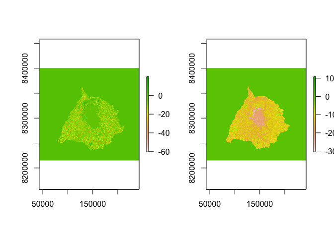
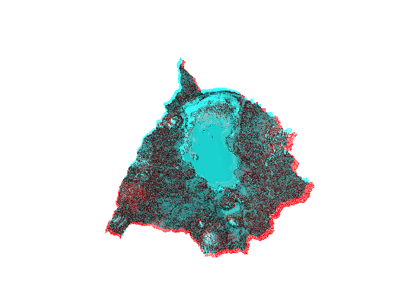

# InSAR-Landsat time series analysis of wetland dynamics in the Lake Chilwa Basin"

#### **Author: "Murphy, S."**

#### **Date: "2024-08-24"**

# Objective

~~Lake Chilwa recessions 1879, 1900, 1914-15, 1922, 1931-32, 1934, 1954, 1960-61, 1967, 1973, 1995 and 2012.~~

Project AOI

``` r
tmap::tmap_mode("plot")
tmap::tmap_options(check.and.fix = T)
aoi = read_sf("./inputs/chilwa_watershed_4326.shp") 
sigma0_wet = raster::raster("./outputs/sar/Sigma_VV_db_slv_WET.tif")
sigma0_dry = raster::raster("./outputs/sar/Sigma_VV_db_mst_DRY.tif")
multi_temp = raster::stack(sigma0_wet, sigma0_dry)
bbox = terrainr::add_bbox_buffer(aoi, 40000, distance_unit = "meters") 
vbox = ext(vect(bbox))
  
sites_locator <- st_as_sf(data.frame(
  longitude = c(32, 36), latitude = c(-8,-16)), 
  coords = c("longitude", "latitude"), crs = 4326, agr = "constant")

malawi = ggplot(data = world) +
  geom_sf(fill = "antiquewhite1") +
  annotate(geom = "text", x = 35.5, y = -8.5, label = "Malawi", 
           color = "grey22", size = 4.5) +
  coord_sf(xlim = c(32, 36.5), ylim = c(-8.5, -18)) +
  xlab("Longitude")+ ylab("Latitude") + 
  theme(panel.grid.major = element_line(
    colour = gray(0.5), linetype = "dashed", size = 0.5), 
    panel.background = element_rect(fill = "aliceblue"),
    panel.border = element_rect(fill = NA))

chilwa <- ggplot(aoi) +
  geom_sf() +
  theme_void() +
  theme(
    panel.border = element_rect(fill = NA, colour = "black"),
    plot.background = element_rect(fill = "antiquewhite1")
  )

lake = ggplot(aoi) +
  theme_void() +
  geom_sf(lwd = 20, color = "red")

ggdraw() +
  draw_plot(malawi) +
  draw_plot(chilwa, height = 0.15, x = -0.05, y = 0.15) +
  draw_plot(lake, height = 0.02, x = 0.1, y = 0.4)

plotRGB(multi_temp, r=2, g=1, b=1, stretch="lin") #stretch="hist"
```


# InSAR dataset

SAR is effective for mapping water surfaces due to its sensitivity to backscatter differences between smooth water and rough land. Calm water yields low backscatter, while vegetated areas increase surface roughness and backscatter. Long wavelengths enhance penetration through vegetation, while urban structures can complicate backscatter interpretations by introducing double-bounce scattering effects. Wet soils also exhibit higher backscatter than dry soils due to their increased dielectric constant.

Environmental conditions, such as wind-driven waves, can further complicate water surface mapping. A common mapping approach involves thresholding backscatter values to distinguish between water and land. The backscatter contrast improves with higher incidence angles, and for polarization, HH is preferable for wetland detection, whereas VV is sensitive to soil moisture. Cross-polarization (HV or VH) effectively differentiates between woody and herbaceous vegetation.

Significant changes in water body extents, particularly due to land reclamation, have occurred in the Firth, notably resulting in a loss of intertidal areas. Regular monitoring of these changes is crucial for environmental management and conservation efforts.

Data was acquired from the Copernicus Dataspace, downloaded to local directory, examined, cleaned and prepared for batch processing. A batch processing script was derived in `.xml` format using the SNAP graphical application, which was then exported and deployed using the `gpt` command-line shell. This image pre-processing included several radiometric, geometric, intensity and phase corrections, as shown below.


``` r
dir_in      = "/Volumes/TOSHIBA_EXT/chilwa/data/raw_cube/SAR/inputs"
dir_out      = "/Volumes/TOSHIBA_EXT/chilwa/data/reg_cube/SAR/outpus"

cube_s1 <- sits_cube(
  source     = "CDSE",
  collection = "SENTINEL-1-RTC",
  roi        = aoi,
  bands      = c("VV", "VH"),
  orbit      = "descending",
  start_date = "2014-11-01",
  end_date   = "2014-12-01",
  output_dir = dir_in
)

cube_s1_reg <- sits_regularize(
  cube       = cube_s1,
  period     = "P1M",
  res        = 10,
  roi        = aoi,
  memsize    = 12,
  multicores = 8,
  output_dir = dir_in
)

#s1_list_dry     = list.files(dir_in, pattern = '2014$', full.names   = T)
s1_list      = list.files(dir_wet, pattern = '.tiff$', full.names   = T)
rast_list    = lapply(s1_list, raster)
rast_merge   = do.call(merge, c(rast_list, tolerance = 1))

# rectify rotational angles
s1_1         = rast(s1_list[1])
s1_2         = rast(s1_list[2])
s1_3         = rast(s1_list[3])
s1_1_rectify = rectify(s1_1, aoi = vbox)
s1_2_rectify = rectify(s1_2, aoi = vbox)
s1_3_rectify = rectify(s1_3, aoi = vbox)

# apply mask & extract subsets
s1_1_crop    = terra::crop(s1_1_rectify, vect(aoi), mask=T)
s1_2_crop    = terra::crop(s1_2_rectify, vect(aoi), mask=T)
s1_3_crop    = terra::crop(s1_3_rectify, vect(aoi), mask=T)

# resample slaves to master images
master = s1_1_crop
s1_3_resampled = resample(s1_3_crop, master)
s1_2_resampled = resample(s1_2_crop, master)
s1_1_resampled = resample(s1_1_crop, master)

#Matrices for gradient calculation: jensenda11/Landfast_Ice_Algorithm 
m<- matrix(c(-1/2,0,1/2))
m1<- cbind(0,m,0)
m2<- rbind(0,t(m),0)

# Prep for horizontal & vertical calibration
igrad1<- focal(s1_1_resampled, m1)
jgrad1<- focal(s1_1_resampled, m2)
igrad2<- focal(s1_2_resampled, m1)
jgrad2<- focal(s1_2_resampled, m2)
igrad3<- focal(s1_3_resampled, m1)
jgrad3<- focal(s1_3_resampled, m2)
rm(s1_1_resampled, s1_2_resampled, s1_3_resampled) 

#Horizontal correction
hori1<- abs(jgrad1-jgrad2)
hori2<- abs(jgrad1-jgrad3)
hori3<- abs(jgrad2-jgrad3)
hori_field<- hori1 + hori2 + hori3

#Vertical correction
vert1<- abs(igrad1-igrad2)
vert2<- abs(igrad1-igrad3)
vert3<- abs(igrad2-igrad3)
vert_field<- vert1 + vert2 + vert3

#Magnitude correction
mag<- sqrt((vert_field^2)+(hori_field^2))
writeRaster(mag, "./inputs/gradient.tif", overwrite = T)
```

# InSAR batch processing

``` r
# define input/output paths 
gpt = "/Applications/esa-snap/gpt.sh"
dir_in = "/Volumes/TOSHIBA_EXT/chilwa/data/raw_cube/SAR/inputs"
dir_out = "/Volumes/TOSHIBA_EXT/chilwa/data/raw_cube/SAR/outputs"

# compile xml scripts from your SNAP graph folder  
graphXml_files = list.files(
  "/Users/seamus/SAR", 
  pattern=glob2rx("*.xml"), 
  full.names = TRUE
  )

for(xml_file in graphXml_files){
  print(xml_file)
  }

# compile input images
input_files = list.files(dir_in, 
  pattern=glob2rx("S2A_MSIL2A*.SAFE"),
  full.names = TRUE
  )

for(infile in input_files){
  print(infile)
}

# testing
for(infile in input_files){
  print(paste0("Processing file ", infile))
for(xml_file in graphXml_files){
    print(xml_file)
# copy xml filename and apply prefix to output file
prefix = substring(basename(xml_file), 1, nchar(basename(xml_file))-4)
outname = substring(basename(infile), 1, nchar(basename(infile))-5)
outfile = paste0(output_path, "/", prefix, "_", outname, ".dim")
# shortcut for graph processing tool
cmd = paste0(gpt," ", xml_file," -e -t ", outfile," -Pinfile=", infile)
    system(cmd)
  }
}
```

# InSAR Visualization

``` r
sigma0_wet = raster::raster("./outputs/sar/Sigma_VV_db_slv_WET.tif")
sigma0_dry = raster::raster("./outputs/sar/Sigma_VV_db_mst_DRY.tif")
multi_temp = raster::stack(sigma0_wet, sigma0_dry)
par(mfrow = c(1, 2))
plot(sigma0_wet)
plot(sigma0_dry)
```

<!-- -->

``` r
par(mfrow = c(1, 1))
plotRGB(multi_temp, r=2, g=1, b=1, stretch="lin") #stretch="hist"
```

<!-- -->

# Landsat time series cube

``` r
dir_raw      = "/Volumes/TOSHIBA_EXT/chilwa/data/raw_cube/MPC"
dir_reg      = "/Volumes/TOSHIBA_EXT/chilwa/data/reg_cube/MPC"

cube <- sits_cube(
  source     = "MPC",
  collection = "LANDSAT-C2-L2",
  bands      = c("BLUE", "GREEN", "RED", "NIR08", "SWIR16", "SWIR22", "CLOUD"),
  start_date = "1994-07-01",
  end_date   = "2015-07-01",
  roi        = bbox
)

# Faster when cube saved locally
cube_raw = sits_cube_copy(
  cube,
  roi        = aoi,
  res        = 30,
  n_tries    = 5,
  output_dir = dir_raw,
  progress   = T
)

# Normalize by cloudless pixel ranking & monthly medians
cube_reg <- sits_regularize(
  cube       = cube_raw,
  output_dir = dir_reg,
  res        = 30,
  period     = "P1M",
  multicores = 8
)
```

``` r
cube_index = sits_apply(
  NDVI       = (NIR08 - RED) / (NIR08 + RED), 
  data       = cube_reg,
  output_dir = dir_reg,
  memsize    = 4,
  multicores = 6,
  progress   = T
  )

cube_index = sits_apply(
  NDWI       = (GREEN - NIR08) / (GREEN + NIR08), 
  data       = cube_index,
  output_dir = dir_reg,
  memsize    = 6,
  multicores = 8,
  progress   = T
  )

cube_index = sits_apply(
  MNDWI      = (GREEN - SWIR16) / (GREEN + SWIR16),
  data       = cube_index,
  output_dir = dir_reg,
  memsize    = 6,
  multicores = 8,
  progress   = T
  ) 

cube_index = sits_apply(
  NDPI       = (SWIR16 - GREEN) / (SWIR16 + GREEN),
  data       = cube_index,
  output_dir = dir_reg,
  memsize    = 6,
  multicores = 8,
  progress   = T
  )

cube_index = sits_apply(
  AWEIsh     = (BLUE+2.5(GREEN)−1.5(NIR+SWIR1)−0.25(SWIR2)),
  data       = cube_index,
  output_dir = dir_reg,
  memsize    = 6,
  multicores = 8,
  progress   = T
  )

cube_index = sits_apply(
  NDPI       = (SWIR16 - GREEN) / (SWIR16 + GREEN),
  data       = cube_index,
  output_dir = dir_reg,
  memsize    = 6,
  multicores = 8,
  progress   = T
  )
  
cube_index = sits_apply(
  WRI        = (GREEN + RED) / (NIR08 + SWIR16),
  data       = cube_reg,
  output_dir = dir_reg,
  memsize    = 6,
  multicores = 8,
  progress   = T
  )
```

# Training sample

``` r
# run to manually derive training plots from multi-temporal InSAR wetland image
points <- plotRGB(multi_temp, r=2, g=1, b=1, stretch="lin") %>% editMap()
clouds <- points$finished$geometry %>% st_sf() %>% 
  mutate(class = "clouds", id = 1)
forest <- points$finished$geometry %>% st_sf() %>% 
  mutate(class = "clouds", id = 1)
grassland <- points$finished$geometry %>% st_sf() %>% 
  mutate(class = "clouds", id = 1)
cropland <- points$finished$geometry %>% st_sf() %>% 
  mutate(class = "clouds", id = 1)
wetland <- points$finished$geometry %>% st_sf() %>% 
  mutate(class = "clouds", id = 1)
bare_land  <- points$finished$geometry %>% st_sf() %>% 
  mutate(class = "clouds", id = 1)
water  <- points$finished$geometry %>% st_sf() %>% 
  mutate(class = "clouds", id = 1)
```
