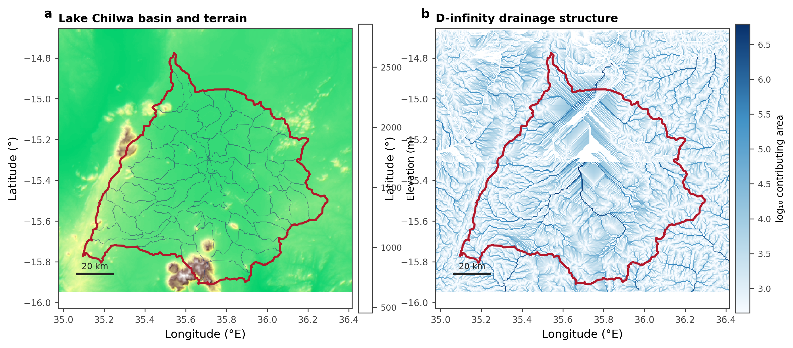
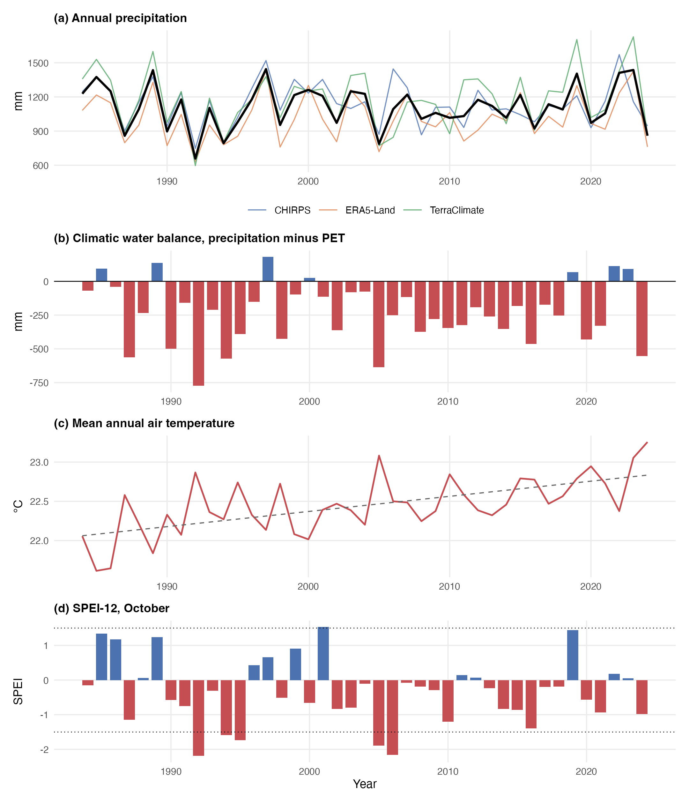
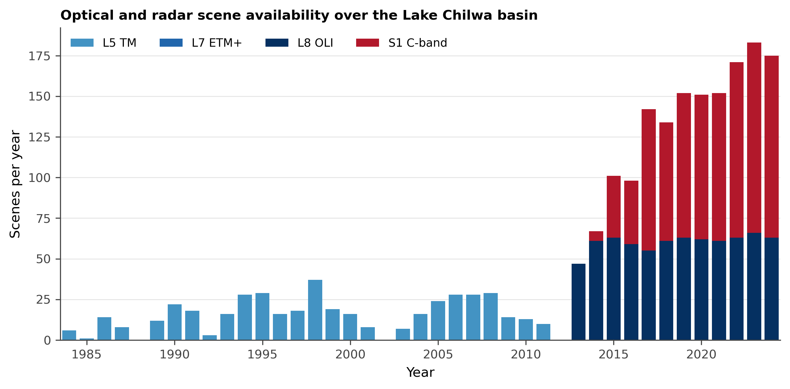
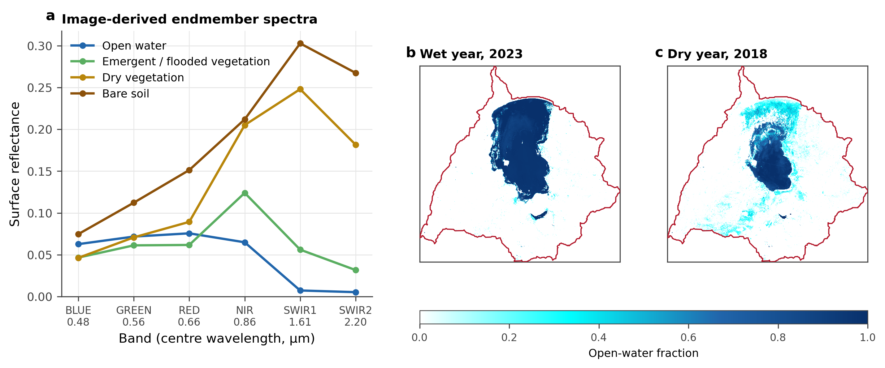
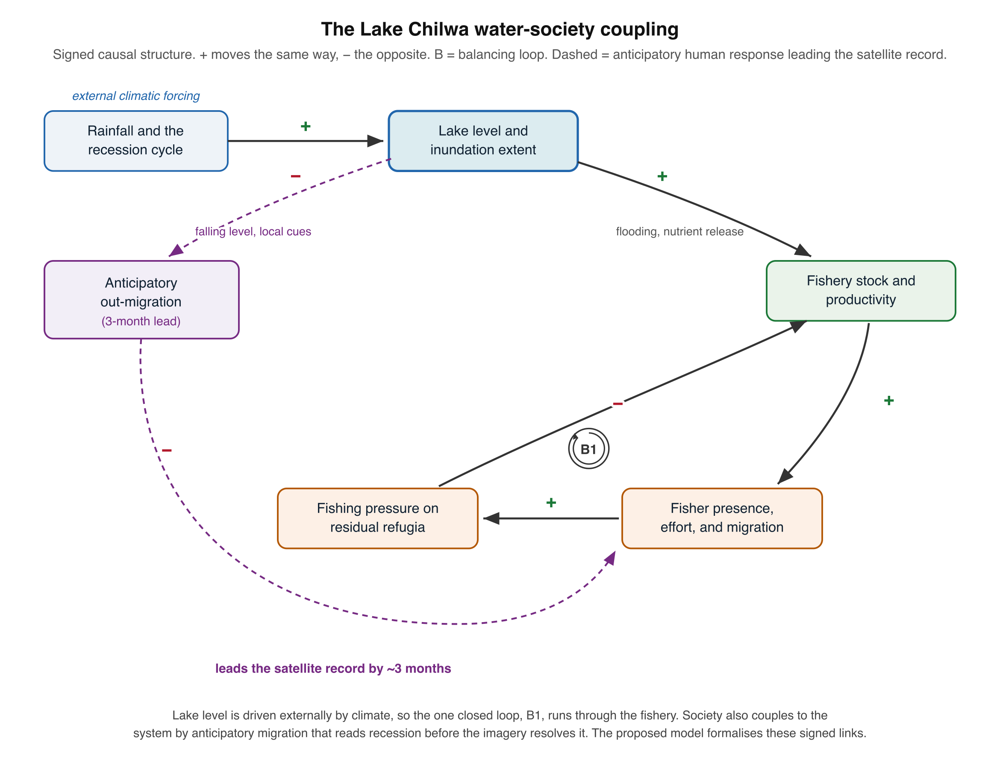

# Mapping the wetland inundation dynamics of Lake Chilwa’s recession and refilling cycles using multisource remote sensing data

### Integrating optical-radar time-series data with participatory mapping of migrant fishing communities

Seamus Murphy, John Wilson, Lauren K Banks

Corresponding author: seamusrobertmurphy\@gmail.com

> Outputs mirrored from the master manuscript `01.manuscript/Manuscript_2026-07-30.qmd`. Rendered draft: `01.manuscript/DOCX/Manuscript_2026-07-30.docx`.

## Abstract

Wetlands rank among the most valuable ecosystems on Earth and the hardest to monitor, nowhere more so than in sub-Saharan Africa. The binding constraint is the detection of water standing beneath emergent vegetation: optical sensors cannot resolve it in principle, C-band radar resolves it only conditionally, and the state of the art commonly answers by excluding the class. Because vegetated water can constitute most of a wetland's inundated area, omitting it misstates extent, hydroperiod, and flood timing. We take that problem as our primary objective in the Lake Chilwa basin, a shallow endorheic lake in southern Malawi that recedes and refills on a cycle of roughly fifteen years and whose migratory fishery tracks the water. We build one model from four components: a harmonised Landsat record spanning 1984 to 2024 with five spectral water indices; Sentinel-1 C-band and ALOS PALSAR L-band backscatter; sub-pixel cover fractions fitted by spectral endmember mixture analysis; and training labels from participatory mapping with fishing communities, who observe water beneath the vegetation directly. Within the self-derived 8,752 km² basin, sub-pixel open water averaged 1,225 km², peaking at 2,083 km² in 2024 and falling to 835 km² in the 1995 recession, two fifths of peak extent. Open water and emergent vegetation are anti-correlated, so the wetland compensates as the lake retreats and the combined footprint, 2,807 km² at the 2023 refill, varies far less than open water alone. Mapping the footprint rather than the lake changes how recession reads hydrologically, and the fieldwork records the migration and enforcement patterns satellites cannot.

**Keywords:** Wetland inundation dynamics; SAR backscatter; Spectral mixture analysis; Participatory mapping; Socio-hydrological systems; Endorheic lakes; Lake Chilwa.

## Summary

Surface water and open water are treated as synonyms, so surface-water products report only the fraction of the water that lies open to the sky. At Lake Chilwa most of the water stands within emergent vegetation, so we measure surface water as open water plus vegetated water, using fisher observation to supply the labels no sensor and no image interpreter can. The record spans 1984 to 2024 within a self-derived basin, combining harmonised Landsat optical reflectance and five water indices, Sentinel-1 C-band and ALOS PALSAR L-band backscatter, sub-pixel cover fractions from spectral endmember mixture analysis, and participatory mapping with the basin's migrant fishing communities.

------------------------------------------------------------------------

## Analysis outputs

### Study area and terrain

*The self-derived basin. (a) Basin boundary and sub-basins on the SRTM terrain surface. (b) D-infinity contributing area on a log10 scale, computed on the least-cost depression-breached surface. Terrain is SRTM 1 arc-second at 30 m; the 15 arc-second SRTM15Plus product used in earlier drafts is retired.*

### Temporal coverage of each data stream

| Data stream | Coverage | Gaps |
|---|---|---|
| Landsat 5, 7, and 8, harmonised | 1984 to 2024, 37 annual composites | 1985, 1988, 2002, and 2012 absent |
| Sentinel-1 C-band | 2015 to 2024, monthly composites | 2016 absent; 2014 scenes too few to composite |
| ALOS PALSAR L-band | 2007 to 2010, 2015 to 2024 | 2011 to 2014 absent between the two missions |
| Field photographs | 2011 to 2014, 244 frames | 219 fall in February to June 2012; 21 carry unusable camera-clock defaults |
| Participatory and interview record | September 2012 to March 2014 | Continuous |
| Climate reanalysis and satellite | 1984 to 2024, 492 monthly steps | Continuous; TerraClimate and SPEI end December 2024 |

*Table 1: Temporal coverage of each data stream, with the gaps that constrain cross-sensor comparison. The absence of Landsat in 2012 and of L-band between 2011 and 2014 leaves the 2012 recession observable only through the adjacent years and the participatory record.*

### Climatic setting

*Climatic setting of the Lake Chilwa basin, 1984 to 2024, over the same window as the optical and radar record. (a) Annual precipitation from CHIRPS, TerraClimate, and ERA5-Land, with their mean in black. (b) Climatic water balance, precipitation minus potential evapotranspiration; the deficit is the normal state and only seven years are positive. (c) Mean annual air temperature, rising at 0.19 °C per decade. (d) Twelve-month SPEI at October, with the conventional thresholds at plus and minus 1.5.*

### Sensor availability

*Optical and radar scene availability over the Lake Chilwa basin, 1984 to 2024. Landsat carries the record from 1984; Sentinel-1 C-band adds dense coverage from 2015.*

### Spectral water indices evaluated

| Index | Formula | Lake Chilwa Application |
|---|---|---|
| NDWI (McFeeters, 1996) | (Green - NIR) / (Green + NIR) | The original water index, sensitive to deep open water but prone to false negatives in turbid, shallow, or vegetated conditions because suspended sediment and vegetation raise NIR reflectance; the baseline against which the others are compared. |
| MNDWI (Xu, 2006) | (Green - SWIR1) / (Green + SWIR1) | Substitutes SWIR for NIR, improving discrimination of water from built-up and bare-soil surfaces; the strongest single optical index for turbid water, though it fails beneath emergent vegetation and requires adaptive thresholding in saline systems. |
| AWEIsh (Feyisa et al., 2014) | Blue + 2.5 x Green - 1.5 x (NIR + SWIR1) - 0.25 x SWIR2 | A five-band combination optimised for shadow suppression and complex-landscape discrimination; outperforms simpler indices where topographic or shadow effects confound classification but offers no clear advantage in shallow vegetated wetlands. |
| WRI (Shen and Li, 2010) | (Green + Red) / (NIR + SWIR1) | A ratio index that suppresses cloud and shadow noise effectively; competitive in bare-soil landscapes but vulnerable to inflation from suspended sediment in the red band, and untested in endorheic systems. |
| NDPI (Lacaux et al., 2007) | (SWIR1 - Green) / (SWIR1 + Green) | Designed for temporary pond detection in semi-arid Africa using SPOT-5 data; the algebraic inverse of MNDWI, sensitive to the water-vegetation boundary where other indices fail, most appropriate for Lake Chilwa’s seasonal vegetated margins but weaker in deep or turbid water. |

### Figure 1: Inundation record

*Figure 1: Reconstructed inundation of the Lake Chilwa basin, 1984 to 2024. (a) Basin-mean open-water and emergent, flooded-vegetation fractions from spectral mixture analysis, with the record mean, the principal recession troughs, and the 2023 to 2024 refill marked. (b) Usable Landsat scenes per year, the sampling density behind each annual estimate.*

### Figure 2: Spectral-index performance

*Figure 2: Spectral-index behaviour, 1984 to 2024. (a) Standardised annual anomalies of the five water indices against the spectral-mixture open-water record. (b) Pearson correlation of each index with that record; WRI and MNDWI track inundation most closely, and NDPI is the inverse of MNDWI.*

### Table 2: Index correlation matrix

|        |  NDWI | MNDWI | AWEIsh |   WRI |  NDPI |
|:-------|------:|------:|-------:|------:|------:|
| NDWI   |  1.00 |  0.31 |   0.75 |  0.66 | -0.31 |
| MNDWI  |  0.31 |  1.00 |   0.54 |  0.76 | -1.00 |
| AWEIsh |  0.75 |  0.54 |   1.00 |  0.59 | -0.54 |
| WRI    |  0.66 |  0.76 |   0.59 |  1.00 | -0.76 |
| NDPI   | -0.31 | -1.00 |  -0.54 | -0.76 |  1.00 |

*Table 2: Pairwise Pearson correlation among the five water indices, basin-mean annual values, 1984 to 2024. NDPI is the exact inverse of MNDWI.*

### Figure 3: SAR dynamics

*Figure 3: SAR dynamics of the Lake Chilwa basin. (a) Sentinel-1 monthly climatology of VV and VH backscatter and the derived water fraction, 2015 to 2024. (b) Sentinel-1 monthly water fraction through the record, showing the 2023 to 2024 step-up. (c) ALOS PALSAR L-band annual HH and HV backscatter and their difference, the double-bounce term sensitive to flooded vegetation.*

### Spectral mixture analysis

*Image-derived spectral endmembers and the fractions they resolve. (a) Median surface-reflectance spectrum of each of the four endmembers, from spectrally pure pixels of the 2020 dry-season Landsat composite. (b, c) Sub-pixel open-water fraction for a wet year, 2023, and a recession year, 2018.*

### SAR processing chain

*Sentinel-1 C-band pre-processing chain, and a C-band render of the basin in which smooth open water returns dark against brighter land and vegetation.*

### Socio-hydrological coupling

*The Lake Chilwa water-society coupling: a signed causal-loop structure. Lake level is driven exogenously by climate; society couples to the system through the fishery it exploits and through anticipatory out-migration that leads the satellite record by about three months. The proposed model formalises these signed links.*

------------------------------------------------------------------------

## Data outputs

| File | Contents |
|:---|:---|
| `03.outputs/CSV/landsat_annual_indices.csv` | Annual basin-mean water indices, 1984-2024 |
| `03.outputs/CSV/sma_annual_fractions.csv` | Sub-pixel open-water and flooded-vegetation fractions |
| `03.outputs/CSV/sma_endmember_spectra.csv` | Image-derived endmember reflectance spectra |
| `03.outputs/CSV/s1_monthly_timeseries.csv` | Sentinel-1 monthly backscatter and water fraction |
| `03.outputs/CSV/palsar_lband_annual.csv` | ALOS PALSAR L-band annual backscatter |
| `03.outputs/CSV/climate_monthly.csv` | Basin-mean precipitation, PET, temperature, SPEI, monthly |
| `03.outputs/CSV/climate_annual.csv` | The same aggregated annually, 1984-2024 |
| `03.outputs/CSV/sensor_availability_by_year.csv` | Usable scenes per sensor per year |
| `03.outputs/CSV/photo_sessions_labelled.csv` | 38 field photo sessions with reviewed cover class |
| `03.outputs/SHP/chilwa_basin.shp` | Analysis boundary |
| `03.outputs/DEM/` | SRTM 1 arc-second terrain and D-infinity grids |

