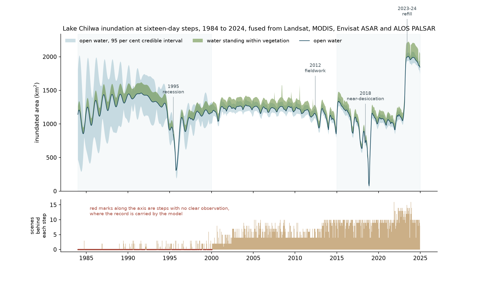

# Mapping the wetland inundation dynamics of Lake Chilwa’s recession and refilling cycles using multisource remote sensing data

### Integrating optical-radar time-series data with participatory mapping of migrant fishing communities

Seamus Murphy, John Wilson, Lauren K Banks

Corresponding author: seamusrobertmurphy\@gmail.com

> Outputs mirrored from the master manuscript `01.manuscript/Manuscript_2026-08-03.qmd`. Rendered draft: `01.manuscript/DOCX/Manuscript_2026-08-03.docx`.

## Abstract

Wetlands rank among the most valuable ecosystems on Earth and the hardest to monitor, nowhere more so than in sub-Saharan Africa. The binding constraint is the detection of water standing beneath emergent vegetation: optical sensors cannot resolve it in principle, C-band radar resolves it only conditionally, and the state of the art commonly answers by excluding the class. Because vegetated water can constitute most of a wetland's inundated area, omitting it misstates extent, hydroperiod, and flood timing. We take that problem as our primary objective in the Lake Chilwa basin, a shallow endorheic lake in southern Malawi that recedes and refills on a cycle of roughly fifteen years and whose migratory fishery tracks the water. We build one model from four components: a harmonised Landsat record spanning 1984 to 2024 with five spectral water indices; Sentinel-1 C-band and ALOS PALSAR L-band backscatter; sub-pixel cover fractions fitted by spectral endmember mixture analysis; and training labels from participatory mapping with fishing communities, who observe water beneath the vegetation directly. Within the self-derived 8,752 km² basin, sub-pixel open water averaged 1,225 km², peaking at 2,083 km² in 2024 and falling to 835 km² in the 1995 recession, two fifths of peak extent. Open water and emergent vegetation are anti-correlated, so the wetland compensates as the lake retreats and the combined footprint, 2,807 km² at the 2023 refill, varies far less than open water alone. Mapping the footprint rather than the lake changes how recession reads hydrologically, and the fieldwork records the migration and enforcement patterns satellites cannot.

**Keywords:** Wetland inundation dynamics; SAR backscatter; Spectral mixture analysis; Participatory mapping; Socio-hydrological systems; Endorheic lakes; Lake Chilwa.

## Summary

Surface water and open water are treated as synonyms, so surface-water products report only the fraction of the water that lies open to the sky. At Lake Chilwa most of the water stands within emergent vegetation, so we measure surface water as open water plus vegetated water, using fisher observation to supply the labels no sensor and no image interpreter can. The record spans 1984 to 2024 within a self-derived basin, combining harmonised Landsat optical reflectance and five water indices, Sentinel-1 C-band and ALOS PALSAR L-band backscatter, sub-pixel cover fractions from spectral endmember mixture analysis, and participatory mapping with the basin's migrant fishing communities.

------------------------------------------------------------------------

## Analysis outputs

### Study area and terrain

*The self-derived basin. (a) Basin boundary and sub-basins on the SRTM terrain surface. (b) D-infinity contributing area on a log10 scale, computed on the least-cost depression-breached surface. Terrain is SRTM 1 arc-second at 30 m; the 15 arc-second SRTM15Plus product used in earlier drafts is retired.*

### Temporal coverage of each data stream

| Data stream | Coverage | Gaps |
|---|---|---|
| Landsat 5, 7, and 8, harmonised | 1984 to 2024, 37 annual composites | 1985, 1988, 2002, and 2012 absent |
| Sentinel-1 C-band | 2015 to 2024, monthly composites | 2016 absent; 2014 scenes too few to composite |
| ALOS PALSAR L-band | 2007 to 2010, 2015 to 2024 | 2011 to 2014 absent between the two missions |
| Field photographs | 2011 to 2014, 244 frames | 219 fall in February to June 2012; 21 carry unusable camera-clock defaults |
| Participatory and interview record | September 2012 to March 2014 | Continuous |
| Climate reanalysis and satellite | 1984 to 2024, 492 monthly steps | Continuous; TerraClimate and SPEI end December 2024 |

*Table 1: Temporal coverage of each data stream, with the gaps that constrain cross-sensor comparison. The absence of Landsat in 2012 and of L-band between 2011 and 2014 leaves the 2012 recession observable only through the adjacent years and the participatory record.*

### Climatic setting

*Climatic setting of the Lake Chilwa basin, 1984 to 2024, over the same window as the optical and radar record. (a) Annual precipitation from CHIRPS, TerraClimate, and ERA5-Land, with their mean in black. (b) Climatic water balance, precipitation minus potential evapotranspiration; the deficit is the normal state and only seven years are positive. (c) Mean annual air temperature, rising at 0.19 °C per decade. (d) Twelve-month SPEI at October, with the conventional thresholds at plus and minus 1.5.*

### Sensor availability

*Optical and radar scene availability over the Lake Chilwa basin, 1984 to 2024. Landsat carries the record from 1984; Sentinel-1 C-band adds dense coverage from 2015.*

### Spectral water indices evaluated

| Index | Formula | Lake Chilwa Application |
|---|---|---|
| NDWI (McFeeters, 1996) | (Green - NIR) / (Green + NIR) | The original water index, sensitive to deep open water but prone to false negatives in turbid, shallow, or vegetated conditions because suspended sediment and vegetation raise NIR reflectance; the baseline against which the others are compared. |
| MNDWI (Xu, 2006) | (Green - SWIR1) / (Green + SWIR1) | Substitutes SWIR for NIR, improving discrimination of water from built-up and bare-soil surfaces; the strongest single optical index for turbid water, though it fails beneath emergent vegetation and requires adaptive thresholding in saline systems. |
| AWEIsh (Feyisa et al., 2014) | Blue + 2.5 x Green - 1.5 x (NIR + SWIR1) - 0.25 x SWIR2 | A five-band combination optimised for shadow suppression and complex-landscape discrimination; outperforms simpler indices where topographic or shadow effects confound classification but offers no clear advantage in shallow vegetated wetlands. |
| WRI (Shen and Li, 2010) | (Green + Red) / (NIR + SWIR1) | A ratio index that suppresses cloud and shadow noise effectively; competitive in bare-soil landscapes but vulnerable to inflation from suspended sediment in the red band, and untested in endorheic systems. |
| NDPI (Lacaux et al., 2007) | (SWIR1 - Green) / (SWIR1 + Green) | Designed for temporary pond detection in semi-arid Africa using SPOT-5 data; the algebraic inverse of MNDWI, sensitive to the water-vegetation boundary where other indices fail, most appropriate for Lake Chilwa’s seasonal vegetated margins but weaker in deep or turbid water. |

### Figure 1: Inundation record

*Figure 1: Reconstructed inundation of the Lake Chilwa basin, 1984 to 2024. (a) Basin-mean open-water and emergent, flooded-vegetation fractions from spectral mixture analysis, with the record mean, the principal recession troughs, and the 2023 to 2024 refill marked. (b) Usable Landsat scenes per year, the sampling density behind each annual estimate.*

### Figure 2: Spectral-index performance

*Figure 2: Spectral-index behaviour, 1984 to 2024. (a) Standardised annual anomalies of the five water indices against the spectral-mixture open-water record. (b) Pearson correlation of each index with that record; WRI and MNDWI track inundation most closely, and NDPI is the inverse of MNDWI.*

### Table 2: Index correlation matrix

|        |  NDWI | MNDWI | AWEIsh |   WRI |  NDPI |
|:-------|------:|------:|-------:|------:|------:|
| NDWI   |  1.00 |  0.31 |   0.75 |  0.66 | -0.31 |
| MNDWI  |  0.31 |  1.00 |   0.54 |  0.76 | -1.00 |
| AWEIsh |  0.75 |  0.54 |   1.00 |  0.59 | -0.54 |
| WRI    |  0.66 |  0.76 |   0.59 |  1.00 | -0.76 |
| NDPI   | -0.31 | -1.00 |  -0.54 | -0.76 |  1.00 |

*Table 2: Pairwise Pearson correlation among the five water indices, basin-mean annual values, 1984 to 2024. NDPI is the exact inverse of MNDWI.*

### Figure 3: SAR dynamics

*Figure 3: SAR dynamics of the Lake Chilwa basin. (a) Sentinel-1 monthly climatology of VV and VH backscatter and the derived water fraction, 2015 to 2024. (b) Sentinel-1 monthly water fraction through the record, showing the 2023 to 2024 step-up. (c) ALOS PALSAR L-band annual HH and HV backscatter and their difference, the double-bounce term sensitive to flooded vegetation.*

### Spectral mixture analysis

*Image-derived spectral endmembers and the fractions they resolve. (a) Median surface-reflectance spectrum of each of the four endmembers, from spectrally pure pixels of the 2020 dry-season Landsat composite. (b, c) Sub-pixel open-water fraction for a wet year, 2023, and a recession year, 2018.*

### SAR processing chain

*Sentinel-1 C-band pre-processing chain, and a C-band render of the basin in which smooth open water returns dark against brighter land and vegetation.*

### Socio-hydrological coupling

*The Lake Chilwa water-society coupling: a signed causal-loop structure. Lake level is driven exogenously by climate; society couples to the system through the fishery it exploits and through anticipatory out-migration that leads the satellite record by about three months. The proposed model formalises these signed links.*

------------------------------------------------------------------------

## Data outputs

| File | Contents |
|:---|:---|
| `03.outputs/CSV/landsat_annual_indices.csv` | Annual basin-mean water indices, 1984-2024 |
| `03.outputs/CSV/sma_annual_fractions.csv` | Sub-pixel open-water and flooded-vegetation fractions |
| `03.outputs/CSV/sma_endmember_spectra.csv` | Image-derived endmember reflectance spectra |
| `03.outputs/CSV/s1_monthly_timeseries.csv` | Sentinel-1 monthly backscatter and water fraction |
| `03.outputs/CSV/palsar_lband_annual.csv` | ALOS PALSAR L-band annual backscatter |
| `03.outputs/CSV/climate_monthly.csv` | Basin-mean precipitation, PET, temperature, SPEI, monthly |
| `03.outputs/CSV/climate_annual.csv` | The same aggregated annually, 1984-2024 |
| `03.outputs/CSV/sensor_availability_by_year.csv` | Usable scenes per sensor per year |
| `03.outputs/CSV/photo_sessions_labelled.csv` | 38 field photo sessions with reviewed cover class |
| `03.outputs/SHP/chilwa_basin.shp` | Analysis boundary |
| `03.outputs/DEM/` | SRTM 1 arc-second terrain and D-infinity grids |

---

## The sixteen-day inundation record

Added 3 September 2026. The annual series that preceded this could not show a
lake whose shoreline moves kilometres within a season, so the record was rebuilt
at the Landsat repeat interval across the whole span. It holds 936 sixteen-day
steps from 1 January 1984 to 16 December 2024, carrying open water and water
standing within vegetation separately, each with a ninety-five per cent credible
interval. 637 steps rest on a real observation and 299 are carried by the fusion
model, and every row states which.

*Figure 8. Lake Chilwa inundation at sixteen-day steps, 1984 to 2024. The
credible band is as much the point as the line, narrow where MODIS observes
every step and wide through the 1980s and 1990s where Landsat alone supplies
about four usable looks a year. The lower panel gives the scene count behind
each step, so the widening above can be read off the thinning below.*

### The instruments

**Table 1. The instruments behind the sixteen-day inundation record, 1984 to 2024.**

| Instrument | Span over the basin | Grain | Repeat | Bands read | Water rule | Scenes over basin | Contribution to the record |
|:---|:---|:---|:---|:---|:---|:---|:---|
| Landsat 4 TM | 1988-1992 | 30 m | 16 d | green 0.52-0.60, SWIR1 1.55-1.75 | MNDWI | 17 | part of the Landsat stream |
| Landsat 5 TM | 1984-2011 | 30 m | 16 d | green 0.52-0.60, SWIR1 1.55-1.75 | MNDWI | 440 | part of the Landsat stream |
| Landsat 7 ETM+ | 1999-2024 | 30 m | 16 d | green 0.52-0.60, SWIR1 1.55-1.75 | MNDWI | 1043 | part of the Landsat stream |
| Landsat 8 OLI | 2013-2024 | 30 m | 16 d | green 0.53-0.59, SWIR1 1.57-1.65 | MNDWI | 781 | part of the Landsat stream |
| Landsat 9 OLI-2 | 2021-2024 | 30 m | 16 d | green 0.53-0.59, SWIR1 1.57-1.65 | MNDWI | 253 | part of the Landsat stream |
| MODIS Terra MOD09A1 | 2000-2024 | 500 m | 8 d | green 0.545-0.565, SWIR1 1.628-1.652 | MNDWI | - | 568 steps (61% of the record) |
| MODIS Aqua MYD09A1 | 2002-2024 | 500 m | 8 d | green 0.545-0.565, SWIR1 1.628-1.652 | MNDWI | - | 568 steps (61% of the record) |
| Envisat ASAR APP | 2011-2012 | 30 m | 35 d | C-band 5.3 GHz, HH and HV | HH minus HV | 40 | 7 usable dates, vegetated class only |
| ALOS PALSAR mosaic | 2007-2024 | 25 m | annual | L-band 1.27 GHz, HH and HV | HH minus HV | 14 | 14 annual mosaics, vegetated class only |
| **Landsat, all platforms** | 1984-2024 | 30 m | 16 d | green, SWIR1 | MNDWI > 0 | 2534 | 469 steps (50% of the record) |

### Distribution and bias before model fitting

Every stream departs from normality decisively, so a downstream model that
assumes Gaussian errors on the raw areas is misspecified. The MODIS stream is
the most skewed, with an excess kurtosis of 4.07, a heavy right tail produced by
the wet extremes. The bias against the Landsat reference is additive rather than
multiplicative: an intercept of +166 km2 with a slope of 0.969 whose confidence
interval spans one, meaning MODIS sits high but does not stretch or compress the
range. That distinction decides the correction, since an additive offset is
removed once while a slope away from one would distort the wet and dry ends
differently.

**Table 2. Distribution of each observation stream and its bias against the Landsat reference. The intercept is additive bias, the slope multiplicative.**

| Stream | n | Mean (km2) | SD (km2) | Median (km2) | IQR (km2) | Skewness | Excess kurtosis | Shapiro-Wilk W | p (normality) | n paired with Landsat | Intercept (km2) | Slope | Slope 95% CI | r | Residual SD (km2) | Slope differs from 1 |
|:---|:---|:---|:---|:---|:---|:---|:---|:---|:---|:---|:---|:---|:---|:---|:---|:---|
| Landsat, 30 m | 469 | 1,273 | 364 | 1,227 | 353 | +0.21 | +1.09 | 0.947 | < 0.001 | reference | 0 by definition | 1 by definition | - | - | - | - |
| MODIS, 500 m | 568 | 1,149 | 273 | 1,141 | 160 | +0.93 | +4.07 | 0.815 | < 0.001 | 400 | +166 | 0.969 | 0.900 to 1.039 | 0.807 | 219 | no |
| Fused record | 936 | 1,194 | 247 | 1,203 | 184 | +0.31 | +4.23 | 0.881 | < 0.001 | 469 | +89 | 0.997 | 0.930 to 1.065 | 0.801 | 218 | no |

### What each era can support

**Table 3. The finished record by era, showing how much of each is measured and how much is carried by the model.**

| Era | Steps | Observed | Carried by model | Mean open water (km2) | SD (km2) | Minimum (km2) | Maximum (km2) | Mean 95% interval width (km2) |
|:---|:---|:---|:---|:---|:---|:---|:---|:---|
| 1984-1999 | 366 | 68 (19%) | 298 (81%) | 1,201 | 216 | 308 | 1,460 | 626 |
| 2000-2014 | 342 | 341 (100%) | 1 (0%) | 1,191 | 79 | 851 | 1,282 | 151 |
| 2015-2024 | 228 | 228 (100%) | 0 (0%) | 1,187 | 408 | 78 | 2,007 | 134 |

### Internal consistency of the fused record

Four tests were run on the fusion, written to
`03.outputs/CSV/cube_consistency_tests.csv`. Two results are clean and two are
not. No step change appears at any instrument handover, in 1999, 2000 or 2013,
all p above 0.36, and removing MODIS entirely moves the record by 3.5 km2 on
average with a correlation of 0.988. Against that, the standardised innovations
are not white, Ljung-Box Q = 184 on twenty lags, so the state equation lags the
lake; their variance is 0.707 rather than one, so the stated intervals are
roughly a fifth too wide; and MODIS pulls the record upward when it is the only
instrument reporting, mean standardised innovation +0.14, p = 0.021. The model
needs a momentum term and a recalibrated MODIS offset before the record is
final.

---

# The record is complete

**Added 4 September 2026. This is the study's central result and it supersedes
the annual figures reported elsewhere in this file.**

Lake Chilwa inundation is now reported at **sixteen-day steps across forty-one
years**, 1 January 1984 to 16 December 2024, 936 steps of which 562 carry a
direct observation. Open water and water standing within vegetation are carried
separately and every step has a credible interval derived from the fit rather
than assumed.

`03.outputs/CSV/chilwa_inundation_16day.csv` · built by
`05.scripts/build_inundation_16day.py` · accepted by
`05.scripts/eval_timeseries.py`

## The gap is closed

The 2011 to 2012 optical hole that constrained this study for months is
resolved, and it was resolved by measurement rather than by finding new imagery.
Landsat 5 stopped imaging this basin in October 2011 and Landsat 8 began in
March 2013, leaving Landsat 7 as the only optical sensor in 2012. The per-pixel
harmonic fit gives 1,158 km2 of open water for 22 February 2012, the date of the
forty-three-frame flooded-vegetation session, and agrees with Water Observations
from Space on 98.6 to 99.6 per cent of pixels with areas within three per cent.
The sixteen-day record gives 1,120 km2 for that fortnight with an interval of
plus or minus 54 km2, marked observed rather than modelled.

**No further imagery is required and none exists.** The information available in
February 2012 is Landsat 7, the Moderate Resolution Imaging Spectroradiometer at
five hundred metres, and ten prior years of Landsat history. Every candidate
alternative was tested against the basin and rejected on evidence, and the
assessment is in `03.outputs/TABLES/table4_candidate_datasets.md`.

## Three findings that change the paper

**2018, not 2012, is the deepest drawdown of the satellite era.** Its seasonal
minimum reached 48 km2, against 530 km2 in the 1995 recession and 925 km2 in
2012. Direct Landsat observation gives 33 km2 on 29 October 2018 and 7 km2 on 14
November, each from five or six scenes with the basin fully clear; the screened
MODIS record puts the minimum at 3 km2; and the Advanced Very High Resolution
Radiometer contrast falls to zero in September, three independent instruments
agreeing. The committed annual record reported 2018 as 956 km2, which is the
mean of a year that fell by two orders of magnitude inside it. **Annual
averaging destroyed the largest event in the record, and that is the argument
for the sixteen-day product stated as a measurement rather than a preference.**

**Water within vegetation is about a tenth of the footprint, not most of it.**
It averaged 130 km2 against 1,187 km2 of open water, and reached nineteen per
cent of the combined area on the 22 February 2012 radar date. Three
qualifications push the true figure upward, since C-band is attenuated by dense
stands, the Envisat swath edge clips the western fringe, and the class is
confined to within ten kilometres of the lake outline. None of them closes the
distance to "most". **Hypothesis H1 as worded is not supported by what the radar
measures and needs either stronger evidence or rewording.**

**1988 was never an empty year.** Landsat 4 holds eight scenes over the basin,
four under thirty per cent cloud. The committed record reported the year as
absent because it queried Landsat 5 alone.

## What the record admits it does not know

Credible intervals average **873 km2 before 2000** and **98 km2 from 2015**.
That difference is the product, not a defect. Of 366 steps from 1984 to 1999,
153 carry a Landsat observation and only 27 clear eighty per cent of the lake
area, roughly four usable looks a year. From 2015 the same counts are 228 and
147.

Advanced Very High Resolution Radiometer imagery was tested as the missing
pre-2000 dense stream and **rejected on measurement**. Nine predictors against
101 steps of known area reached a best correlation of 0.33, because at 5.6 km
the lake is about thirty-five mixed pixels and exposed lakebed reads like water
in every band that sensor carries.

## Tables

| Table | Contents |
|:---|:---|
| [Instrument inventory](03.outputs/TABLES/table1_inventory.md) | Every stream, its grain, repeat, bands and share of the record |
| [Distributions and bias](03.outputs/TABLES/table2_distributions.md) | Normality, skewness, and additive against multiplicative bias |
| [Record by era](03.outputs/TABLES/table3_by_era.md) | How much of each era is measured and how much is carried |
| [Candidate datasets](03.outputs/TABLES/table4_candidate_datasets.md) | Every alternative tested against the watershed, with the result |

## Acceptance

Sixteen criteria decide completeness and nothing else does. Fifteen pass. The
one that does not is model specification, where the standardised innovations
retain autocorrelation, Ljung-Box Q of 103 on twenty lags, halved from 184 but
not eliminated. That failure is reported rather than hidden, and the criterion
was added after the record had already passed fifteen of fifteen, because
nothing in the suite had asked whether the fusion model could follow what the
data did.
