# Mapping the wetland inundation dynamics of Lake Chilwa’s recession and refilling cycles using multisource remote sensing data

### Integrating optical-radar time-series data with participatory mapping of migrant fishing communities

Seamus Murphy, John Wilson, Lauren K Banks

Corresponding author: seamusrobertmurphy\@gmail.com

> Outputs mirrored from the master manuscript `01.manuscript/Manuscript_2026-08-03.qmd`, last revised 26 September 2026. Latest draft `01.manuscript/Manuscript_2026-09-26.docx`. Coauthor workplan `03.outputs/HTML/chilwa-workplan.html`, rendered from `03.outputs/HTML/chilwa-workplan.qmd`.

## Abstract

Surface water and open water are treated as synonyms across the wetland literature, so every surface water record reports only the fraction of water lying open to the sky, and where a reed belt holds much of the standing water that is a measurement of the wrong quantity. Few studies measure the vegetated fraction directly, because no optical sensor resolves water beneath a stand and the reference labels cannot be collected from above. This study built a sixteen-day record of inundated area for the Lake Chilwa basin, a shallow endorheic lake in southern Malawi that recedes and refills across roughly fifteen years, spanning forty-one years from 1984 to 2024 (936 steps, 8,752 km2, 562 of them carrying a direct observation). Water area measured by Landsat and by the Moderate Resolution Imaging Spectroradiometer was combined in a state-space model, a statistical model that updated its estimate of the lake at each sixteen-day step as observations arrived and gave the uncertainty of every estimate. The design followed a published pixel-by-pixel method for combining the two satellites but was applied to the water area of the whole basin, and it filled the seventeen months from October 2011 to March 2013 when the only Landsat satellite over the basin, Landsat 7, recorded images with strips of missing data. Water standing within vegetation was measured from the horizontally polarised double bounce recorded by Envisat Advanced Synthetic Aperture Radar in 2011 and 2012 and by ALOS Phased Array L-band Synthetic Aperture Radar. Open water averaged 1,187 km2 and ranged from 48 km2 to 2,010 km2, and water within vegetation averaged 130 km2, a tenth of the combined footprint and a fifth of it on the 22 February 2012 radar date rather than the majority that the framing anticipated. The deepest drawdown of the satellite era fell in 2018, whose seasonal minimum of 48 km2 approached desiccation, against 530 km2 in the 1995 recession and 925 km2 in 2012, so an annual record built on composites had missed the largest event it contained. Credible intervals averaged 873 km2 before 2000, where Landsat supplies about four usable observations a year, against 98 km2 from 2015, which states rather than conceals how much of the early record is measured. Reporting inundation at the interval a lake actually moves, with the uncertainty that the archive earns, changes which years read as recessions and therefore which years a migratory fishery is understood to have responded to.

**Keywords.** Wetland inundation dynamics; SAR backscatter; Spectral mixture analysis; Participatory mapping; Socio-hydrological systems; Endorheic lakes; Lake Chilwa.

## Summary

Surface water and open water are treated as synonyms in the wetland literature, so surface-water products report only the water lying open to the sky. This study measured surface water at Lake Chilwa as open water plus water standing within emergent vegetation, and labelled the vegetated class with photographs and observations from the basin's fishing communities, because no sensor and no image interpreter can label it from above.

The record ran at sixteen-day steps from 1984 to 2024 inside a basin boundary derived from the terrain. Landsat and MODIS water area were combined through time by a Kalman filter with a backward pass, following the published HISTARFM design but applied to basin area, which also filled the seventeen months from October 2011 to March 2013 when Landsat 7, with its strips of missing data, was the only Landsat satellite over the basin. Envisat and ALOS PALSAR radar measured the water beneath the reeds, spectral mixture analysis resolved the water and vegetation shares inside each 30 m pixel, and a random forest classified four cover classes.

Water within vegetation averaged 130 km², 10 per cent of the combined footprint and 19 per cent on the 22 February 2012 radar date, well short of the majority the framing expected. The deepest drawdown of the satellite era fell in 2018, not in the 2012 fieldwork year.

------------------------------------------------------------------------

## Analysis outputs

### Basin and terrain

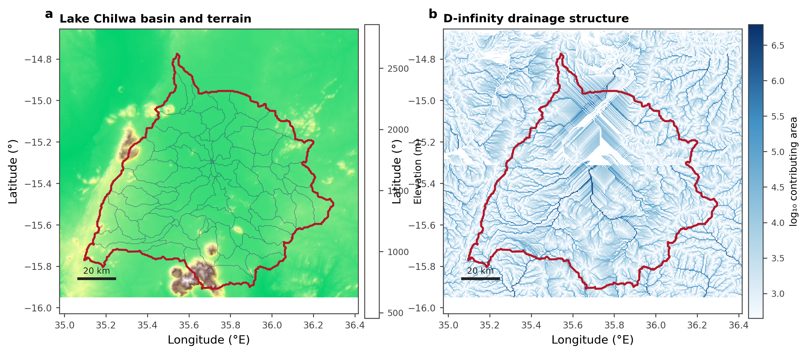

*The self-derived basin. (a) Basin boundary and sub-basins on the SRTM terrain surface. (b) D-infinity contributing area on a log10 scale, computed on the least-cost depression-breached surface. Terrain is SRTM 1 arc-second at 30 m.*

### Data coverage

*Table 1. Temporal coverage of each data stream, with the gaps that limit cross-sensor comparison. From 18 October 2011 to 25 March 2013 Landsat 7 was the only Landsat satellite imaging the basin, and the sixteen-day record filled that interval mainly with MODIS calibrated to Landsat.*

| Data stream | Coverage | Gaps |
|---|---|---|
| Landsat 4, 5, 7, 8 and 9 | 1984 to 2024; sixteen-day record from all five, annual composites from Landsat 5 and 8 | Landsat 7 alone from 18 Oct 2011 to 25 Mar 2013; annual composites absent for 1985, 1988, 2002 and 2012 |
| MODIS surface reflectance | Feb 2000 to 2024, combined with Landsat at sixteen-day steps | 500 m grid cannot resolve the vegetated class |
| Sentinel-1 C-band | 2015 to 2024, monthly composites | 2016 absent; 2014 scenes too few to composite |
| ALOS PALSAR L-band | 2007 to 2010, 2015 to 2024 | 2011 to 2014 absent between the two missions |
| Envisat ASAR | 16 Nov 2011 to 15 Mar 2012, 7 usable dates on 2 tracks | Mission ended 8 Apr 2012 |
| Field photographs | 2011 to 2014, 244 frames | 213 fall in February to June 2012; 21 carry unusable camera-clock defaults |
| Participatory and interview record | September 2012 to March 2014 | Continuous |
| Climate reanalysis and satellite | 1984 to 2024, 492 monthly steps | Continuous; TerraClimate and SPEI end December 2024 |

### Climatic setting

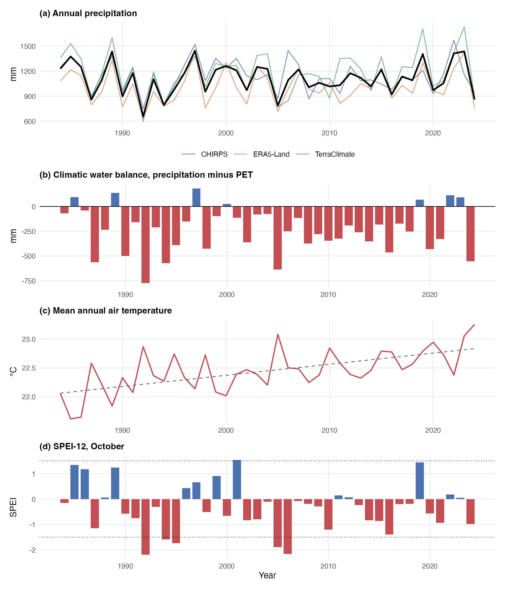

*Climatic setting of the Lake Chilwa basin, 1984 to 2024. (a) Annual precipitation from CHIRPS, TerraClimate, and ERA5-Land, with their mean in black. (b) Climatic water balance, precipitation minus potential evapotranspiration; the deficit is the normal state and only seven years are positive. (c) Mean annual air temperature, rising at 0.19 °C per decade. (d) Twelve-month SPEI at October, with the conventional thresholds at plus and minus 1.5.*

### Sensor availability

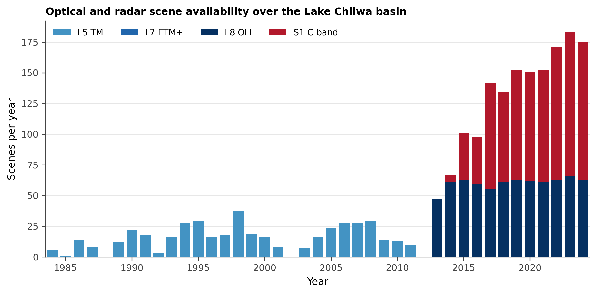

*Optical and radar scene availability over the Lake Chilwa basin, 1984 to 2024. Landsat carries the record from 1984, and Sentinel-1 C-band adds dense coverage from 2015.*

### Water indices

| Index | Formula | Lake Chilwa Application |
|---|---|---|
| NDWI (McFeeters, 1996) | (Green - NIR) / (Green + NIR) | The original water index, sensitive to deep open water but prone to false negatives in turbid, shallow, or vegetated conditions because suspended sediment and vegetation raise NIR reflectance; the baseline against which the others are compared. |
| MNDWI (Xu, 2006) | (Green - SWIR1) / (Green + SWIR1) | Substitutes SWIR for NIR, improving discrimination of water from built-up and bare-soil surfaces; the strongest single optical index for turbid water, though it fails beneath emergent vegetation and requires adaptive thresholding in saline systems. |
| AWEIsh (Feyisa et al., 2014) | Blue + 2.5 x Green - 1.5 x (NIR + SWIR1) - 0.25 x SWIR2 | A five-band combination optimised for shadow suppression and complex-landscape discrimination; outperforms simpler indices where topographic or shadow effects confound classification but offers no clear advantage in shallow vegetated wetlands. |
| WRI (Shen and Li, 2010) | (Green + Red) / (NIR + SWIR1) | A ratio index that suppresses cloud and shadow noise effectively; competitive in bare-soil landscapes but vulnerable to inflation from suspended sediment in the red band, and untested in endorheic systems. |
| NDPI (Lacaux et al., 2007) | (SWIR1 - Green) / (SWIR1 + Green) | Designed for temporary pond detection in semi-arid Africa using SPOT-5 data; the algebraic inverse of MNDWI, sensitive to the water-vegetation boundary where other indices fail, most appropriate for Lake Chilwa’s seasonal vegetated margins but weaker in deep or turbid water. |

### Annual mixture record

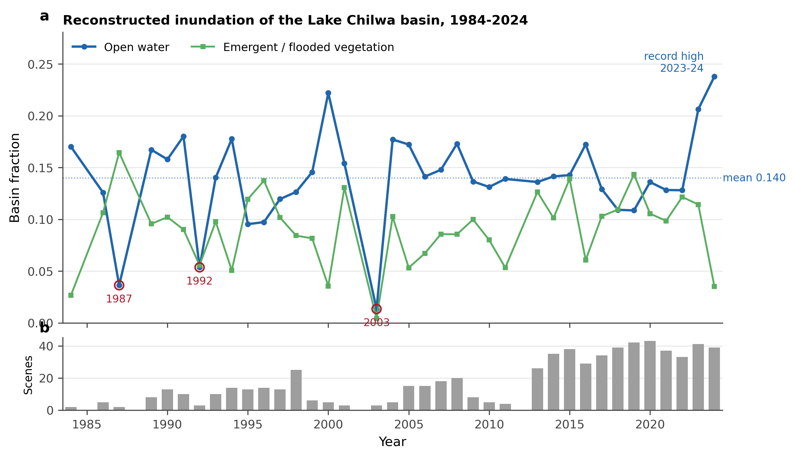

*Figure 1. Reconstructed inundation of the Lake Chilwa basin, 1984 to 2024. (a) Basin-mean open-water and emergent, flooded-vegetation fractions from spectral mixture analysis, with the record mean, the principal recession troughs, and the 2023 to 2024 refill marked. (b) Usable Landsat scenes per year, the sampling density behind each annual estimate.*

### Index performance

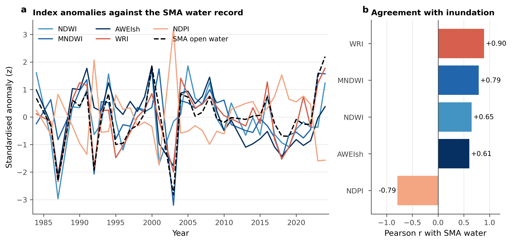

*Figure 2. Spectral-index behaviour, 1984 to 2024. (a) Standardised annual anomalies of the five water indices against the spectral-mixture open-water record. (b) Pearson correlation of each index with that record. WRI and MNDWI track inundation most closely, and NDPI is the inverse of MNDWI.*

### Index correlations

*Table 2. Pairwise Pearson correlation among the five water indices, basin-mean annual values, 1984 to 2024. NDPI is the exact inverse of MNDWI.*

|        |  NDWI | MNDWI | AWEIsh |   WRI |  NDPI |
|:-------|------:|------:|-------:|------:|------:|
| NDWI   |  1.00 |  0.31 |   0.75 |  0.66 | -0.31 |
| MNDWI  |  0.31 |  1.00 |   0.54 |  0.76 | -1.00 |
| AWEIsh |  0.75 |  0.54 |   1.00 |  0.59 | -0.54 |
| WRI    |  0.66 |  0.76 |   0.59 |  1.00 | -0.76 |
| NDPI   | -0.31 | -1.00 |  -0.54 | -0.76 |  1.00 |

### Radar dynamics

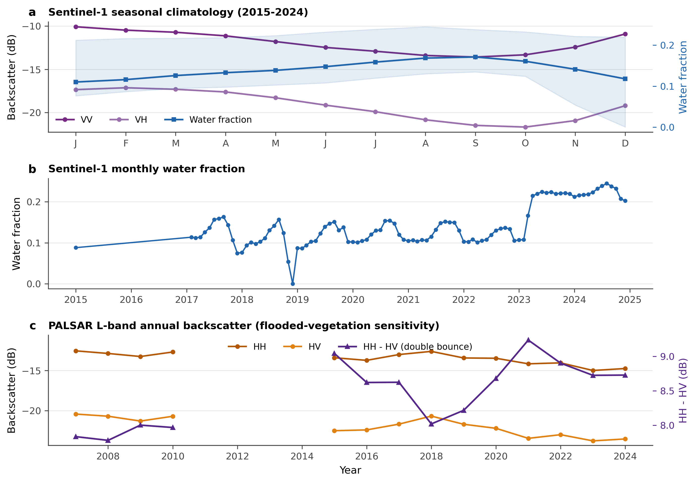

*Figure 3. SAR dynamics of the Lake Chilwa basin. (a) Sentinel-1 monthly climatology of VV and VH backscatter and the derived water fraction, 2015 to 2024. (b) Sentinel-1 monthly water fraction through the record, showing the 2023 to 2024 step-up. (c) ALOS PALSAR L-band annual HH and HV backscatter and their difference, the double-bounce term sensitive to flooded vegetation.*

### Spectral mixture analysis

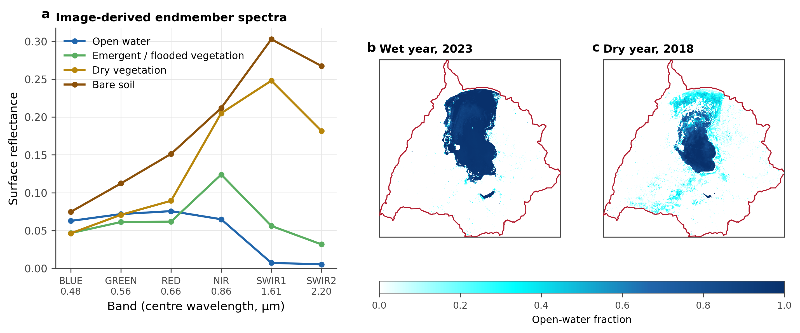

*Image-derived spectral endmembers and the fractions they resolve. (a) Median surface-reflectance spectrum of each of the four endmembers, from spectrally pure pixels of the 2020 dry-season Landsat composite. (b, c) Sub-pixel open-water fraction for a wet year, 2023, and a recession year, 2018.*

### SAR processing chain

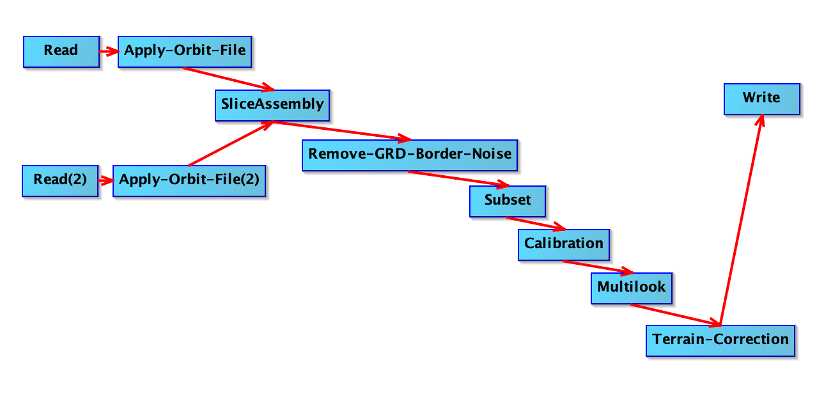

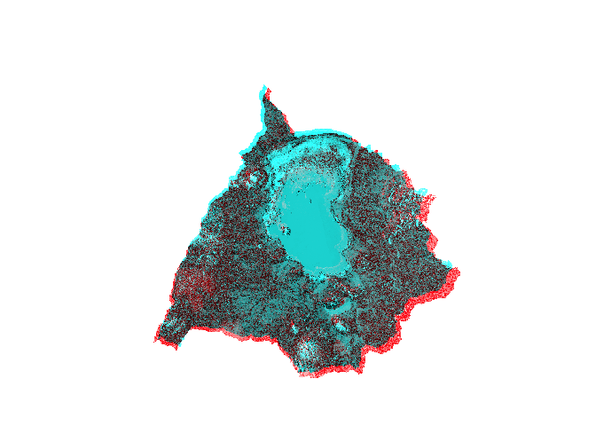

*Sentinel-1 C-band pre-processing chain, and a C-band render of the basin in which smooth open water returns dark against brighter land and vegetation.*

### Socio-hydrological coupling

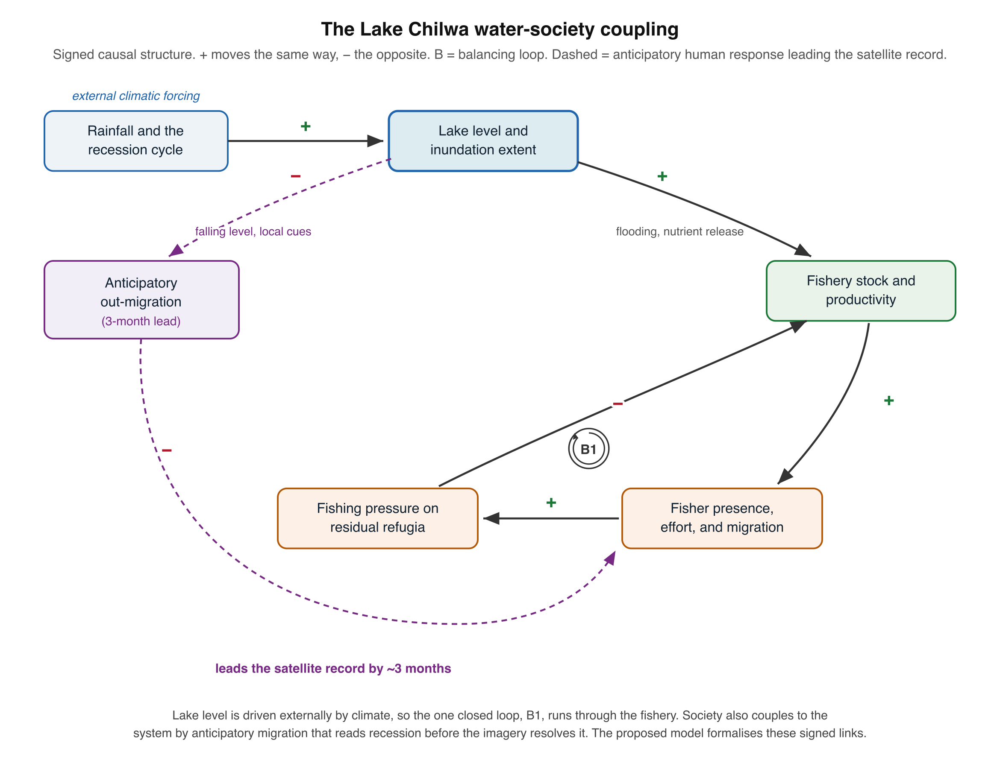

*The Lake Chilwa water-society coupling as a signed causal-loop structure. Lake level is driven by climate from outside the system, and society couples to it through the fishery it exploits and through out-migration that leads the satellite record by about three months.*

------------------------------------------------------------------------

## Sixteen-day record

Lake Chilwa inundation is reported at sixteen-day steps, the Landsat repeat interval, from 1 January 1984 to 16 December 2024. The record holds 936 steps, of which 562 carry a direct observation and 374 are estimated by the model, and every row says which. Open water and water standing within vegetation are carried separately, each with a ninety-five per cent credible interval derived from the fit.

`03.outputs/CSV/chilwa_inundation_16day.csv` is built by `05.scripts/build_inundation_16day.py`, fitted in Section 2.3 of the manuscript, and accepted by `05.scripts/eval_timeseries.py`.

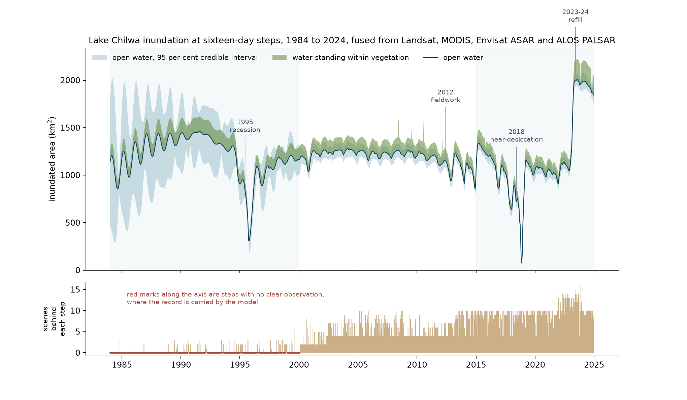

*Figure 8. Lake Chilwa inundation at sixteen-day steps, 1984 to 2024. The credible band is narrow where MODIS observes every step and wide through the 1980s and 1990s, where Landsat alone supplies about four usable views a year. The lower panel gives the scene count behind each step.*

### The instruments

*Table 3. The instruments behind the sixteen-day record. Scene counts are archive totals over the basin. A step counts toward an instrument when that instrument supplied an observation passing the eighty per cent clear-view rule.*

| Instrument | Span over the basin | Grain | Repeat | Bands read | Water rule | Scenes over basin | Contribution to the record |
|:---|:---|:---|:---|:---|:---|:---|:---|
| Landsat 4 TM | 1988 to 1992 | 30 m | 16 d | green, SWIR1 | MNDWI | 17 | part of the Landsat stream |
| Landsat 5 TM | 1984 to 2011 | 30 m | 16 d | green, SWIR1 | MNDWI | 440 | part of the Landsat stream |
| Landsat 7 ETM+ | 1999 to 2024 | 30 m | 16 d | green, SWIR1 | MNDWI | 1043 | part of the Landsat stream |
| Landsat 8 OLI | 2013 to 2024 | 30 m | 16 d | green, SWIR1 | MNDWI | 781 | part of the Landsat stream |
| Landsat 9 OLI-2 | 2021 to 2024 | 30 m | 16 d | green, SWIR1 | MNDWI | 253 | part of the Landsat stream |
| **Landsat, all platforms** | 1984 to 2024 | 30 m | 16 d | green, SWIR1 | MNDWI above 0 | 2534 | 271 steps (29% of the record) |
| MODIS Terra and Aqua | 2000 to 2024 | 500 m | 8 d | green, SWIR1 | MNDWI, calibrated to Landsat | - | 534 steps (57% of the record) |
| Envisat ASAR APP | 2011 to 2012 | 30 m | 35 d | C-band, HH and HV | HH minus HV | 40 | 7 usable dates, vegetated class only |
| ALOS PALSAR mosaic | 2007 to 2024 | 25 m | annual | L-band, HH and HV | HH minus HV | 14 | 14 annual mosaics, vegetated class only |

### Record by era

*Table 4. The record by era, showing how much of each is measured and how much is estimated by the model.*

| Era | Steps | Observed | Estimated by model | Mean open water (km²) | SD (km²) | Minimum (km²) | Maximum (km²) | Mean 95% interval width (km²) |
|:---|:---|:---|:---|:---|:---|:---|:---|:---|
| 1984 to 1999 | 366 | 27 (7%) | 339 | 1,184 | 228 | 530 | 1,526 | 873 |
| 2000 to 2014 | 342 | 317 (93%) | 25 | 1,191 | 78 | 823 | 1,282 | 111 |
| 2015 to 2024 | 228 | 218 (96%) | 10 | 1,189 | 410 | 48 | 2,010 | 98 |

### Model checks

MODIS water area was calibrated to Landsat on 243 steps that both observed with over eighty per cent of the lake clear, giving a Pearson correlation of 0.986 and a residual standard deviation of 58.9 km². The standard deviation of each step in the level, 36.5 km², and a factor of 0.377 on the stated observation variances were fitted by maximum likelihood. Fifteen of the sixteen acceptance criteria pass. The one that does not is model specification, because the leftover errors still follow a pattern in time, Ljung-Box Q = 103.1 on twenty lags.

## Gap-filling design

The seventeen months between the last Landsat 5 image
on 18 October 2011 and the first Landsat 8 image on 25 March 2013 were filled by
combining satellites through time, following the design of the Highly Scalable
Temporal Adaptive Reflectance Fusion Model, HISTARFM (Moreno-Martínez et al.,
2020). HISTARFM runs in Google Earth Engine and joins a regression of Landsat on
MODIS with a Kalman filter, a method that keeps a running estimate and corrects
it each time an observation arrives according to how reliable that observation
is, producing monthly 30 m reflectance with no gaps and an uncertainty on every
pixel.

The study applied the same structure to the water area of the whole basin
rather than to the reflectance of each pixel, and filled the gap by three routes.
The sixteen-day record calibrated MODIS water area onto Landsat on 243 steps
that both observed (r = 0.986, residual 58.9 km2) and carried the lake through
time with a Kalman filter and a backward pass, so that each estimate also used
observations made after it. A harmonic model, a smooth yearly curve of sine and
cosine waves, was fitted to the water index of every 30 m pixel from 243
Landsat 5, 7 and 8 scenes between June 2010 and June 2014, giving a water map
for the date of each photograph session. Envisat radar on seven usable dates
between November 2011 and March 2012 supplied the water standing beneath the
reeds, which neither optical route can see.

Inside the gap, 30 of the 33 sixteen-day steps carried an observation, 24 of
them from MODIS alone, and Landsat 7 passed the eighty per cent clear-view rule
on only five steps, the first on 5 May 2012. The fieldwork months of February to
April were therefore observed at 500 m and calibrated to the 30 m reference.

The pixel-by-pixel version was not used for the record, because no HISTARFM
collection covers southern Africa and because HISTARFM removes pixels with a
vegetation index below -0.1, a threshold below which open water commonly lies.
The basin design estimates the quantity the study reports directly, with an
interval in square kilometres at every step, but it gives no map, so it cannot
locate the vegetated fraction on its own. Rebuilding the record pixel by pixel on
the HISTARFM design, with its vegetation mask replaced by one that keeps open
water, is the open design decision and is written into the manuscript as future
work. The full argument is in Sections 2.3.1 and 4.1.2 of
`01.manuscript/Manuscript_2026-08-03.qmd`.

The data flow from question to scores, the Earth Engine datasets and algorithms
each step uses, and the open items are set out in a two-page workplan,
`03.outputs/HTML/chilwa-workplan.html`, rendered from
`03.outputs/HTML/chilwa-workplan.qmd` with every figure computed from the
committed tables.

Moreno-Martínez, Á., Izquierdo-Verdiguier, E., Maneta, M. P., Camps-Valls, G.,
Robinson, N., Muñoz-Marí, J., Sedano, F., Clinton, N., & Running, S. W. (2020).
Multispectral high resolution sensor fusion for smoothing and gap-filling in the
cloud. *Remote Sensing of Environment*, *247*, 111901.
https://doi.org/10.1016/j.rse.2020.111901

For the window containing the 22 February 2012 session of 43 photographs, the sixteen-day record gave 1,120 km² of open water with a ninety-five per cent interval of plus or minus 54 km². The per-pixel harmonic map gave 1,158 km² on 22 February 2012 and agreed with an external surface-water product built from the same Landsat 7 scenes on 98.6 to 99.6 per cent of pixels. Every alternative dataset was tested against the basin and rejected on evidence, in `03.outputs/TABLES/table4_candidate_datasets.md`.

## Key findings

**2018, not 2012, was the deepest drawdown of the satellite era.** Its seasonal minimum reached 48 km², against 530 km² in the 1995 recession and 925 km² in 2012. Direct Landsat views with over 96 per cent of the lake clear gave 28 km² on 29 October 2018 and 1 km² on 14 November. The annual composite record reported 2018 as 956 km², the mean of a year that fell by two orders of magnitude within it, which is the case for reporting at sixteen-day steps.

**Water within vegetation was about a tenth of the footprint, not most of it.** It averaged 130 km² against 1,187 km² of open water, and reached 19 per cent of the combined area on the 22 February 2012 radar date. C-band is weakened by dense stands, the Envisat swath edge clips the western fringe, and the class is confined to within ten kilometres of the lake, so the true share is higher, but none of these closes the distance to a majority. Hypothesis H1 as worded is not supported by what the radar measures, and how the paper reports that is an open decision.

**1988 was never an empty year.** Landsat 4 holds eight scenes over the basin, four under thirty per cent cloud.

## Stated uncertainty

Credible intervals averaged 873 km² before 2000 and 98 km² from 2015, and that difference is part of the product. Of 366 steps from 1984 to 1999, 153 carry a Landsat view and 27 clear eighty per cent of the lake, about four usable views a year. From 2015 the same counts are 228 and 147.

Advanced Very High Resolution Radiometer imagery was tested as a dense stream before 2000 and rejected. Nine predictors against 101 steps of known area reached a best correlation of 0.33, because at 5.6 km the lake spans about thirty-five mixed pixels and exposed lakebed reads like water in every band that sensor carries.

## Data outputs

| File | Contents |
|:---|:---|
| `03.outputs/CSV/chilwa_inundation_16day.csv` | The sixteen-day record, open water and vegetated water with 95% intervals |
| `03.outputs/CSV/chilwa_inundation_16day_validation.csv` | Calibration, fitted parameters and interval widths of the record |
| `03.outputs/CSV/optical_water_16day.csv` | Landsat and MODIS water area and clear share per sixteen-day window |
| `03.outputs/CSV/asar_series_join.csv` | Envisat water beneath vegetation per radar date, joined to the optical model |
| `03.outputs/CSV/landsat_annual_indices.csv` | Annual basin-mean water indices, 1984 to 2024 |
| `03.outputs/CSV/sma_annual_fractions.csv` | Sub-pixel open-water and flooded-vegetation fractions |
| `03.outputs/CSV/sma_endmember_spectra.csv` | Image-derived endmember reflectance spectra |
| `03.outputs/CSV/s1_monthly_timeseries.csv` | Sentinel-1 monthly backscatter and water fraction |
| `03.outputs/CSV/palsar_lband_annual.csv` | ALOS PALSAR L-band annual backscatter |
| `03.outputs/CSV/climate_monthly.csv` | Basin-mean precipitation, PET, temperature and SPEI, monthly |
| `03.outputs/CSV/climate_annual.csv` | The same aggregated annually, 1984 to 2024 |
| `03.outputs/CSV/sensor_availability_by_year.csv` | Usable scenes per sensor per year |
| `03.outputs/CSV/field_photo_metadata.csv` | Capture date and camera for each of the 244 field photographs |
| `03.outputs/CSV/photo_sessions_labelled.csv` | 38 field photo sessions with reviewed cover class |
| `03.outputs/PNG/pansharpened_15m/` | Landsat 7 true colour sharpened to 15 m on the photo dates, for placing training points |
| `03.outputs/TABLES/table4_candidate_datasets.md` | Every alternative dataset tested against the basin, with the result |
| `03.outputs/HTML/chilwa-workplan.html` | Two-page coauthor workplan, data flow, software and open items |
| `03.outputs/SHP/chilwa_basin.shp` | Analysis boundary |
| `03.outputs/DEM/` | SRTM 1 arc-second terrain and D-infinity grids |
