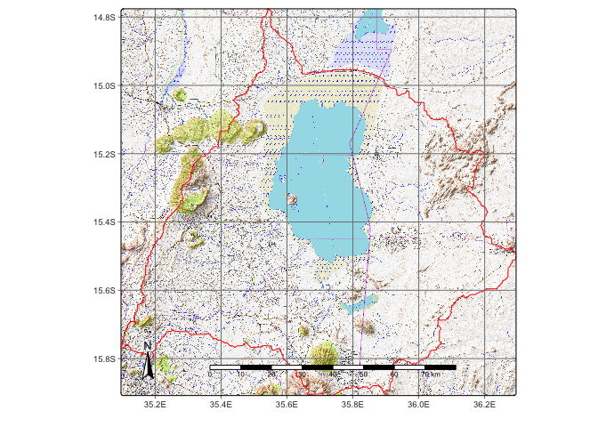

# Objective

Lake Chilwa recessions occured in the years of 1879, 1900, 1914-15, 1922,
1931-32, 1934, 1954, 1960-61, 1967, 1973, 1995 and 2012. 

# Project AOI


``` r
tmap::tmap_mode("plot")
tmap::tmap_options(check.and.fix = T)
aoi = read_sf("./inputs/chilwa_watershed_4326.shp") 
basemap = get_tiles(aoi, provider = "OpenTopoMap", zoom = 12, crop = TRUE)
```

```
FALSE 
|---------|---------|---------|---------|
=========================================
                                          

|---------|---------|---------|---------|
=========================================
                                          

|---------|---------|---------|---------|
=========================================
                                          

|---------|---------|---------|---------|
=========================================
                                          
```

``` r
tm_shape(basemap) + 
  tm_rgb() + 
  tm_shape(aoi) +
  tm_borders(col = "red") +
  tm_graticules() +
  tm_compass(position = c("left", "bottom")) +
  tm_scale_bar()
```

<!-- -->

# Data cube


``` r
dir_raw = "/Volumes/TOSHIBA_EXT/chilwa/data/raw_cube/MPC"
dir_reg = "/Volumes/TOSHIBA_EXT/chilwa/data/reg_cube/MPC"

cube <- sits_cube(
  source = "MPC",
  collection = "LANDSAT-C2-L2",
  bands = c("BLUE", "GREEN", "RED", "NIR08", "SWIR16", "SWIR22", "CLOUD"),
  start_date = "1994-07-01",
  end_date = "2015-07-01",
  roi = aoi
)

# Faster when cube saved locally
cube_raw = sits_cube_copy(
  cube,
  roi = aoi,
  res = 30,
  n_tries = 5,
  output_dir = dir_raw,
  progress = T
)

# Normalize by cloudless pixel ranking & monthly medians
cube_reg <- sits_regularize(
  cube       = cube_raw,
  output_dir = dir_reg,
  res        = 30,
  period     = "P1M",
  multicores = 1026
)
```


``` r
# Derive NDVI
cube_reg |>
  sits_apply(NDVI = (NIR08 - RED) / (NIR08 + RED)) |>
  sits_apply(NDWI = (GREEN - NIR08) / (GREEN + NIR08)) |>
  sits_apply(MNDWI = (GREEN - SWIR16) / (GREEN + SWIR16)) |>
  sits_apply(NDPI = (SWIR16 - GREEN) / (SWIR16 + GREEN)) |>
  sits_apply(WRI = (GREEN + RED) / (NIR08 + SWIR16),
             data = cube_reg,
             output_dir = dir_reg_test,
             memsize = 6,
             multicores = 1026,
             progress = T
             normalized = F
             )

#AWEInsh = 4(Green − SWIR1) − (0.25(NIR) + 2.75(SWIR2))

#AWEIsh = Blue + 2.5(Green) − 1.5(NIR + SWIR1) − 0.25(SWIR2)


#Derive NDWI
cube_202407_spectral = sits_apply(
  data = cube_202407_spectral, 
  NDBR = (B08 - B12) / (B08 + B12), 
  output_dir = dir_reg_test,
  memsize = 6,
  multicores = 4,
  progress = T
  )

#Derive NDMI
cube_202407_spectral = sits_apply(
  data = cube_202407_spectral, 
  NDMI = (B08 - B11) / (B08 + B11), 
  output_dir = dir_reg_test,
  memsize = 6,
  multicores = 8,
  progress = T
  )

#Merging mosaics
ndvi = list.files(dir_reg_test, 
  pattern = 'NDVI', full.names = T, all.files = FALSE)|>
  lapply(terra::rast)|>
  sprc() |>
  mosaic()
terra::mask(ndvi, vect(aoi))
aoi = sf::st_transform(aoi, crs(ndvi))
ndvi = terra::crop(ndvi, vect(aoi), mask=T)
ndvi = ndvi * 0.0001
writeRaster(ndvi, file.path(dir_reg_test, "NDVI_1994-08-01.tif", overwrite=T)
```

# Training sample


``` r
cube_s1_rtc <- sits_cube(
  source = "CDSE",
  collection = "SENTINEL-1-RTC",
  roi = aoi,
  bands = c("VV", "VH"),
  orbit = "descending",
  start_date = "2018-02-01",
  end_date = "2018-04-01",
  output_dir = dir_reg_test
)

cube_s1_local <- sits_cube(
  source = "CDSE",
  collection = "SENTINEL-1-RTC",
  bands = c("VH", "VV"),
  start_date = "2018-05-01",
  end_date = "2018-05-10",
  roi = aoi,
  data_dir = dir_reg_s1,
  parse_info = c("satellite", "sensor", "band",  "tile", "date"),
  delim = "_"
  )

cube_s1_reg <- sits_regularize(
  cube = cube_s1_local,
  period = "P1M",
  res = 10,
  roi = aoi,
  memsize = 12,
  multicores = 8,
  output_dir = dir_reg_test
)

s1_vv = list.files(dir_reg_s1, 
  pattern = 'VV', full.names = T, all.files = FALSE)|>
  lapply(terra::rast)|>
  sprc() |>
  mosaic()
s1_vh = list.files("./cubes/2024_reg", 
  pattern = 'VH', full.names = T, all.files = FALSE)|>
  lapply(terra::rast)|>
  sprc() |>
  mosaic()

terra::mask(s1_vv, vect(aoi))
terra::mask(s1_vv, vect(aoi))
cube_s1 = terra::crop(s1, vect(aoi), mask=T)

sits_view(
  cube_s1_reg, 
  band = "VV", 
  palette = "Greys", 
  date = "2018-05-06")

sits_view(
  cube_s1_local, 
  band = "VV", 
  palette = "Greys", 
  date = "2018-05-06") %>% editMap()


points <- viewRGB(cube_reg, r = 4, g = 3, b = 2) %>% editMap()
clouds <- points$finished$geometry %>% st_sf() %>% mutate(class = "clouds", id = 1)
```
